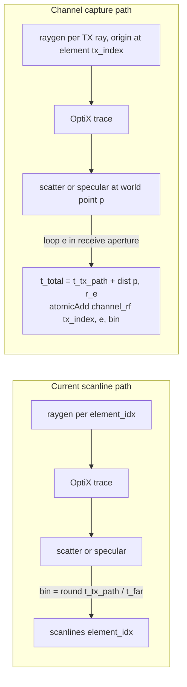

# Channel-Capture (per-element RF) for the OptiX ultrasound raytracer

This document describes a development-level extension to the `ultrasound-raytracing`
package that turns the existing scanline-based simulator into a **channel-capture**
simulator: instead of producing one already-beamformed A-line per transducer element,
the new path produces a 3D tensor of raw RF signals, indexed by `(TX element, RX
element, time sample)`, that downstream code can beamform offline (e.g. delay-and-sum,
DMAS, MV, or learned reconstructors).

Supported apertures: **phased array** (v1, §2–§6) and **synthetic-aperture IVUS**
(added later, §10 — including the offline pulse/TGC/IQ chain and DAS
reconstruction that reproduce the legacy IVUS B-mode from the raw cube).

The goal is *understanding by developing*: by reading this document and the diff that
implements it, a contributor should walk away with a clear mental model of how a ray
tracer generates per-element RF and how that compares to classical SIR-based
simulators such as Field II / FieldGPU.

## Process changes at a glance

This update adds a **second simulation pipeline** alongside the existing one. The
legacy `simulate(...)` path is unchanged; a new `simulate_channel_capture(...)`
path is added that reuses the same OptiX scene, acceleration structure, materials,
and ray-physics code but swaps out the *deposition rule* and the *ray generation
strategy*.

### Pipelines side-by-side

| Stage | Legacy `simulate(...)` (unchanged) | New `simulate_channel_capture(...)` |
|---|---|---|
| **Setup** | Build OptiX scene + AS once at construction. | Same scene + AS, reused. |
| **Per-call uploads** | One SBT raygen record (probe pose) + zeroed `scanlines` buffer `[N_el_samples × N_elements × buffer_size]`. | Element positions + normals in world coords (length `N_RX`); zeroed `channel_rf` cube `[N_TX × N_RX × buffer_size]`. |
| **OptiX launches** | **One** launch with grid `(N_elements, N_el_samples)`. Each `(idx.x, idx.y)` is a steered beam from the array center. | **`N_TX` launches** with grid `(num_tx_rays, num_el_samples)`. Each launch fires from a single TX element; the host updates the SBT raygen origin and `params.tx_index` between launches. |
| **Per-ray TX** | Origin = array center; direction = steered angle for `idx.x`. | Origin = `elements_local[tx_index]`; direction = same steered angle as before. |
| **Deposition (scatter step / specular hit)** | `scanlines[ray_index, bin] += contribution`, `bin` from TX-only path length. | For each of `N_RX` receive elements: compute `t_total = t_tx_path + ‖p − r_e‖`, gate on cos directivity, `atomicAdd(channel_rf[tx_index, e, bin], val * att_rx)`. |
| **Post-processing** | PSF convolution → TGC → Hilbert envelope → log compression → median clip → scan conversion → 2D B-mode image. | None on the GPU. The raw RF cube is downloaded as-is; downstream code (e.g. the demo's NumPy DAS) does the beamforming. |
| **Output** | `(b_mode_h, b_mode_w)` float numpy image. | dict with `rf` `(N_TX, N_RX, N_samples)` plus TX/RX positions, speed of sound, and `t_far`. |
| **Coexistence** | Always available. | Selected by calling the new method; same simulator instance, same materials, same world. |

### Kernel-level process changes

Three things change inside `optix_trace.cu`; everything else stays bit-for-bit
identical:

1. **Ray generation** gains a per-launch lateral offset `tx_origin_local`. In
   legacy mode it is `(0, 0, 0)` and the existing steered-beam logic is
   unchanged. In channel-capture mode it shifts the origin to the firing TX
   element so all rays emanate from that element's surface point.
2. **A new device helper `splat_to_channels(p, intensity, t_tx_path, material)`**
   loops over the receive aperture and atomically adds the per-element
   contribution at `bin = round((t_tx + t_rx) / t_far · (buffer_size − 1))`,
   applying Beer–Lambert attenuation on the receive leg and a cos directivity
   gate via the per-element outward normal.
3. **Each of the three deposition sites is gated by a runtime nullness check**:
   `if (params.scanlines) scanline[bin] += …` writes the legacy A-line; `if
   (params.channel_rf) splat_to_channels(…)` writes the channel cube. The host
   chooses by allocating one buffer or the other (or, for debugging, both).
   Because the gates are runtime, the same compiled OptiX pipeline binary
   serves both modes — no second program group, no recompile.

### Host-level process changes

On the C++ side the new method `RaytracingUltrasoundSimulator::simulate_channel_capture`
adds these steps relative to the legacy one:

```text
allocate channel_rf  [N_TX × N_RX × buffer_size]   (zeroed)
gather rx_positions/rx_normals from probe (world coords)   →  upload to GPU
fill Params { scanlines = nullptr, channel_rf = ..., rx_positions = ..., ... }

for tx in 0 .. N_TX-1:
    pack RayGenData { ..., tx_origin_local = elements_local[tx] }
    upload SBT raygen record
    params.tx_index = tx
    upload pipeline_params
    optixLaunch(grid = (num_tx_rays, num_el_samples))   # one TX event

return ChannelCaptureResult { channel_rf, num_tx, num_rx, buffer_size,
                              tx_positions, rx_positions, c, t_far }
```

No PSF / TGC / envelope / scan-conversion stages run; that is intentional —
those are downstream of beamforming, and beamforming is now the user's
responsibility.

```mermaid
sequenceDiagram
    participant Py as Python (demo)
    participant Host as C++ host
    participant GPU as OptiX kernel
    Py->>Host: simulate_channel_capture(probe, params)
    Host->>GPU: upload rx_positions, rx_normals
    Host->>GPU: alloc + memset channel_rf cube
    loop For each TX element tx
        Host->>Host: pack RayGenData (tx_origin_local = elements_local[tx])
        Host->>GPU: upload SBT raygen + Params (tx_index = tx)
        Host->>GPU: optixLaunch(num_tx_rays, num_el_samples)
        GPU->>GPU: trace rays; on each scatter / hit splat_to_channels (atomicAdd to all RX bins)
    end
    Host->>Py: download channel_rf  →  numpy (N_TX, N_RX, N_samples)
```

### Python-level process changes

```python
sim = rs.RaytracingUltrasoundSimulator(world, materials)

# Existing path — unchanged behaviour
b_mode = sim.simulate(probe, sim_params)              # 2D image

# New path — per-element RF cube
cap = sim.simulate_channel_capture(probe, cc_params)  # dict
rf            = cap["rf"]            # (N_TX, N_RX, N_samples) float32
tx_positions  = cap["tx_positions"]  # (N_TX, 3)
rx_positions  = cap["rx_positions"]  # (N_RX, 3)
c             = cap["speed_of_sound"]
t_far         = cap["t_far"]
```

The user then runs whatever beamformer they like (the demo includes a textbook
NumPy DAS) and compares against the legacy B-mode for the same scene.

## 1. Scanline vs channel-capture

The existing `simulate(...)` path in
[`ultrasound-raytracing/csrc/core/raytracing_ultrasound_simulator.cpp`](ultrasound-raytracing/csrc/core/raytracing_ultrasound_simulator.cpp)
launches one OptiX ray per `(element index, elevational sample)` and writes both
volumetric scatter and specular reflections directly into a per-element 1D buffer
indexed by depth bin:

```
bin = round(t_path / t_far * (buffer_size - 1))
scanlines[element_idx, bin] += contribution
```

That tensor is already implicitly *beamformed*: each element transmits and receives
its own focused beam, so each "channel" is really a single A-line for one beam
direction. The downstream pipeline (PSF convolution, TGC, envelope, log compression,
scan conversion) then turns that into a B-mode image. There is no parallel receive
aperture; you cannot do post-hoc beamforming from this output.

**Channel data**, in the FieldGPU / Field II `calc_scat_multi` sense, decouples
transmit and receive: one TX event drives the medium, and *every* receive element
records its own time series. The echo from a scatter point `p` arrives at element
`e` at time

\[
t_{\text{tx,rx}}(p, e) = \frac{\lVert p - r_{\text{tx}} \rVert + \lVert p - r_e \rVert}{c},
\]

where `r_tx` is the transmit element position and `r_e` is the receive element
position. Beamforming happens **after** capture, in user code.



The *physics* in both modes is identical (Beer–Lambert attenuation, oblique-incidence
acoustic reflection, 3D-texture speckle). What changes is the **deposition rule**:
instead of writing to one bin in one scanline, every scatter sample / hit splats to
every receive element at that element's time of flight.

## 2. Scope of v1

This first iteration is intentionally minimal so the structural changes are easy to
read.

| Aspect | v1 choice | Rationale |
|---|---|---|
| Probe | Phased array; **IVUS synthetic aperture added later (see §10)** | Phased array is easy to compare against the [`phasedArray_psf.ipynb`](ultrasound-raytracing/phasedArray_psf.ipynb) Field II notebook |
| TX scheme | Single-element FMC (each element TX once, all RX) | Most general capture; mirrors `calc_scat_multi` / `calc_scat_all` from FieldGPU |
| RX response | Point-element delta (1 sample bin per echo) | No SIR, no transducer impulse response; downstream code can convolve with a pulse |
| Output | `float[N_TX, N_RX, N_samples]` returned to Python | Straight `numpy` array, easy to beamform in NumPy/CuPy |
| Beamforming | Done outside the simulator (textbook DAS in the demo) | Keeps the simulator's responsibility to "produce per-element RF"; learning value |

What is **deliberately deferred** to v2 (see §7):

- Far-field rectangular SIR (Jensen/Svendsen trapezoid `h(t)`)
- Plane-wave / diverging-wave TX with delays
- TX/RX apodization windows
- Built-in pulse modulation on the channel cube (the IVUS demo applies it
  offline in NumPy; see §10)
- True specular visibility via OptiX shadow rays (instead of a cos directivity proxy)

## 3. Mapping the OptiX kernel onto channel capture

There are exactly three deposition sites in
[`ultrasound-raytracing/csrc/cuda/optix_trace.cu`](ultrasound-raytracing/csrc/cuda/optix_trace.cu)
that write into the `scanlines` buffer today:

1. `sample_intensities(...)` — volumetric scatter loop, writes to
   `scanline[bin] += segment_weight * scatter` for each step along a ray segment.
2. `__closesthit__...` (via the `closest_hit<>` template) — specular and
   reflection-coefficient deposits, writes to `scanline[hit_bin] += R*I` and
   `scanline[hit_bin] += 2.f * specular`.
3. `__miss__ms` — one final scatter sweep along the unhit ray segment.

Channel capture replaces (or coexists with) each of these with a single device
helper:

```cpp
__device__ void splat_to_channels(float3 p, float intensity_at_p, float t_tx_path,
                                  const Material* current_material) {
  for (uint32_t e = 0; e < params.num_rx; ++e) {
    const float3 d = params.rx_positions[e] - p;
    const float t_rx = length(d);
    const float t_total = t_tx_path + t_rx;
    if (t_total >= params.t_far) continue;
    const uint32_t bin = get_intensity_offset(t_total);
    const float cos_g = fmaxf(0.f, dot(normalize(-d), params.rx_normals[e]));
    if (cos_g <= 0.f) continue;  // RX element looking the wrong way
    const float att = get_intensity_at_distance(t_rx, current_material->attenuation_);
    const float val = intensity_at_p * cos_g * att;
    const uint64_t out_idx =
        (uint64_t(params.tx_index) * params.num_rx + e) * params.buffer_size + bin;
    atomicAdd(&params.channel_rf[out_idx], val);
  }
}
```

The kernel decides which mode to write into based on which buffer is non-null:

```cpp
if (params.scanlines)  scanline[bin] += contribution;
if (params.channel_rf) splat_to_channels(p, contribution, t_tx_path, current_material);
```

so **the same OptiX pipeline binary serves both modes** — no recompile, no second
program group. The host simply allocates `scanlines` *or* `channel_rf` (or both, for
debugging).

### TX ray generation

For a phased array under FMC, the existing per-element ray gen is reused with two
small changes:

- The ray origin is shifted from the array center to the actual TX element position
  (`elements_local[tx_index].x` along the lateral axis, then transformed by the
  probe pose like every other ray).
- The ray direction is still steered across `sector_angle * d_x`, exactly as today
  in `generate_phased_array_probe_ray_local`. The launch grid is `(num_tx_rays,
  num_el_samples)` per TX event; we sweep `tx_index = 0 .. N_TX-1` on the host and
  re-launch.

Each TX event therefore reuses the entire OptiX scene + acceleration structure;
only `params.tx_index` and the SBT raygen record's origin change.

## 4. Memory model

For a `64 × 64` phased array with `buffer_size = 4096` samples and one elevation
plane:

```
sizeof(channel_rf) = N_TX * N_RX * buffer_size * 4 bytes
                   = 64 * 64 * 4096 * 4 = 64 MiB
```

That fits comfortably on any modern GPU. For larger configurations the cube grows
linearly in `N_TX * N_RX`; at 192 × 192 × 4096 it is 0.56 GiB.

Atomic contention is the main concern. Per scatter sample we issue `N_RX` atomic
adds; with thousands of TX rays × thousands of steps × `N_RX` receivers the
arithmetic is non-trivial. For v1 we accept this; profiling can guide later
optimizations (e.g. per-warp shared-memory accumulation, or dispatching one
"receive splat" kernel after recording deposition events).

Elevational handling is unchanged: each elevation sample contributes to the same
channel cube via the same atomic adds. If you want a 3D channel cube, change the
output layout to `[N_TX, N_RX, N_el, N_samples]` — out of scope for v1.

## 5. Relation to FieldGPU

The companion paper
[`docs/FieldGPU_A_GPU-based_Version_of_Field_II_with_Python_Bindings_for_Large_Scale_Simulations_and_Complex_Transducer_Configurations.pdf`](docs/FieldGPU_A_GPU-based_Version_of_Field_II_with_Python_Bindings_for_Large_Scale_Simulations_and_Complex_Transducer_Configurations.pdf)
describes a GPU implementation of Field II's `calc_scat`, `calc_scat_multi`, and
`calc_scat_all`. The structural similarity to the channel-capture path proposed
here is:

| Field II / FieldGPU | This raytracer (channel capture) |
|---|---|
| Iterate over all scatterers `s_i` in the medium | Iterate over all scatter samples along ray paths and all geometry hits |
| For each `s_i`, compute TX SIR `h_tx(s_i, t)` (trapezoid eqs. 1–2) | Use ray-traced TX path length `t_tx_path = t_ancestors + t_val` |
| For each `(s_i, e)`, compute RX SIR `h_e(s_i, t)` and convolve with pulse | Compute `t_rx = ‖p − r_e‖`; deposit a delta at `t_total = t_tx + t_rx` |
| Sum contributions into per-element RF traces | `atomicAdd` into `channel_rf[tx, e, bin]` |

The two big *physical* differences:

1. **Scatterer model.** Field II uses an explicit list of point scatterers; this
   raytracer integrates a 3D scattering texture along ray paths. The per-sample
   contribution `sigma · I · texture` plays the role of "scatterer amplitude × SIR
   delta" in Field II.
2. **Reflection model.** Field II has no specular reflection from interfaces
   beyond what the scatterers reproduce. The raytracer adds an explicit specular
   term at each ray–geometry hit, written into the same channel cube. This makes
   the raytracer a better match for tissue boundaries (vessel walls, bone) than
   pure SIR simulation.

Where FieldGPU computes a trapezoidal `h(t)` per rectangular element to capture
finite element width, this v1 deposits a single delta — equivalent to assuming a
point element. v2 (§7) replaces the delta with the same trapezoid as FieldGPU,
giving a fair point-of-comparison for accuracy benchmarks.

## 6. Validation strategy (run by the demo)

[`examples/channel_capture_demo.py`](ultrasound-raytracing/examples/channel_capture_demo.py)
is the development-time check. It performs three things in order:

1. **Hyperbolic moveout.** Place a single point reflector (small sphere in a
   uniform medium) at known `(x_s, z_s)`. For TX element `tx`, the arrival time
   at RX element `e` should be
   \(t = (\lVert p_s - r_{\text{tx}} \rVert + \lVert p_s - r_e \rVert) / c\). The
   demo overlays the predicted hyperbola on the simulated `rf[tx, :, :]` slice and
   reports the per-element error in samples.
2. **Self-channel sanity.** The diagonal `rf[i, i, :]` (TX = RX) should peak at
   `t = 2 d / c` for a depth-`d` reflector. Compare to the legacy scanline output
   for the same scene.
3. **DAS B-mode.** A textbook delay-and-sum (NumPy/CuPy) reconstructs an image
   from the channel cube; the result is shown side-by-side with the legacy
   `simulate(...)` B-mode for the same phantom. They will not be pixel-identical
   (different post-processing chains), but they should agree on geometry.

## 7. v2 roadmap

The natural extensions, in order of effort vs payoff:

1. **Far-field rectangular SIR** at deposition. Replace the single-bin add with a
   trapezoidal `h(t)` of breakpoints `t1..t4` from FieldGPU eqs. 1–2 and write to
   the four bins. This matches Field II in the far field for rectangular
   elements.
2. **Pulse modulation on the channel cube.** Reuse `create_gaussian_psf` from
   [`raytracing_ultrasound_simulator.cpp`](ultrasound-raytracing/csrc/core/raytracing_ultrasound_simulator.cpp)
   and convolve the time axis of the channel cube before returning it.
3. **TX delays for plane / diverging waves.** Add `tx_delays[N_TX]` and shift the
   arrival time bin: `t_total = t_tx_path + t_rx + delay[tx_index]`. Then a
   single OptiX launch with rays from every element produces one composite
   transmit event.
4. **TX/RX apodization.** Multiply the splat amplitude by `apod_tx[tx_index] *
   apod_rx[e]`.
5. **True specular visibility.** From every ray-hit point `p`, fire OptiX shadow
   rays toward each receive element to gate the specular contribution by
   geometric visibility instead of a cos directivity proxy.
6. **Other probes.** ~~Extend element layout for curvilinear and IVUS arrays.~~
   **Done for IVUS** — the rotating single element is treated as sequential TX
   events on a small ring (synthetic-aperture FMC); see §10. Curvilinear is
   still open.

## 8. File-by-file change map

| File | Change |
|---|---|
| [`ultrasound-raytracing/include/raysim/cuda/optix_trace.hpp`](ultrasound-raytracing/include/raysim/cuda/optix_trace.hpp) | Add `channel_rf`, `rx_positions`, `rx_normals`, `num_rx`, `tx_index`, `inv_c` and the previously-missing `scattering_resolution_mm`, `disable_scatter`, `scatter_integral_scale` to `Params`; add `tx_origin_local` to `RayGenData` |
| [`ultrasound-raytracing/csrc/cuda/optix_trace.cu`](ultrasound-raytracing/csrc/cuda/optix_trace.cu) | Add `splat_to_channels`; gate scanline writes on `params.scanlines != nullptr`; gate channel writes on `params.channel_rf != nullptr`; phased-array raygen offsets origin by `tx_origin_local` |
| [`ultrasound-raytracing/include/raysim/core/probe.hpp`](ultrasound-raytracing/include/raysim/core/probe.hpp) | Add `get_local_element_position` already present; add `get_world_element_positions`/`get_world_element_normals` helpers that fill host vectors |
| [`ultrasound-raytracing/include/raysim/core/raytracing_ultrasound_simulator.hpp`](ultrasound-raytracing/include/raysim/core/raytracing_ultrasound_simulator.hpp) | Declare `simulate_channel_capture` and `ChannelCaptureResult` |
| [`ultrasound-raytracing/csrc/core/raytracing_ultrasound_simulator.cpp`](ultrasound-raytracing/csrc/core/raytracing_ultrasound_simulator.cpp) | Implement `simulate_channel_capture`: upload RX geometry, allocate `channel_rf`, loop `tx_index`, launch OptiX |
| [`ultrasound-raytracing/csrc/python/raysim_bindings.cpp`](ultrasound-raytracing/csrc/python/raysim_bindings.cpp) | Bind `simulate_channel_capture` returning a `numpy` array of shape `(N_TX, N_RX, buffer_size)` |
| [`ultrasound-raytracing/examples/channel_capture_demo.py`](ultrasound-raytracing/examples/channel_capture_demo.py) | New demo: phased-array FMC capture on a point-reflector phantom; hyperbolic-moveout check; DAS B-mode comparison against legacy `simulate(...)` |
| [`ultrasound-raytracing/examples/ivus_channel_capture_demo.py`](ultrasound-raytracing/examples/ivus_channel_capture_demo.py) | IVUS synthetic-aperture capture on a vessel phantom; pulse + TGC + IQ conditioning; coherent DAS reconstruction (Cartesian + unwrapped) vs legacy B-mode (§10) |
| [`ultrasound-raytracing/examples/ivus_channel_capture_benchmark.py`](ultrasound-raytracing/examples/ivus_channel_capture_benchmark.py) | 100-frame pullback throughput benchmark for the IVUS capture path (§10.5) |

## 9. Reading order for newcomers

1. This document.
2. The diff in `optix_trace.hpp` (smallest unit).
3. The new `splat_to_channels` in `optix_trace.cu`.
4. `simulate_channel_capture` in `raytracing_ultrasound_simulator.cpp`.
5. The Python demo. Run it; tweak `tx_index` and the reflector position; watch the
   hyperbola change.

By the end you should be able to answer: *"why does the same OptiX scene produce
either a B-mode image directly or an unbeamformed RF cube, and what does the cube
contain that the scanline buffer threw away?"*

## 10. IVUS synthetic-aperture channel capture

`simulate_channel_capture` also supports `IVUSProbe`. This section documents the
extension (added after v1) and the offline signal chain that turns the raw cube
into a B-mode matching the legacy IVUS pipeline.

### 10.1 Acquisition model

A rotating IVUS transducer is a single element mounted a small radius off the
catheter axis. `IVUSProbe` itself reports every element at the origin (a point
source has no aperture), so the host path synthesises a **rotating-element
ring**: `N` angular positions on a ring of radius `ivus_ring_radius_mm`
(default 0.5 mm), each facing radially outward. Element `k` transmits a fan of
rays of half-angle `ivus_tx_fan_half_deg` (default 25°) about its radial
direction; **every** ring element receives, producing the same
`rf[tx, rx, sample]` cube as the phased-array FMC.

Implementation notes:

- Kernel: the legacy IVUS raygen sweeps 360° per launch. In channel-capture
  mode (`params.channel_rf != nullptr` **and** probe type IVUS) the raygen
  instead rotates `RayGenData::tx_dir_local` about the elevation axis by
  `d_x * 2 * tx_fan_half_deg` — one narrow transmit wedge per TX event.
- Host: builds ring positions/normals from the probe pose, uploads them as the
  RX aperture, and sets `tx_origin_local` / `tx_dir_local` per launch.
- New `ChannelCaptureParams` fields: `ivus_ring_radius_mm`,
  `ivus_tx_fan_half_deg`, and `scattering_resolution_mm` (0 = probe-appropriate
  default: 10 mm for IVUS, 50 mm otherwise, matching legacy `simulate`).

### 10.2 Why the cube needs a pulse before beamforming

The ray tracer deposits **non-negative energy spikes**. Coherent DAS on
non-negative data cannot form speckle (nothing interferes destructively) and
collapses walls to single-bin rings. The demo therefore conditions the cube
offline, in NumPy:

1. **Pulse modulation** — convolve the time axis with a zero-mean
   Gaussian-windowed cosine at the carrier (`lambda = c / f_c` in path-length
   units), turning deposits into bipolar RF.
2. **TGC** — depth-dependent gain (dB per mm of total path, capped).
3. **IQ conversion** — Hilbert transform per channel; beamforming then sums
   complex samples and envelope-detects after the sum, exactly like a real IQ
   beamformer.

With this chain the DAS output reproduces the legacy B-mode's structure: dark
lumen, bright wall band at the true radii, speckled extravascular tissue.

### 10.3 Reconstruction

`examples/ivus_channel_capture_demo.py` reconstructs on two pixel grids with
the same coherent DAS (transmit-wedge gate + receive-directivity gate):
Cartesian (native cross-section) and unwrapped depth × angle (for direct
comparison with the legacy scan-converted image). Display normalizes to a high
percentile rather than the specular peak so tissue speckle survives log
compression.

### 10.4 Outputs

Running the demo writes `ivus_channel_capture_output/`:

- `channel_rf.npz` — raw cube + ring geometry + metadata
- `01_rf_slice.png` — pulsed RF slice with predicted wall moveout
- `02_das_reconstruction.png` — Cartesian DAS with true wall radii overlaid
- `03_das_vs_legacy.png` — unwrapped DAS vs legacy `simulate()` B-mode

### 10.5 Throughput

`examples/ivus_channel_capture_benchmark.py` runs a pullback (probe advances
along the vessel axis between frames) and reports steady-state statistics to
`benchmark_throughput.json`. Reference numbers (RTX 5070 Ti Laptop, 128 TX ×
256 rays, 128 RX, buffer 4096, max_depth 3, download included): **~6.2 s per
frame (0.16 fps)**, ~21 TX events/s, ~11 M RF samples/s. Frame time scales
roughly linearly with `buffer_size` (dense scatter integration steps once per
depth bin) and with `num_rx` (atomic adds per scatter sample); capture at
buffer 1024 runs ~4x faster.

### 10.6 Known gaps (vs channel-level RF accuracy)

Same as v1 elsewhere: point-element delta deposits (no circular-element SIR),
pulse applied offline rather than physically at TX/RX, no transmit directivity
weighting inside the wedge, cos-gate receive directivity, no catheter
ring-down / dead zone. See §7 for the roadmap.
