# IVUS Calibration & Characterization Protocol — Volcano s5i

This document is the bench protocol for the experiments needed to populate the
unspecified entries in `IVUS Simulation Parameters - Sheet1.csv` and to drive
`ultrasound-raytracing/configs/volcano_s5i.yaml`.

The protocol is organized as nine experiments, **E1–E9**. E1–E8 feed the
per-frame raysim simulator; E9 feeds the deferred motion / acquisition layer.
Each experiment includes:

1. Purpose — which CSV/YAML fields it produces.
2. Equipment list (with tolerance thresholds).
3. Setup diagram.
4. Console / device settings.
5. Step-by-step procedure.
6. Data to acquire.
7. Analysis — exact formulas / methods used to extract each parameter.
8. Acceptance criteria.

> All experiments are run with the same Volcano s5i console, the same catheter,
> and at the **same water/phantom temperature (22 ± 1 °C)** unless otherwise
> noted. Speed of sound in degassed water at 22 °C is taken as
> **c_water = 1488 m/s** (Marczak 1997).

## IVUS imaging geometry — read this before designing fixtures

These experiments are **specific to the Volcano s5i 64-element solid-state
synthetic-aperture (SA) IVUS probe** (Eagle Eye Gold / Platinum family) and
differ from external-probe ultrasound calibration in several important ways:

1. **No mechanical rotation.** The 64 transducer elements are arranged in a
   ring on the side of the catheter near the distal tip. The device generates
   a 360° image by SA-beamforming across these elements, *not* by rotating a
   single element. This means:
   - Per-azimuth PSF can vary because different sub-aperture combinations are
     used to reconstruct different angular bins.
   - "Rotating the catheter" only rotates the element ring as a rigid body; it
     does not change how the beamformer operates. It is still useful for
     cross-element averaging (the same target gets imaged by different element
     subsets) but is not a substitute for sampling multiple azimuths.

2. **Beam is radial.** Beams are emitted perpendicular to the catheter long
   axis, in a plane (the imaging plane) that is also perpendicular to the
   catheter axis. Targets must be placed at a known **radial distance** from
   the catheter; "depth" in the simulator and in this document means radial
   distance.

3. **Two view conventions are used in the figures:**
   - **Cross-section view** (looking down the catheter long axis): catheter
     appears as a small disc with a gold ring (the 64-element array). Targets
     are positioned in 2D with `(radial distance, azimuth)`. Used by
     **E1, E2, E4, E5, E6, E8**.
   - **Side view** (catheter long axis horizontal in page): used by **E3**
     because the elevation direction *is* the catheter long axis.

4. **Wires and rod targets must be parallel to the catheter long axis**, so
   they appear as point-like scatterers in the imaging plane (cross-section
   view).

5. **Lateral resolution scales with depth.** Because the lateral axis of the
   PSF is an arc length at radius z, `lateral_FWHM_mm(z) = z · θ_FWHM(z)`.
   Even with a perfectly Gaussian beam, the millimetre-FWHM grows linearly
   with depth purely from geometry — analyses must convert between angular
   FWHM and arc-length FWHM consistently.

6. **Elevation = along the catheter long axis.** When measuring slice
   thickness, the target must move along the catheter shaft, not within the
   imaging plane.

## Common equipment

| Item | Spec | Tolerance / Notes |
|------|------|-------------------|
| Volcano s5i console + Eagle Eye Gold (20 MHz) catheter | service-mode access | Same unit and same catheter S/N for all experiments |
| Water tank | ≥ 300 × 200 × 150 mm, non-reflective lining | walls ≥ 30 mm from catheter tip in any direction |
| Degassed deionized water | dissolved O₂ ≤ 4 ppm | let sit ≥ 24 h after degassing; T = 22 ± 1 °C |
| 3-axis micrometer / motorized stage | XYZ travel ≥ 25 mm | step resolution ≤ 25 µm, repeatability ≤ 50 µm |
| Catheter fixture | rigid clamp, axial alignment ≤ ±0.1 mm | does not occlude the imaging plane |
| RF capture | DAQ ≥ 100 MS/s, ≥ 12-bit (e.g. NI PXIe-5160) | direct RF tap on console back panel; if unavailable, use service-mode raw RF stream |
| Frame grabber | DVI/HDMI capture of console screen, ≥ 1080p @ 30 fps | for grayscale-only analyses (E7 fallback, E4 fallback) |
| Calibrated thermometer | ± 0.2 °C | log T at the start of every session |

## E1 — Pulse-Echo Capture (flat reflector)

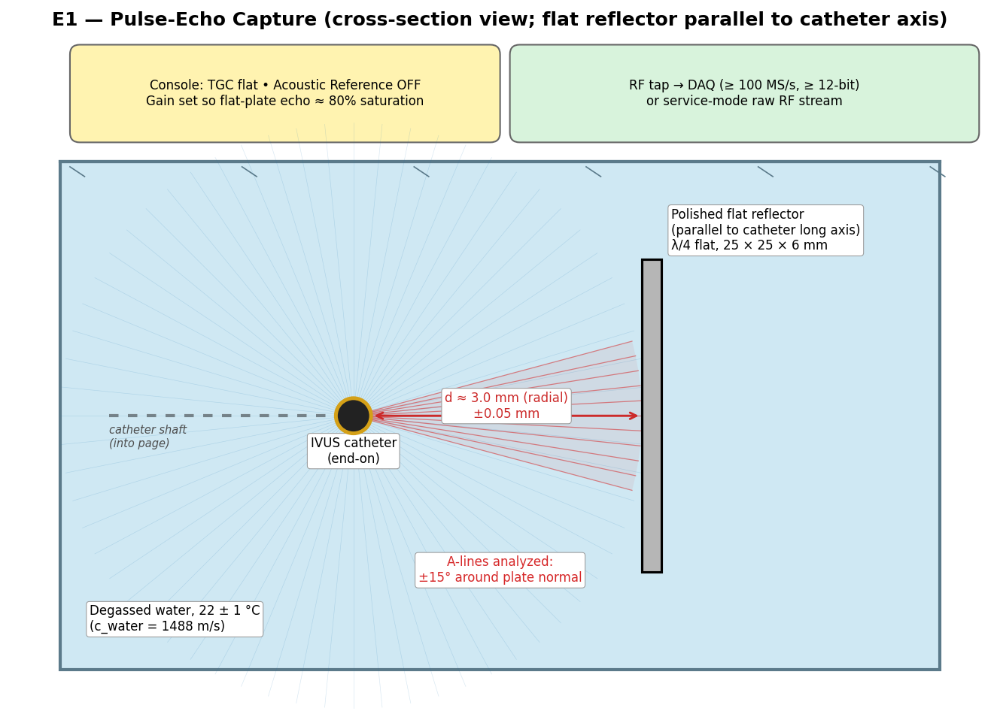

**Produces:** `probe.pulse_duration_cycles`, `probe.impulse_response_path`,
`sim.buffer_size`, `sim.sampling_freq_mhz`, validates `probe.frequency_mhz`.

> **IVUS-specific note.** Because the beam is radial, the reflector is a flat
> plate **parallel to the catheter long axis**, placed at a known radial
> distance from the catheter. Only A-lines whose azimuth is within ~±15° of
> the plate's surface normal are used in the analysis (those are the angles
> at which the reflection is near-normal-incidence and specular). All other
> A-lines see free water within t_far and are ignored.

### Equipment

| Item | Spec | Tolerance |
|------|------|-----------|
| Polished metal reflector (304 stainless or 6061 Al) | 25 × 25 × 6 mm thick block, mounted **parallel to the catheter long axis** | flatness ≤ λ/4 ≈ 19 µm (20 MHz in water); surface roughness Ra ≤ 0.4 µm |
| Reflector tilt mount | goniometric, 2 axes; one axis is rotation about the catheter long axis (sets which catheter azimuth sees the plate normally), the other is in-plane tilt to sweep the normal | resolution ≤ 0.1°, range ±10° |
| Reflector standoff | known **radial** distance d from catheter element ring | d = 3.0 mm ± 0.05 mm |
| Catheter mount | rigid clamp, holds catheter horizontal so its long axis is fixed and the element ring is at a known location | axial position ≤ ±0.1 mm; allows the catheter to be rotated by 0/90/180/270° about its own long axis between captures |

### Console settings

| Setting | Value |
|---------|-------|
| Imaging mode | IVUS B-mode |
| Catheter | Eagle Eye Gold (20 MHz) |
| Diameter | 8 mm (smallest available; minimizes downsampling) |
| Gain (slider) | adjusted so the flat-reflector echo peaks at ~80% of full scale (no clipping) |
| TGC sliders | all centered (flat / disabled) |
| Acoustic Reference | **OFF** |
| Speckle reduction / smoothing | **OFF** |
| Compounding | **OFF** |

### Procedure

1. Mount the catheter horizontally in the fixture so the element ring is centered in the tank. Insert tip 50 mm into the water (≥ 30 mm clearance to walls).
2. Mount the reflector on the goniometric stage with its surface plane parallel to the catheter long axis and its surface normal pointing radially toward the catheter at azimuth θ₀ = 0°. Set the radial distance d = 3.0 mm from the element ring (use a calibrated depth gauge).
3. **Tune tilt**: rotate the reflector ±2° in each axis (in-plane tilt and tilt-about-catheter-axis) and record the peak A-line amplitude at the angular bin closest to θ₀. Set the tilt to the maximum-amplitude position (normal incidence). Acceptance: peak amplitude must be within 1 dB of the maximum found during the sweep.
4. Verify d via time-of-flight: `d_est = c_water · t_peak / 2`. Adjust the stage if `|d_est − 3.0| > 0.05 mm`.
5. Capture **300 frames** at static position. Within each frame, only the A-lines at azimuths θ ∈ [θ₀ − 15°, θ₀ + 15°] are kept; the rest see free water and are discarded. Average across the kept A-lines and across the 300 frames to obtain the impulse response.
6. Repeat steps 3–5 at d = 5.0 mm and d = 8.0 mm.
7. **Element-coverage replicate** (specific to the SA probe): rotate the catheter about its long axis by 90°, 180°, and 270° and repeat steps 3–5 at d = 3.0 mm. This re-images the same plate using different SA element subsets. Compare the four impulse responses; if they differ in pulse-duration or center-frequency by more than the acceptance criteria below, store all four (the simulator will use the mean and the device-side variability becomes an additional uncertainty input).

### Data to acquire

- `e1_d3mm_rf.npy` — raw RF, shape (300, N_samples)
- `e1_d5mm_rf.npy`, `e1_d8mm_rf.npy`
- `e1_metadata.json` — fs (claimed), gain, TGC, T_water, reflector tilt residual.

### Analysis

| Output | Method |
|--------|--------|
| `impulse_response` | `h(t) = mean_n RF(n, t)` over 300 A-lines from the d = 3 mm capture, windowed ±2 µs around the peak. Save as 1D float to `probe.impulse_response_path`. |
| `frequency_mhz` (verify) | `f0 = argmax |FFT(h)|`. Must agree with manual within ±5%. |
| `pulse_duration_cycles` | `BW_-6dB` from `|FFT(h)|`, then `n = f0 / BW_-6dB`. Cross-check by counting envelope zero-crossings within the −20 dB envelope. |
| `sampling_freq_mhz` | `fs = N_samples_between_d5_and_d3 · c_water / (2 · (d5 − d3))`. Should agree with the claimed fs within ±1%. |
| `buffer_size` | `N_samples` at the largest tested t_far for the configured Diameter. |

### Acceptance criteria

- Reflector tilt residual ≤ 0.5° (peak amplitude within 1 dB of the maximum found during tilt sweep).
- d agreement (depth-gauge vs TOF): ≤ 0.05 mm.
- Coefficient of variation of A-line peak amplitude across 300 captures ≤ 2%.
- f0 stable to within ±0.2 MHz across the three depths.

## E2 — Spiral Wire-Phantom 2D PSF

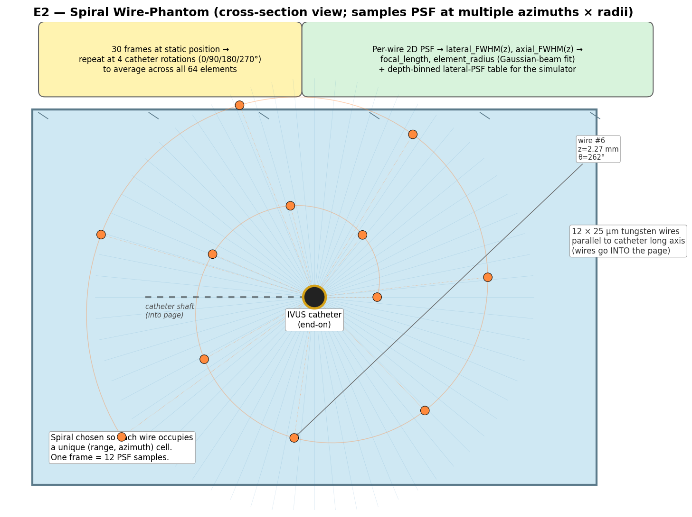

**Produces:** `probe.element_radius_mm`, `probe.focal_length_mm`,
depth-dependent lateral PSF table, F-number derivative,
azimuthal-uniformity QC.

> **IVUS-specific note.** A linear / radial wire arrangement (all wires on
> one radius) only samples a single azimuth and is sensitive to whichever
> SA-element subset reconstructs that bin. We instead use a **spiral
> arrangement** so a single capture samples PSF at multiple
> `(range, azimuth)` pairs. All wires are **parallel to the catheter long
> axis** (i.e. perpendicular to the imaging plane).

### Equipment

| Item | Spec | Tolerance |
|------|------|-----------|
| Tungsten wires (12 ×) | 25 µm diameter | ≤ λ/3 in water at 20 MHz (λ_water ≈ 75 µm) — acceptable, document as a known limitation |
| Wire frame | rigid frame holding 12 wires in an Archimedean spiral pattern, all wires parallel and tensioned | wire-position accuracy ≤ 50 µm radial, ≤ 1° azimuthal; tension ≥ 1 N, sag ≤ 50 µm over the 50 mm wire length; frame opaque to ultrasound only outside the imaging plane |
| Spiral parameters | r_n = r_0 + n · Δr, θ_n = n · Δθ; r_0 = 1.75 mm, Δr = 0.18 mm, Δθ = 30° (gives 12 wires from r = 1.75 to 3.73 mm in one full turn — uniform 30° azimuthal spacing matches the ±15° PSF analysis window) | r and θ tolerances above |
| Catheter mount | rigid clamp coaxial with the spiral frame | catheter axis must coincide with the spiral center within ±0.1 mm |
| 3-axis micrometer stage (frame) | optional, for fine centering of the spiral on the catheter | step ≤ 25 µm |

> **Building the spiral fixture.** A 3D-printable design is provided —
> see [Appendix A — Phantom & Fixture Construction](#appendix-a--phantom--fixture-construction).
> Briefly: print 2 × `hardware/wire_spiral_disc.stl` (50 mm OD × 5 mm),
> connect them with 3 × M3 × 50 mm threaded standoffs, thread 25 µm tungsten
> wire through each pair of corresponding holes, tension by hand and lock
> with cyanoacrylate or set-screws.

### Console settings

Identical to E1, with two changes:
- Diameter set to the largest value that keeps every wire well-resolved at maximum z (e.g. 12 mm for a sweep up to z = 6 mm).
- Gain set so the deepest wire echo is ≥ 30 dB above noise but the shallowest is ≤ 95% saturated.

### Procedure

1. Center the spiral fixture on the catheter; verify the catheter axis is on the spiral center to within ±0.1 mm (visual or micrometer check).
2. Capture **30 frames** at static position. One frame contains a 2D PSF sample for each of the 12 wires.
3. **SA element-coverage replicate.** Rotate the catheter about its long axis by 90°, 180°, and 270° (the spiral fixture stays still). Capture 30 frames at each rotation. This re-images each wire with different SA element subsets.

Total: 12 wires × 4 rotations × 30 frames = 1440 PSF samples on a
non-redundant `(range, azimuth, element-subset)` grid.

### Data to acquire

- `e2_rotYYY_rf.npy` — RF, shape (30, N_az, N_samples), one file per catheter rotation.
- `e2_wire_positions.csv` — wire index, expected r (mm), expected θ (deg) for every wire.
- `e2_metadata.json` — gain, fs, T_water, wire diameter, fixture S/N, tension log.

### Analysis

For each `(rotation, wire)` pair:

1. Locate the wire echo: peak in the polar B-mode within a ±5° azimuthal window and ±0.3 mm radial window of the expected `(r_n, θ_n)`.
2. Extract a 3 mm (radial) × 30° (azimuthal) patch around the peak in **envelope** image space.
3. Average the patch across the 30 frames → 2D PSF for that `(rotation, wire)`.
4. Convert the azimuthal axis to arc length: `arc_mm = r · θ_rad` where `r` is the measured radial position of the wire.
5. Fit a 2D Gaussian (axial × arc-length) to extract `axial_FWHM(z)` and `lateral_FWHM_mm(z) = arc_FWHM(z)`.
6. Average the four rotations per wire to suppress per-element-subset variation; report the mean and σ.

| Output | Method |
|--------|--------|
| `focal_length_mm` | `F = argmin_z lateral_FWHM_mm(z)`; parabolic fit on the three closest wires. |
| `element_radius_mm` | Fit Gaussian-beam waist `w(z) = w₀ · √(1 + (z − F)² / z_R²)` to the rotation-averaged `w_meas(z) = lateral_FWHM_mm(z) / 1.177`. With `w₀ = λ · F / (π · a)` and `z_R = π · w₀² / λ`, solve for `a` (`element_radius_mm`). λ uses c_water at the measured tank temperature. |
| `f_number` (derived) | `F# = F / (2a)`. Sanity check: should be in [1.5, 4]. |
| `psf_lat_2d` lookup table | Save the depth-binned lateral PSF (rotation-mean) directly for use by `convolve_columns_depth_dependent`. |
| Azimuthal-uniformity QC | Per-wire σ across the four rotations vs the mean — reports SA per-element-subset variability. |

### Acceptance criteria

- Per-wire echo SNR ≥ 30 dB.
- Spiral-center alignment error ≤ 0.1 mm (verified as: predicted vs measured `r` agreement across all 12 wires ≤ 0.1 mm RMSE).
- Per-rotation `lateral_FWHM(z)` consistency: σ across 4 rotations ≤ 10% of the mean at every wire.
- Gaussian-beam fit residual ≤ 5% across the 12 wires.

## E3 — Slice-Thickness Sweep (elevational PSF)

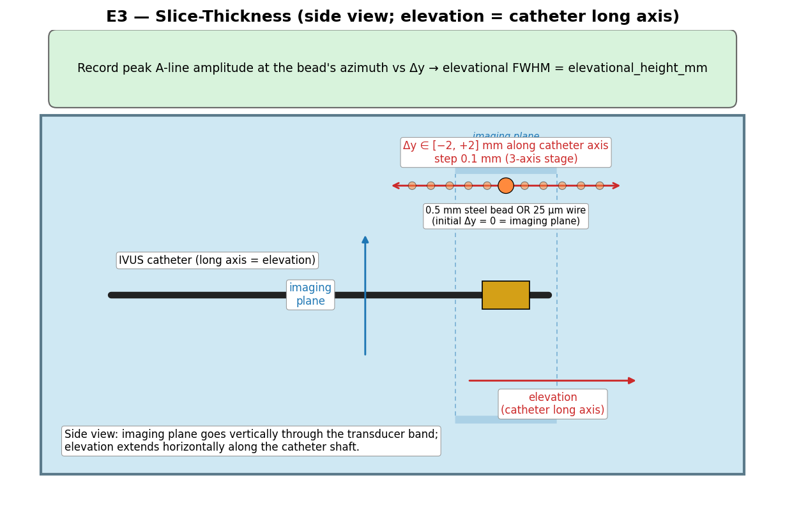

**Produces:** `probe.elevational_height_mm` and the elevational PSF profile.

> **IVUS-specific note.** For an IVUS probe the "elevation" direction is
> **along the catheter long axis**, not perpendicular to it. The bead must
> be translated parallel to the catheter shaft, not within the imaging
> plane. The figure above shows the side view to make this explicit.

### Equipment

| Item | Spec | Tolerance |
|------|------|-----------|
| Target | 25 µm tungsten wire OR 0.5 mm steel bead on monofilament | bead diameter ≤ λ at the focal depth |
| 3-axis micrometer stage | as in “Common equipment” | Δy step 0.1 mm, range ±2.0 mm — Δy is **along the catheter long axis** |
| Catheter mount | holds catheter long axis horizontal and stationary | axial play ≤ 25 µm during the sweep |

### Console settings

Same as E2.

### Procedure

1. Mount the catheter horizontally with the element ring at a known position. Position the bead at radial distance equal to the focal length F (from E2), at azimuth 90° above the catheter axis (so its echo is in a clean A-line bin).
2. Align the bead's elevation (along-axis position) with the center of the imaging plane (Δy = 0): sweep the bead along the catheter long axis over ±0.2 mm in 0.05 mm steps and pick the position of maximum A-line peak amplitude. This is Δy = 0.
3. Sweep `Δy ∈ [−2.0, +2.0] mm` along the catheter long axis, 0.1 mm steps. At each Δy: capture **30 frames** and log the peak A-line amplitude at the bead's azimuthal bin.
4. Optionally repeat at z = F/2 and z = 2F to characterize depth-dependence of slice thickness.

### Data to acquire

- `e3_dyXXX_rf.npy`
- `e3_amplitude_vs_dy.csv` — Δy (mm), peak amplitude, std.

### Analysis

| Output | Method |
|--------|--------|
| `elevational_height_mm` | FWHM of `peak_amplitude(Δy)` curve. |
| Elevational PSF | Save `peak_amplitude(Δy)` normalized to 1.0 at Δy = 0 (used for sensitivity-weighting the elevation samples in the simulator). |

### Acceptance criteria

- Profile symmetry: `|FWHM_left − FWHM_right| / FWHM ≤ 10%`.
- Peak repeatability across 30 frames at Δy = 0: CV ≤ 2%.

## E4 — Uniform Attenuation Phantom (TGC + α)

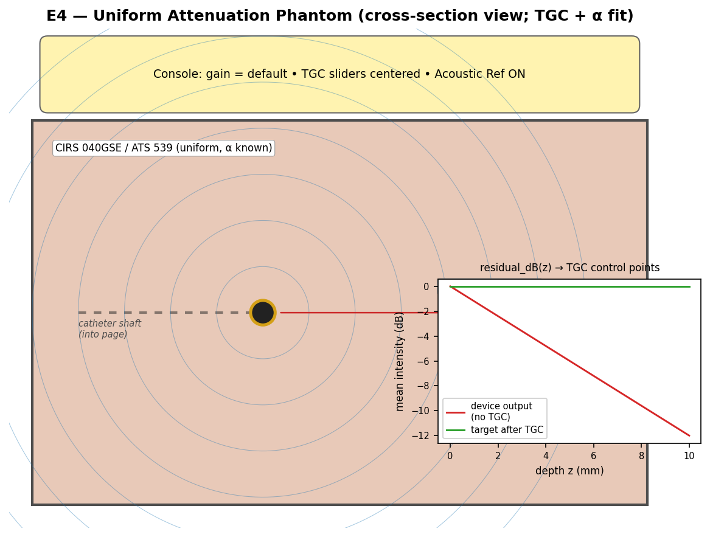

**Produces:** `processing.tgc_control_points`, `materials[].attenuation_db_per_cm_mhz`
prior, refined `probe.speed_of_sound_mm_per_us`.

### Equipment

| Item | Spec | Tolerance |
|------|------|-----------|
| Uniform tissue-mimicking phantom | CIRS Model 040GSE, 0.5 dB/cm/MHz, with 2.7 F-compatible IVUS channel; **or** DIY agar/graphite phantom — see [Appendix A.2](#a2--uniform-tissue-mimicking-phantom-e4) | α calibrated to ±0.05 dB/cm/MHz (manufacturer) or ±0.10 dB/cm/MHz (DIY, by transmission-substitution); T-corrected |
| Phantom temperature | 22 ± 1 °C | equilibrate ≥ 4 h |

### Console settings

| Setting | Value |
|---------|-------|
| Diameter | 16 mm (= manual default for service tests) |
| Gain | 50 (manual default) |
| TGC | all sliders centered |
| Acoustic Reference | ON |
| Speckle reduction | OFF |

### Procedure

1. Insert the catheter into the phantom’s IVUS channel; advance to the marked center.
2. Allow ≥ 60 s of equilibration after movement.
3. Capture **30 frames** at static position with the settings above.
4. Repeat at 3 axially separated channel positions (5 mm apart) — each is a replicate.

### Data to acquire

- `e4_posK_rf.npy` for K = 1..3 — RF or polar B-mode.
- `e4_metadata.json` — phantom S/N, α_spec, T_phantom, gain, TGC, console build.

### Analysis

1. Convert each frame to polar B-mode (angle × depth).
2. Mask out the inner 0–2 mm (ring-down zone) and the outer 0.5 mm (boundary echoes).
3. Compute mean intensity vs depth `I(z) = mean_θ B(θ, z)`.
4. Convert to dB and average across the 3 replicate positions.

| Output | Method |
|--------|--------|
| Effective α (verify phantom) | Slope of `I_dB(z)` ÷ (2 · f0) gives effective α (dB/cm/MHz). Must agree with manufacturer α to within ±0.10 dB/cm/MHz. |
| `tgc_control_points` | The TGC needed to flatten `I_dB(z)` is `g(z) = -I_dB(z) + I_dB(0)`. Sample at depths {0.0, 1.5, 3.0, 4.5, 6.0, 8.0} mm to define 6-point control polyline. Convert depths to cm. |
| `speed_of_sound_mm_per_us` | If the phantom contains a known-distance feature (CIRS 040GSE has line-target wire spacing), measure echo TOF and back out c. Use as a refinement to the 1.54 mm/µs default. |

### Acceptance criteria

- Replicate-to-replicate variation in `I_dB(z)` ≤ 1 dB at every depth.
- α agreement with phantom spec: within ±0.10 dB/cm/MHz.

## E5 — Cyst Phantom (speckle, noise, reject)

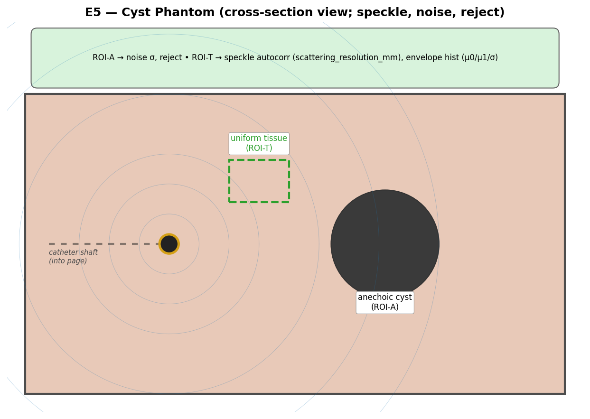

**Produces:** `processing.noise.type`, `processing.noise.sigma`,
`processing.scattering_resolution_mm`, `processing.scatter_integral_scale`,
`processing.reject_db`, prior on per-tissue scattering parameters
(`mu0`, `mu1`, `sigma`).

### Equipment

| Item | Spec | Tolerance |
|------|------|-----------|
| Cyst-bearing tissue-mimicking phantom | CIRS 040GSE (anechoic cylinders 2, 4, 6 mm dia.) or equivalent; **or** DIY phantom with PTFE-rod cyst voids — see [Appendix A.3](#a3--cyst-phantom-e5) | manufacturer-calibrated; or DIY built using the same recipe as A.2 |

### Console settings

Identical to E4 (gain = 50, TGC centered, AR ON), repeated at gain = 20 and gain = 68 for noise-floor / saturation characterization.

### Procedure

1. Position the catheter so a 4 mm anechoic cyst is in the field at z ≈ 5 mm.
2. Capture **30 frames** at gain = 50.
3. Repeat at gain = 20 and gain = 68 (same catheter position).

### Data to acquire

- `e5_gainXX_rf.npy` for XX ∈ {20, 50, 68}.
- ROI definitions: `roi_A` (anechoic interior, ≥ 3 × 3 mm² of cyst lumen, no boundary), `roi_T` (uniform tissue, ≥ 5 × 5 mm², away from any cyst or boundary).

### Analysis

| Output | Method |
|--------|--------|
| `noise.sigma` (linear units) | std of pre-envelope samples in `roi_A` at gain = 20 (clean noise floor). For envelope-only data, use Rayleigh-fit σ. |
| `noise.type` | KS-test of `roi_A` envelope histogram vs Rayleigh / Gaussian / Nakagami. Pick lowest-D test. |
| `reject_db` | `dB_below_T_at_roi_A_50_pct` — i.e. the dB level at which 50% of `roi_A` pixels fall below display threshold. |
| `scattering_resolution_mm` | 2D autocorrelation of `roi_T`; report the 1/e radius along radial and lateral axes (use mean for the scalar field). |
| `scatter_integral_scale` (provisional) | Run sim with measured material defaults; tune until simulated `roi_T` mean matches measured `roi_T` mean within 1 dB. |
| `mu0 / mu1 / sigma` priors | Fit a homodyned-K distribution to the `roi_T` envelope histogram. Map shape parameter k → μ0/μ1 (literature mapping); RMS amplitude → σ. |

### Acceptance criteria

- `roi_A` mean intensity drops by ≥ 30 dB vs `roi_T` (confirms cyst is anechoic).
- KS p-value for chosen noise distribution ≥ 0.05.
- Speckle autocorrelation length consistent across gain settings (CV ≤ 15%).

## E6 — Ring-Down Capture (Acoustic Reference)

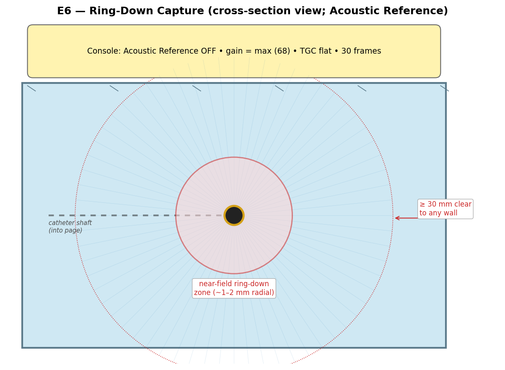

**Produces:** `processing.ring_down.amplitude`,
`processing.ring_down.extent_mm`, `processing.ring_down.decay`,
`processing.ring_down.waveform_path`.

### Equipment

| Item | Spec | Tolerance |
|------|------|-----------|
| Water tank | as in “Common equipment” | walls ≥ 30 mm clear of catheter in any direction |
| Catheter mount | suspends catheter centered in tank | catheter tip ≥ 30 mm from any wall, surface, or other object |

### Console settings

| Setting | Value |
|---------|-------|
| Diameter | 16 mm (full t_far range) |
| Gain | **68** (max) |
| TGC | all sliders centered |
| Acoustic Reference | **OFF** (this is the key requirement) |
| Speckle reduction | OFF |

### Procedure

1. Suspend the catheter in the center of the tank, away from all walls and surfaces (≥ 30 mm clearance).
2. Wait ≥ 60 s for any tank vibrations / bubbles to settle.
3. Capture **300 A-lines × 30 frames** at the same angular position.
4. Save the device’s on-board "Acoustic Reference" file via the service interface (this is the device's stored ring-down template — useful for cross-validation).
5. Repeat with Acoustic Reference **ON**, same conditions, 30 frames (delta capture for validation).

### Data to acquire

- `e6_ar_off_rf.npy` — shape (30, N_az, N_samples).
- `e6_ar_on_rf.npy` — same, with AR ON.
- `e6_device_acoustic_reference.bin` — exported from console (if accessible).

### Analysis

1. Compute `mean_aline = mean over angles and frames of |envelope(rf_off)|`.
2. Compute the noise floor σ_n from the deep portion (z > t_far − 0.5 mm).

| Output | Method |
|--------|--------|
| `ring_down.amplitude` | `max_z mean_aline(z)` (typically near z = 0). Report in linear and dB-of-saturation. |
| `ring_down.extent_mm` | Smallest z at which `mean_aline(z) < 3 σ_n`. |
| `ring_down.decay` | Fit `A · exp(−z/τ)` and `A · 0.5(1 + cos(πz/L))` to `mean_aline(z)` over [0, extent]. Pick lower-RMSE form. Save τ or L. |
| `ring_down.waveform_path` | Save `mean_aline(z)` as a 1D float on the simulator’s 40 MHz grid (resample if device fs differs). |
| Validation | `mean over angles and frames of envelope(rf_on)` should be within ±10% of `mean_aline(z) − device_acoustic_reference(z)` over [0, extent]. |

### Acceptance criteria

- Per-frame A-line variation in the inner 2 mm ≤ 5% (the bias is deterministic).
- Validation step matches AR-ON capture within ±10%.

## E7 — Grayscale / Compression Calibration

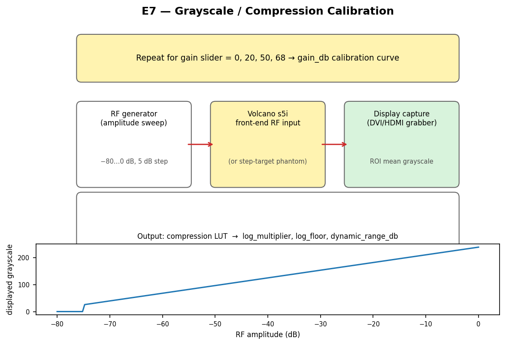

**Produces:** `processing.compression_lut`, `processing.log_multiplier`,
`processing.log_floor`, `processing.dynamic_range_db`,
`processing.gain_db` (slider→dB mapping).

### Equipment (preferred — RF injection)

| Item | Spec | Tolerance |
|------|------|-----------|
| Programmable RF generator | DDS, ≥ 50 MHz BW, ≥ 14-bit amplitude | amplitude accuracy ≤ ±0.5 dB |
| Variable RF attenuator | 0–80 dB, 1 dB steps | calibrated, ≤ ±0.2 dB step error |
| Front-end coupling jig | injects RF at the catheter connector in place of the active element | shielded, return loss ≥ 30 dB |
| Frame grabber | DVI/HDMI capture, lossless 8-bit | full 0–255 range preserved |

### Equipment (fallback — step phantom)

| Item | Spec | Tolerance |
|------|------|-----------|
| Step-target tissue-mimicking phantom | CIRS 044, multi-step grayscale targets at 0/3/6/9/12/15/18 dB below background; **or** DIY 6-chamber concentric phantom — see [Appendix A.4](#a4--step-attenuation-phantom-e7-fallback) | manufacturer ±0.5 dB; DIY ±1 dB if α calibrated by transmission-substitution per chamber |

### Console settings

| Setting | Value |
|---------|-------|
| Acoustic Reference | ON (default) |
| TGC | all sliders centered |
| Dynamic range / persistence | factory default |
| Speckle reduction | OFF |

### Procedure (RF injection)

1. Disconnect the catheter element; connect the RF generator through the coupling jig.
2. Inject a damped sinusoid at f0 with amplitude `A` set by the attenuator.
3. For each gain setting `g ∈ {0, 20, 50, 68}`:
   1. For each amplitude `A ∈ {-80, -75, ..., 0} dB`:
      - Capture display ROI mean grayscale (200 × 200 px ROI at the depth of the simulated echo).
      - Wait ≥ 1 s for any temporal averaging on the device to settle.
4. Total: 4 gains × 17 amplitudes = 68 calibration points.

### Procedure (fallback)

1. Place the step-phantom in the field; image so all step targets fit in one frame.
2. For each gain `g ∈ {0, 20, 50, 68}`: capture 30 frames, average, extract per-step mean grayscale and per-step nominal dB.
3. Use only the linear (non-saturated, non-clipped) portion of the curve.

### Data to acquire

- `e7_gainXX_lut.csv` — columns: amplitude_dB, mean_grayscale, std_grayscale.

### Analysis

| Output | Method |
|--------|--------|
| `compression_lut` | At gain = 50, the mapping `RF_amplitude (linear) → grayscale (uint8)` is the stored LUT (256 entries). Linearly interpolate between the 17 calibration points. Save as JSON array. |
| `log_multiplier` | Slope of `grayscale vs 20·log10(amplitude_linear)` in the linear region (typically 100 ≤ grayscale ≤ 200). |
| `log_floor` | Largest amplitude at which grayscale = 11 (palette black floor; manual p.141). |
| `dynamic_range_db` | `20·log10(A_at_grayscale=239 / A_at_grayscale=11)`. |
| `gain_db(slider)` | For each gain g, find the dB shift in the calibration curve relative to g = 0. Output a 4-point table `slider → dB`. |

### Acceptance criteria

- Calibration repeatability (ROI std at each amplitude) ≤ 1 grayscale unit.
- Monotonicity: LUT must be non-decreasing.
- gain_db curve linearity across the four sliders: residual ≤ 1 dB.

## E8 — Tissue / Material Fit

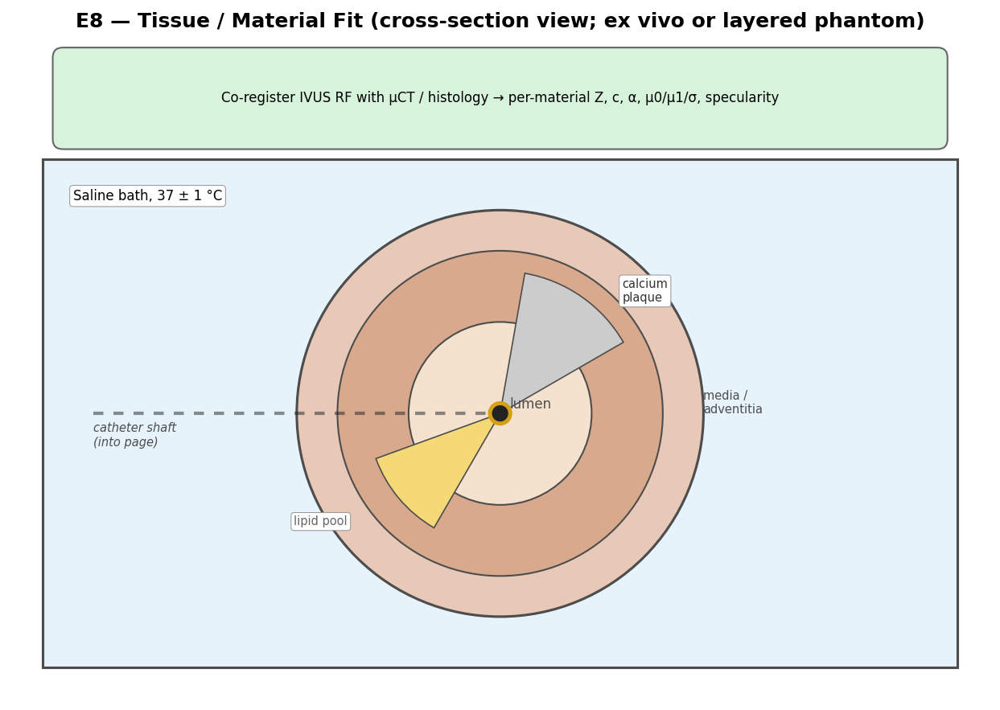

**Produces:** per-material `impedance_mrayl`, `speed_of_sound_m_per_s`,
`attenuation_db_per_cm_mhz`, `mu0`, `mu1`, `sigma`, `specularity` for
`lumen`, `vessel_wall` (intima / media / adventitia), `extravascular`,
`calcium`, `fibrous`, `lipid_pool`.

### Equipment

| Item | Spec | Tolerance |
|------|------|-----------|
| Ex vivo arterial samples | porcine LAD or human cadaver coronary; or CIRS 067 IVUS plaque phantom; **or** DIY layered tissue surrogate — see [Appendix A.5](#a5--layered-tissue-surrogate-e8) | preserved at 4 °C, used within 48 h of harvest; warmed to 37 °C for imaging |
| Saline bath | 0.9% physiological saline | T = 37 ± 1 °C; degassed |
| Sample fixture | IVUS-channel through a saline-filled trough; gentle vessel mounts | maintains lumen geometry |
| Reference modality | µCT (≤ 50 µm voxel) or histology (≤ 5 µm/pixel) | co-registered to IVUS using fiducials (e.g. metal pins inserted before µCT) |

### Console settings

Identical to E4 (gain = 50, TGC centered, AR ON).

### Procedure

1. Mount the sample in the saline trough; insert the catheter into the lumen.
2. Acquire **30 frames** at each of 3 longitudinal positions per sample.
3. After IVUS imaging (without disturbing the sample) acquire µCT or histology.
4. Co-register IVUS frames to µCT/histology slices using the fiducial pins.
5. For each material class, manually segment ROIs ≥ 3 × 3 mm² (or the largest possible).

### Data to acquire

- `e8_sampleK_posJ_rf.npy`, `e8_sampleK_posJ_bmode.png`.
- `e8_sampleK_uct.nrrd` or histology TIFFs.
- `e8_sampleK_segmentation.nii.gz` — per-material masks co-registered to IVUS.

### Analysis

For each material:

| Output | Method |
|--------|--------|
| `impedance_mrayl` | Identify a clean interface between this material and a reference material (saline / known phantom). Measure reflection amplitude `R_meas` at normal incidence. Solve `Z = Z_ref · (1 + R_meas) / (1 − R_meas)` (sign from phase). Use ≥ 5 interface segments per material; report median ± IQR. |
| `speed_of_sound_m_per_s` | TOF through known thickness (from µCT). `c = 2·d_uct / Δt_echo`. ≥ 5 thickness measurements per material. |
| `attenuation_db_per_cm_mhz` | Within a homogeneous ROI ≥ 3 mm thick, fit `ln(env(z))` vs depth. Slope / (2·f0) = α. |
| `mu0 / mu1 / sigma` | Homodyned-K fit to the envelope histogram of the material ROI (as in E5). |
| `specularity` | For the vessel wall: extract `R(θ)` at oblique segments where `θ_inc` can be computed from local wall normal (from µCT). Fit `R(θ) = R0 · cos^n(θ)`; `specularity = n / N` (mapped to the simulator’s 0–1 range). |

### Acceptance criteria

- ≥ 3 independent samples per material class.
- Per-material parameter CV across samples ≤ 30%.
- µCT–IVUS co-registration error ≤ 0.2 mm (RMSE on fiducials).

## E9 — Acquisition Timing Log (deferred layer)

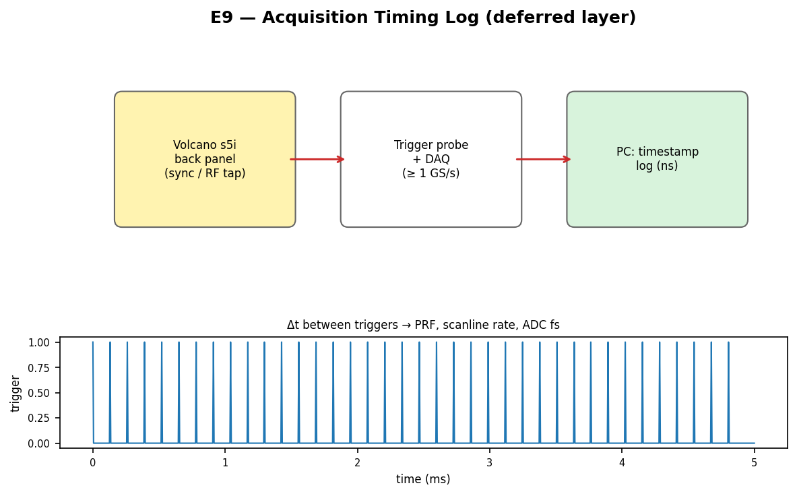

**Produces:** `PRF`, `frame_rate`, `scanline_rate`, `ADC sampling rate`.
These are *not* part of the per-frame raysim config but feed the motion /
acquisition layer (see CSV "Deferred" section).

### Equipment

| Item | Spec | Tolerance |
|------|------|-----------|
| Trigger probe / sync tap | high-impedance probe on console’s RF or sync line | bandwidth ≥ 2× f0 |
| DAQ / oscilloscope | ≥ 1 GS/s, ≥ 1 GHz analog BW, deep memory | timestamp jitter ≤ 1 ns |

### Console settings

Whatever clinical preset is being characterized (e.g. 30 fps, Diameter = 16 mm).

### Procedure

1. Tap the sync line; capture 10 s of trigger pulses at the DAQ.
2. Repeat for each frame-rate preset (10, 15, 30 fps) and each Diameter setting of interest.

### Data to acquire

- `e9_presetXX_triggers.npy` — float64 timestamps in seconds.

### Analysis

| Output | Method |
|--------|--------|
| `PRF` | Median of `1 / Δt_trigger`. |
| `frame_rate` | `1 / Δt_first_trigger_per_frame` (frame boundaries detected by long Δt). |
| `scanline_rate` | `frame_rate × num_scanlines`. |
| `ADC sampling rate` (cross-check) | If RF stream is also captured, count samples per known round-trip from E1 reflector. |

### Acceptance criteria

- PRF jitter (std/mean) ≤ 0.1%.
- Frame-rate measurement matches console label within ±0.2 fps.

## Summary table — what each experiment produces

| Experiment | Days | Primary outputs |
|------------|------|-----------------|
| E1 — Pulse-echo (radial flat plate) | 0.5 | impulse response, pulse duration, fs, buffer size |
| E2 — Spiral wire-phantom PSF | 1.0 | element_radius, focal_length, depth-dependent lateral PSF, azimuthal-uniformity QC |
| E3 — Slice thickness (along catheter axis) | 0.5 | elevational_height |
| E4 — Attenuation phantom | 0.5 | TGC control points, α prior, refined c |
| E5 — Cyst phantom | 0.5 | noise σ, scattering_resolution_mm, scatter scale, reject, μ priors |
| E6 — Ring-down | 0.5 | ring_down amplitude / extent / decay / waveform |
| E7 — Grayscale / compression | 0.5 (RF) / 1 (phantom) | compression LUT, log_multiplier, log_floor, dynamic range, gain map |
| E8 — Tissue fit | 3+ (per sample lot) | per-material Z, c, α, μ0/μ1/σ, specularity |
| E9 — Timing log | 0.25 | PRF, frame rate, scanline rate, ADC fs |

**Recommended order:** E1 → E2 → E3 → E6 → E4 → E5 → E7 → E8, with E9 anytime.

## Reproducibility

All schematic figures in this document are generated by:

```
PYTHONPATH=/path/to/matplotlib MPLBACKEND=Agg python3 tools/gen_calibration_figures.py
```

The hardware STL files (Appendix A) are generated by:

```
PYTHONPATH=/path/to/trimesh:/path/to/shapely:/path/to/manifold3d \
  python3 tools/gen_phantom_stl.py
```

The hardware preview renders are generated by:

```
PYTHONPATH=/path/to/trimesh:/path/to/matplotlib MPLBACKEND=Agg \
  python3 tools/gen_hardware_previews.py
```

All three scripts read the same shared dimensions, so editing one source of
truth (`tools/gen_phantom_stl.py`) regenerates consistent geometry across
STLs, renders, and protocol figures.

## Appendix A — Phantom & Fixture Construction

This appendix describes how to build the phantoms called for in the
experiments above. Wherever a commercial calibrated phantom (CIRS / ATS /
Sun Nuclear) is available you should prefer it because the manufacturer
provides traceable α and grayscale specifications. The DIY recipes below
are validated reproductions of the literature standards (Madsen 1978,
Madsen 1998, Ramnarine 2001, Browne 2003) and are sufficient for
**simulator-input characterization** when paired with a one-time
transmission-substitution α measurement (see A.6).

All printed parts are designed for FDM with a **0.4 mm nozzle**, **0.2 mm
layer height**, **≥ 30 % infill**, **≥ 3 perimeters**, and **PETG** or
**ABS** filament (PLA is acoustically acceptable but warps in warm gel —
avoid it for the molds). Acetone-vapor smoothing of ABS is recommended for
mold surfaces if you want a glassy finish; otherwise expect mild ridging
on the gel surface (acoustically harmless because it is below the resolution
limit).

The Python source for every printed part is `tools/gen_phantom_stl.py` —
edit dimensions there and rerun to regenerate the STLs.

### A.1 — Wire-spiral fixture (E2)

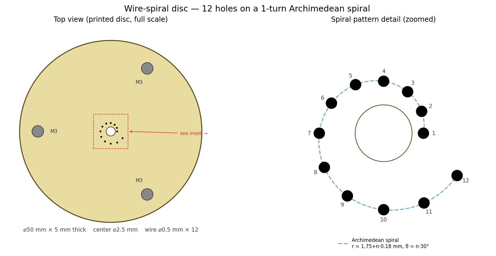
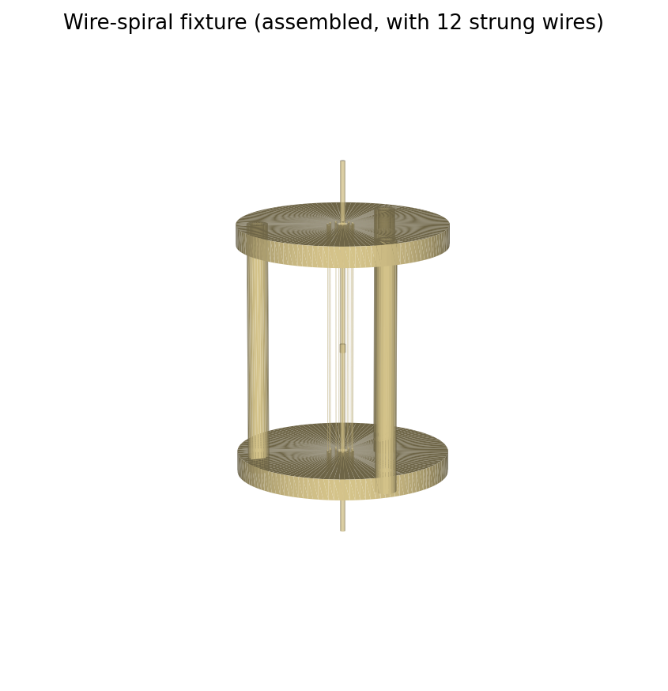

**STL files:**
- `hardware/wire_spiral_disc.stl` — print **2 ×**.
- `hardware/wire_spiral_assembly.stl` — visual reference only (do not print).

**Disc geometry (matches the protocol's spiral parameters):**

| Feature | Value |
|---------|-------|
| Outer diameter | 50.0 mm |
| Thickness | 5.0 mm |
| Center catheter hole | ⌀2.5 mm (clearance + centering for the ⌀1.17 mm Eagle Eye Gold catheter) |
| Wire holes | ⌀0.5 mm × 12, on `r_n = 1.75 + n·0.18 mm`, `θ_n = n·30°` (n = 0…11) |
| Standoff holes | ⌀3.2 mm × 3, on a ⌀40 mm BCD at 60° / 180° / 300° |

**Bill of materials:**

| Item | Spec | Qty |
|------|------|-----|
| Printed disc (`wire_spiral_disc.stl`) | PETG, ≥ 30 % infill | 2 |
| M3 × 50 mm threaded standoffs (M3-F/M3-F) | stainless steel, hex flat-to-flat ≤ 5 mm | 3 |
| M3 × 6 mm pan-head screws | stainless | 6 |
| Tungsten wire | ⌀25 µm, ≥ 250 mm uncut length | 12 |
| Cyanoacrylate adhesive | thin-CA (e.g. Loctite 416) | 1 vial |
| (optional) M3 nylon nuts | for fine wire-tension trim | 12 |

**Assembly:**

1. Inspect both printed discs; deburr the wire-hole exits with a 0.6 mm
   drill bit (twist by hand, do not power-drill).
2. Stack the discs flat, hole-pattern aligned. Insert the 3 standoffs
   through the 3.2 mm BCD holes and screw both ends with M3 × 6 screws so
   the discs are parallel and 50 mm apart. Verify with calipers that the
   disc-to-disc spacing is **50 ± 0.2 mm** at all 3 standoff positions.
3. **Wire stringing.** Working from the outside (n = 12, r = 3.73 mm) to
   the inside (n = 1, r = 1.75 mm):
   - Cut a 250 mm length of 25 µm tungsten wire.
   - Thread one end through the corresponding hole in the **bottom** disc
     and tape it taut to the underside.
   - Thread the other end through the matching hole in the **top** disc.
   - Pull by hand to remove sag (target tension ≈ 1 N — judged by the
     wire's first-mode vibration frequency `f₁ ≈ 220 Hz` for a 50 mm
     span). Hold tension and apply a 1 mm bead of thin-CA at the top exit
     to lock the wire. After cure (≈ 30 s) trim the bottom tape and CA
     the bottom exit too.
4. Repeat for all 12 wires. Take care to thread strictly inside-out so
   adjacent wires do not catch each other during pulling.
5. **QC.** Photograph the assembly down the catheter axis with a USB
   microscope and 0.1 mm graticule:
   - All 12 wires must lie within ±50 µm of the design `(r, θ)`.
   - All wires must appear straight in both top-view and side-view photos
     (sag ≤ 50 µm).
   - Document every wire's measured `(r, θ)` in `e2_wire_positions.csv`.

**Catheter mounting:** the catheter is fed up through the bottom disc's
center hole, through the 50 mm wire span, and out the top disc. The disc
holes are an interference-fit slip on the 1.17 mm Eagle Eye Gold catheter;
the catheter is held coaxially by both end discs simultaneously.

### A.2 — Uniform tissue-mimicking phantom (E4)

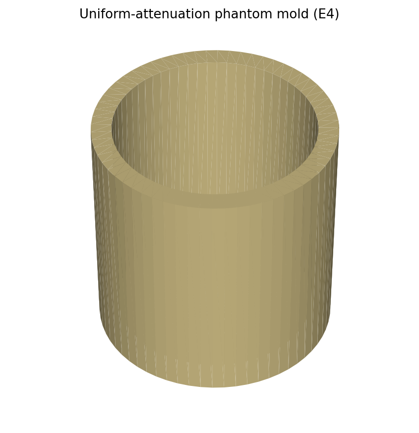

**STL file:** `hardware/phantom_mold_uniform.stl`. Print 1 × (PETG,
re-usable).

**Recipe (Madsen-style agar / graphite, scaled to a 60 × 60 mm phantom):**

| Component | Mass / volume | Function | Tolerance |
|-----------|---------------|----------|-----------|
| Distilled, degassed water | 188 g | gel solvent | ±1 g |
| Agar (high-strength, 600 g cm⁻²) | 6 g (3 % w/w) | gel matrix | ±0.05 g |
| n-Propanol (≥ 99 %) | 14 g (7 % w/w) | sound-speed adjuster (target 1540 m/s) | ±0.2 g |
| Graphite powder, 3 µm flake | 4 g (2 % w/w) | acoustic scatterer + attenuator (target α ≈ 0.5 dB/cm/MHz) | ±0.05 g |
| Potassium sorbate | 0.4 g (0.2 % w/w) | preservative | ±0.05 g |
| Surfactant (Tween-20) | 0.2 g (0.1 % w/w) | wet the graphite | drop count is fine |

Theoretical α (recipe-only) ≈ **0.50 dB/cm/MHz**, c ≈ **1540 m/s**, ρ ≈
1030 kg/m³, Z ≈ 1.59 MRayl. This is sufficient for the **prior** in the
parameter sheet but the actual α **must** be measured per A.6 if you want
α to ±0.10 dB/cm/MHz.

**Equipment:** 250 mL beaker, magnetic stirrer + hot plate (thermometer to
±1 °C), digital scale (≥ 0.01 g resolution), vacuum chamber (≥ 70 kPa) or
ultrasonic bath (40 kHz), printed mold A.2, ⌀1.5 mm × 80 mm PTFE rod
(catheter channel former).

**Procedure:**

1. **Prepare the mold.** Lightly oil the mold interior with a release
   agent (silicone spray). Insert the 1.5 mm PTFE rod through the floor's
   ⌀2.0 mm bore, clamp it externally above and below the mold so it
   stands centered and vertical. Stand the mold on a level surface.
2. **Hydrate the agar.** Stir 6 g agar into 100 g of cold distilled water
   in the beaker; rest 5 min to fully wet.
3. **Disperse the graphite.** In a separate beaker, stir 4 g graphite +
   0.2 g Tween-20 into 88 g of water until a uniform black slurry forms.
4. **Combine and heat.** Pour the graphite slurry into the agar slurry,
   add 0.4 g K-sorbate, stir continuously and bring the mixture to a
   gentle 90 °C boil on the hot plate (~10 min). Maintain 90 ± 2 °C for
   5 min; the agar is now fully dissolved.
5. **Cool with stirring.** Remove from heat and stir while cooling to
   60 °C (~5 min). Add the 14 g of n-propanol and stir an additional 1 min
   (do not boil after adding propanol).
6. **De-gas.** Pour into the vacuum chamber and pull ≥ 70 kPa for 5 min,
   or sonicate in the ultrasonic bath for 10 min, until visible micro-
   bubbles are gone.
7. **Pour the mold.** While still 50–55 °C, pour into the printed mold in
   one continuous pour. Avoid splashing onto the mold walls above the fill
   line. Tap the mold gently on the bench to release wall-bubbles.
8. **Set.** Cover with cling film and rest at 4 °C for ≥ 4 h. The phantom
   is ready when the surface is firm and clear.
9. **Demold:** trim with a scalpel along the lip; gently extract the
   PTFE rod by pulling vertically (the channel will be ~1.6 mm ID, slip
   fit on the 1.17 mm catheter).
10. **Storage.** Wrap in cling film + sealed bag at 4 °C; usable for
    14 days. Add a 1 cm³ K-sorbate top-up gel layer if the surface dries.

**Acceptance criteria:**

- Visible homogeneity: no graphite settling layer at the bottom.
- Mass after demold within ±2 % of the design mass (212.6 g) — confirms
  full liquid was retained.
- Channel concentricity ≤ 0.3 mm offset from the geometric center
  (measured by inserting a ⌀1.5 mm pin and visualizing through the gel).
- Independent α measurement (A.6) within ±0.15 dB/cm/MHz of the recipe
  target.

### A.3 — Cyst phantom (E5)

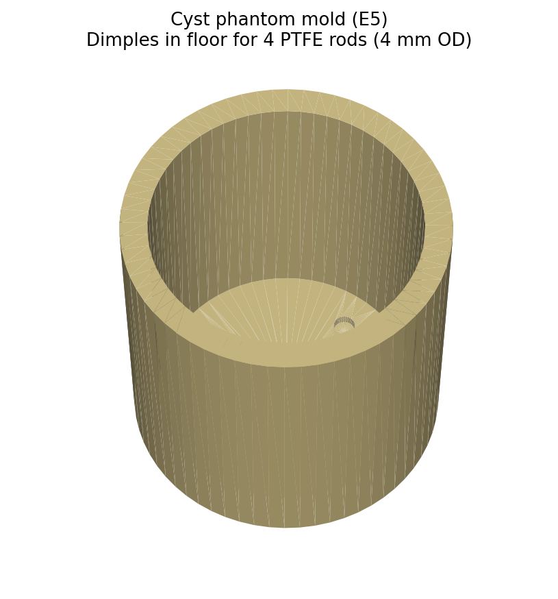

**STL file:** `hardware/phantom_mold_cyst.stl`. Same shell as A.2 but with
4 dimples in the floor at radii 10, 14, 14, 18 mm (azimuths 0°, 90°,
180°, 270°) for inserting cyst-forming PTFE rods.

**Materials:** A.2 gel recipe + four ⌀4 mm × 60 mm PTFE rods. The 4 cyst
rods press-fit into the floor dimples and stand vertically while the gel
sets.

**Procedure:**

1. Prepare the mold as in A.2 (oil + insert ⌀1.5 mm catheter rod).
2. Press the four ⌀4 mm PTFE rods firmly into the floor dimples until
   bottomed; verify each is vertical with a small bubble level.
3. Cast the A.2 gel as in A.2 steps 2–8.
4. **Demold:** extract the catheter rod (vertical pull) and the four cyst
   rods (twist + vertical pull). The four cylindrical voids are the
   anechoic cysts.

**Acceptance criteria:**

- All 4 cyst voids cleanly demolded, walls intact.
- Each cyst's diameter at the imaging plane within ±0.2 mm of 4.0 mm
  (measured optically through the gel with a USB microscope + graticule
  card behind the phantom).
- Cyst-to-catheter radial distance (10, 14, 14, 18 mm) verified ≤ 0.3 mm
  error using the same optical setup.

If you want the standard CIRS 040GSE diameters (2 mm, 4 mm, 6 mm) instead
of 4 × 4 mm, edit `CYST_ROD_DIA` and `CYST_RADII_MM` in
`tools/gen_phantom_stl.py` and regenerate the STL. Use ⌀2 mm and ⌀6 mm
PTFE rods accordingly.

### A.4 — Step-attenuation phantom (E7 fallback)

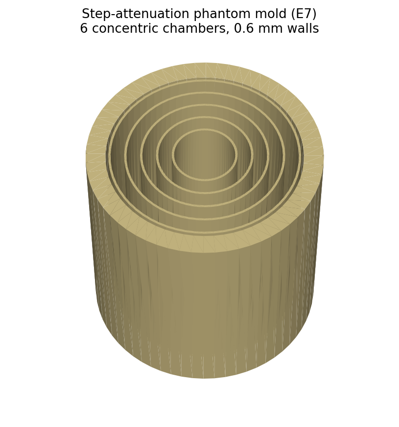

**STL file:** `hardware/phantom_step_mold.stl`. Single mold with **6
concentric chambers** separated by 0.6 mm integral walls at radii 8, 12,
16, 20, 24 mm. Each chamber is filled with a different graphite
concentration to make a stepped-attenuation / stepped-grayscale target.

**Recipe — vary graphite ONLY across chambers:**

| Chamber | Inner-outer radii (mm) | Graphite (% w/w) | Target α (dB/cm/MHz) | Brightness vs. ch. 4 (dB) |
|---------|------------------------|-------------------|-----------------------|----------------------------|
| 1 (center) | 0–8 | 0.5 | 0.20 | −15 |
| 2 | 8.3–11.7 | 1.0 | 0.32 | −9 |
| 3 | 12.3–15.7 | 1.5 | 0.42 | −5 |
| 4 (reference) | 16.3–19.7 | 2.0 | 0.50 | 0 |
| 5 | 20.3–23.7 | 2.5 | 0.60 | +4 |
| 6 (outer) | 24.3–25.0 | 3.0 | 0.72 | +7 |

All chambers use the same A.2 base recipe (water + agar + n-propanol +
K-sorbate + Tween-20); only the graphite mass changes. Compute the new
graphite mass for each chamber from the percentages above multiplied by
the chamber's water mass:

| Chamber | Approx. liquid volume (mL) | Water (g) | Graphite (g) |
|---------|----------------------------|-----------|----------------|
| 1 | 12.0 | 11.5 | 0.058 |
| 2 |  6.4 |  6.1 | 0.061 |
| 3 |  9.0 |  8.6 | 0.130 |
| 4 | 11.7 | 11.2 | 0.225 |
| 5 | 14.4 | 13.8 | 0.346 |
| 6 |  4.6 |  4.4 | 0.132 |

*(Volumes assume 50 mm chamber height. Always batch ≥ 1.3× the chamber
volume to allow for spill / surface-tension losses.)*

**Procedure:**

1. Print and prepare the mold; insert the catheter PTFE rod.
2. **Cast each chamber individually**, working from the **outer** chamber
   inward (chamber 6 → 5 → 4 → 3 → 2 → 1). Pour each chamber, allow it to
   set partially (≈ 10 min at 4 °C — the chamber walls are very thin so
   the next pour cannot displace a partially-set neighbor) before pouring
   the adjacent inner chamber.
3. Use the smaller A.2 batch sizes (scale all reagents to the chamber's
   liquid volume).
4. After all chambers are poured, allow the assembly to set ≥ 4 h at
   4 °C. **Do not demold**; the phantom is used in-mold (the printed
   walls are part of the acoustic structure but they are 0.6 mm thick
   PETG which contributes ≤ 0.5 dB extra attenuation between rings —
   document this in metadata if you need an absolute α calibration).

**Acceptance criteria:**

- Chamber-to-chamber boundary visible as a thin bright line in the IVUS
  image (the PETG wall) at the design radii (8, 12, 16, 20, 24 mm) within
  ±0.3 mm.
- Mean grayscale of each chamber stratifies monotonically with graphite
  fraction.

### A.5 — Layered tissue surrogate (E8)

E8 ideally uses real tissue (porcine LAD ex vivo, human cadaver coronary)
to capture the per-material acoustic properties used by the simulator.
A DIY surrogate cannot replace tissue for the final material database,
but the recipes below are useful for **rehearsing the E8 procedure** and
for sanity-checking the analysis pipeline before committing precious
tissue samples.

**Surrogate stack (cylindrical, 50 mm long):**

| Layer (radial extent) | Mimics | Recipe |
|------------------------|--------|--------|
| 0–3 mm | blood-filled lumen | water + 0.5 % graphite (very low scatter) |
| 3–4 mm | intima | A.2 gel, **1.5 % graphite** |
| 4–6 mm | media | A.2 gel, **2.5 % graphite** |
| 6–7 mm | adventitia | A.2 gel, **3.5 % graphite + 5 % cellulose powder** (high scatter) |
| 7–10 mm | peri-adventitial fat | 1:1 lard:gelatin (10 % w/w gelatin), no graphite |

**Procedure:**

1. Print a 50 mm-tall, 25 mm-OD cylindrical mold (the A.2 mold can be
   re-used by inverting and machining out the floor; or print a custom
   open-ended tube — see `tools/gen_phantom_stl.py` to generate one).
2. Cast each layer in turn, **working radially outward**, using a series
   of removable PTFE collar tubes at each layer boundary (⌀6, 8, 12, 14
   mm OD wall thickness ≤ 0.6 mm). After a layer sets, remove its
   bounding collar and pour the next layer directly against the
   already-set inner gel.
3. The lumen layer (0–3 mm) is poured *last* using a thinner gel that
   stays liquid long enough to fully wet the catheter channel.

This is a substantial multi-day cast; only attempt it if real tissue is
unavailable.

### A.6 — Independent α calibration (transmission-substitution)

For all DIY phantoms above, the recipe gives an α prior good to about
±0.2 dB/cm/MHz. To tighten this you need a **one-time** independent
measurement using two unfocused 20 MHz transducers in a transmission
geometry. This calibration is performed **once per phantom batch**, not
per experiment.

**Equipment:** two unfocused 20 MHz transducers (e.g. Olympus V317-SU,
6.35 mm dia.), broadband pulser/receiver (Olympus 5072PR or equivalent),
12-bit DAQ ≥ 100 MS/s, water tank with the two transducers facing each
other 30 mm apart, one 10 mm-thick sample of the phantom material poured
into a thin acrylic ring (cast separately at the same time as the main
phantom), thermometer.

**Procedure:**

1. Place the two transducers face-to-face, 30 mm apart, aligned ≤ 0.1°
   off-axis. Pulse from one, receive on the other; record the through-
   water reference RF `r_water(t)`.
2. Insert the 10 mm phantom-material slab between the transducers,
   reposition transducers so the through-distance is still 30 mm
   (sample slab + 20 mm water). Record `r_sample(t)`.
3. Fourier-transform both signals. Compute the per-frequency
   transmission coefficient `T(f) = |R_sample(f)| / |R_water(f)|` and the
   per-frequency attenuation `α(f) = −20·log10(T(f) · 4·Z_w·Z_s /
   (Z_w+Z_s)²) / d_sample` (the parenthesized term corrects for the two
   water-sample interface reflections; for graphite-loaded gel, Z_s ≈
   1.59 MRayl, so the interface correction is ≈ 0.05 dB and can usually
   be neglected).
4. Fit `α(f) = α₀ · f` over 10–25 MHz; the slope is α in dB/cm/MHz.

**Result:** the calibrated α value goes into the `Source` field of the
parameter table for E4 (replacing the recipe-prior value).

### A.7 — Mold print settings & acceptance

| Parameter | Setting |
|-----------|---------|
| Filament | PETG (preferred) or ABS |
| Layer height | 0.20 mm |
| Walls / perimeters | 4 |
| Top / bottom solid layers | 6 |
| Infill | 30 % gyroid |
| Print speed | ≤ 60 mm/s for outer perimeters |
| Bed temp | 80 °C (PETG) / 100 °C (ABS) |
| First-layer flow | 110 % (for water-tight floor) |

**Print acceptance:**

- Floor is water-tight: fill with water for 10 min and confirm zero
  weeping at the floor seam.
- All design dimensions within ±0.2 mm of nominal (calliper check on the
  outer diameter, inner diameter, and floor thickness).
- Catheter bore is straight (insert a ⌀1.5 mm steel pin; pin must drop
  through under its own weight).
- For the step mold (A.4), each integral divider wall is fully fused to
  the floor (visual check; no light gap when held to a lamp).
