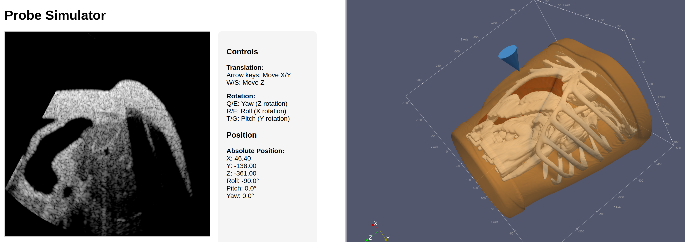

# Isaac for Healthcare - Sensor Simulation

This repository contains high-performance GPU-accelerated sensor simulation tools for healthcare applications, powered by NVIDIA technologies.

## Components

### Vessel Generator

Procedural peripheral-vessel geometry and paired IVUS dataset generation
for ML training. Builds trilaminar anatomy, samples probe poses, and
renders B-mode + segmentation frames through the calibrated simulator.

[Quick start](../vessel-generator/docs/quickstart.md) · [README](../vessel-generator/README.md)

### Ultrasound Raytracing Simulator




A high-performance GPU-accelerated ultrasound simulator using NVIDIA OptiX raytracing with Python bindings. This simulator enables real-time ultrasound simulation for training, research, and development purposes.

Key features:
- GPU acceleration with CUDA and NVIDIA OptiX
- Python interface for ease of use
- Real-time simulation capabilities

[Learn more about the Ultrasound Raytracing Simulator](./ultrasound-raytracing/README.md)

## Repository Structure

```
i4h-sensor-simulation/
├── docs/                      # Cross-component documentation
│   ├── ultrasound_simulator_foundations.md    # Physics primer
│   ├── ultrasound_simulator_technical_guide.md# Pipeline + physics deep dive
│   ├── ultrasound_simulator_tutorial.md       # Hands-on tutorial (7+ examples)
│   └── simulation_acceptance_criteria.md      # Porcine-lab acceptance gates
├── ultrasound-raytracing/     # Ultrasound raytracing simulator
    ├── .devcontainer/         # Development container configuration
    ├── cmake/                 # CMake build configuration
    ├── configs/               # Reference simulator configurations
    ├── csrc/                  # C++/CUDA source code
    ├── docs/                  # Simulator-local docs (quick_start, vm_setup, docker_build, ivus writeup)
    ├── examples/              # Usage examples and demos
    ├── include/               # C++ header files
    ├── mesh/                  # Bundled phantom meshes (cylinder, etc.)
    ├── raysim/                # Python package and bindings
    └── utils/                 # Utility scripts (phantom maker, etc.)
```

`vessel-generator/` is a sibling package in the same monorepo root
(`../vessel-generator` from this directory) for procedural anatomy and paired
dataset generation.

## Requirements

- NVIDIA GPU with CUDA support
- NVIDIA Driver 555+
- CUDA 12.6+
- CMake 3.24+
- Python 3.10+

See individual component READMEs for specific requirements.

## Getting Started

1. Clone this repository:
   ```bash
   git clone https://github.com/isaac-for-healthcare/i4h-sensor-simulation.git
   cd i4h-sensor-simulation
   ```

2. Pick a starting point:
   - **Just want a rendered frame?** → [Quick Start](./ultrasound-raytracing/docs/quick_start.md)
   - **Generate realistic IVUS training data?** → [Vessel Generator Quick Start](../vessel-generator/docs/quickstart.md)
   - **Setting up a fresh cloud GPU?** → [VM Setup (GCP)](./ultrasound-raytracing/docs/vm_setup.md)
   - **Installing on a machine you already own?** → [Simulator README](./ultrasound-raytracing/README.md)
   - **Want to learn the simulator step by step?** → [Tutorial](./docs/ultrasound_simulator_tutorial.md)
   - **Curious about the physics?** → [Technical Guide](./docs/ultrasound_simulator_technical_guide.md)


## License

This project is licensed under the Apache License 2.0 - see the [LICENSE](./LICENSE) file for details.

## Security

Please see our [Security Policy](./SECURITY.md) for information on reporting security vulnerabilities.

## Support

For questions and support, please open an issue in the GitHub repository.
