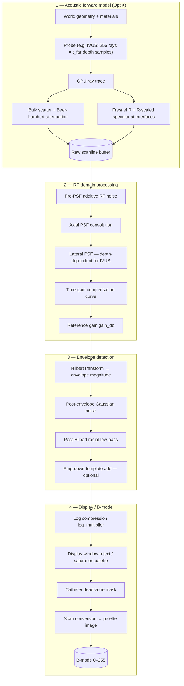

# Ultrasound Simulator Technical Guide

This guide explains the technical implementation and physical principles behind the GPU-accelerated raytracing ultrasound simulator.

> 💡 **Looking for an end-to-end picture first?** Jump to [§2 Pipeline overview](#2-pipeline-overview) for the 4-stage block diagram.
>
> 📖 **For IVUS-specific implementation details** (probe class, depth-dependent lateral PSF, IVUS scan conversion, etc.), see the companion [IVUS Implementation Writeup](../ultrasound-raytracing/docs/ivus_implementation_writeup.md).

## 1. Ultrasound Physics and Ray-Based Modeling

### 1.1 Basic Ultrasound Physics

Ultrasound imaging relies on high-frequency sound waves (typically 1-20 MHz) propagating through tissue. The fundamental physical principles include:

- **Wave Propagation**: Ultrasound travels as a mechanical pressure wave through tissue at speeds of approximately 1540 m/s (varying by tissue type)
- **Wavelength**: For medical ultrasound at 5 MHz, the wavelength is approximately 0.3 mm in soft tissue
- **Attenuation**: As ultrasound travels through tissue, its amplitude decreases exponentially with distance due to absorption and scattering
- **Reflection and Refraction**: At interfaces between tissues with different acoustic impedances, waves are partially reflected and refracted
- **Scattering**: Small tissue structure that are smaller than the wavelength of the transmitted pulse scatter ultrasound energy in multiple directions. When scattered signals return to the transducer, they create the characteristic speckle pattern

see further definitions in [Helpful Definitions](#6-helpful-definitions)

#### Point Spread Function

The Point Spread Function (PSF) represents how the imaging system responds to a point reflector and defines the theoretical resolution of the ultrasound image. In our ray-based simulator:

- **PSF Implementation**: We model the PSF as a Gaussian kernel modulated by a cosine function with parameters based on:
  - Probe frequency (axial resolution)
  - Aperture size (lateral resolution)
  - Elevational height (slice thickness)

- **Resolution Modeling**: The PSF captures the key resolution limitations of real ultrasound:
  - Axial resolution: Limited by pulse length, related to transducer frequency
  - Lateral resolution: Determined by beam width, related to aperture size and focal depth

### 1.2 From Waves to Rays

Ultrasound wave propagation occurs in two distinct regions: the near field (Fresnel zone), where waves from a transducer source are complex with multiple interference patterns and curved wavefronts, and the far field (Fraunhofer zone), where waves spread in a more predictable pattern with approximately planar wavefronts. The transition between these regions occurs at approximately D²/4λ, where D is the aperture diameter and λ is the wavelength. Ultrasound imaging typically creates images in the near-field, but converts curved near-field wavefronts to coherent, flat far-field plane wave wavefronts via beamforming.

Rays model the normal direction of wavefront propagation over time. For a homogeneous medium, refraction can be ignored and wave propagation can be modeled as straight rays perpendicular to the wavefront.


While ultrasound imaging works primarily in the near-field, we can model the beamformed scanlines with parallel rays because:

1. **Beamforming Transformation**: Beamforming effectively transforms near-field waves into far-field-like behavior
2. **Primary Propagation Direction**: Each scanline has a well-defined primary direction of energy propagation
3. **Interface Physics**: Reflection and refraction at tissue interfaces follow predictable patterns similar to optical rays

This ray-based approach provides an excellent compromise between physical accuracy and computational efficiency for real-time simulation.

### 1.3 Ray-Tracing Approach

In our simulator, we model ultrasound propagation using deterministic ray tracing:

- **Ray Generation**: Rays are emitted from the transducer elements in patterns matching the probe geometry
- **Ray Propagation**: Rays travel in straight lines until encountering a tissue interface
- **Interface Interaction**: At interfaces, rays can split into reflected and refracted components using acoustic versions of optical laws:
  - Snell's law for refraction: sin(θ₁)/sin(θ₂) = c₁/c₂
  - Reflection coefficient: R = ((Z₂cos(θ₁) - Z₁cos(θ₂))/(Z₂cos(θ₁) + Z₁cos(θ₂)))²
- **Intensity Modeling**: Ray intensity diminishes with distance according to the Beer-Lambert law and tissue attenuation properties
- **Scattering**: Volume scattering is modeled using stochastic textures with tissue-specific properties

### 1.4 Limitations and Solutions

Ray-based models have inherent limitations in capturing certain wave phenomena:

| Wave Phenomenon | Ray Limitation | Solution |
|-----------------|----------------|--------------|
| Diffraction | Not directly modeled by rays | PSF convolution in post-processing |
| Interference | Not captured by individual rays | Not modeled (PSF convolution) |
| Phase information | Rays typically don't carry phase | Not modeled (amplitude-only simulation) |
| Near-field effects | Ray approximation less accurate near transducer | Focus on modeling far-field behavior |

Despite these limitations, ray-based models provide an excellent compromise between physical accuracy and computational efficiency, especially for real-time applications.

## 2. Pipeline overview

The ultrasound simulator uses NVIDIA OptiX ray tracing and CUDA to deliver high-performance real-time ultrasound image generation. Every frame flows through four stages: acoustic forward model on the GPU, an RF-domain processing chain, envelope detection, and finally display formatting.



Stage-1 implements the underlying acoustic physics: OptiX casts rays from the probe, accumulates bulk scattering with Beer–Lambert attenuation along each ray, and adds **Fresnel-coefficient–scaled specular returns at each interface** so the bench-tunable specular term cannot exceed physical reflection. Stages 2–4 mirror a clinical signal-processing chain: noise injection, PSF convolution (axial and depth-dependent lateral for IVUS), TGC, envelope detection, optional ring-down injection, log compression, and probe-specific scan conversion.

Every block in the diagram corresponds to either a CUDA kernel or a step in `RaytracingUltrasoundSimulator::simulate()`; each section below points to the implementation.

### Key Components

- **Core Physics Engine**: Ray tracing implementation using OptiX [`csrc/cuda/optix_trace.cu`]
- **Ultrasound Simulation**: Main simulation pipeline [`csrc/core/raytracing_ultrasound_simulator.cpp`]
- **CUDA Algorithms**: RF processing, envelope detection, log compression, scan conversion [`csrc/cuda/cuda_algorithms.cu`]
- **Python Interface**: Bindings + the `raysim.config` YAML-driven configuration layer [`raysim/cuda/__init__.py`, `raysim/config.py`]

## 3. Simulation Pipeline

### 3.1 Ray Generation

The simulation starts by generating rays from the face of the ultrasound transducer. The x dimension describes the position latterally (azimuthally) along the transducer surface. The y dimensions defines the elevation direction (slice thickness). By definition, transducers image in the positive z direction. The ray generation varies by probe type to model the probe dependent transmit beam sequence:

- **Curvilinear Probe**:
  - **Physical Layout**: Elements are arranged along a convex curved surface with a fixed radius
  - **Implemented Beam Pattern**: Rays originate from points along the curved surface with diverging directions forming a sector image
  - **Implementation**: [`csrc/cuda/optix_trace.cu` – see `generate_curvilinear_probe_ray_local()`]
  - **Mathematical Model**: Each ray starts at position `(R*sin(θ), y, R*(cos(θ)-1))` with direction normal to the curved surface

- **Linear Array Probe**:
  - **Physical Layout**: Elements are arranged in a straight line with uniform spacing
  - **Implemented Beam Pattern**: Rays originate in parallel from points along the straight line, creating a rectangular image
  - **Implementation**: [`csrc/cuda/optix_trace.cu` – see `generate_linear_array_probe_ray_local()`]
  - **Mathematical Model**: Each ray starts at position `(x, y, 0)` along the linear array with direction `(0, 0, 1)`

- **Phased Array Probe**:
  - **Physical Layout**: Elements are arranged in a small, straight line array
  - **Implemented Beam Pattern**: Rays originate from approximately the same point but with different angular directions, creating a sector image
  - **Implementation**: [`csrc/cuda/optix_trace.cu` – see `generate_phased_array_probe_ray_local()`]
  - **Mathematical Model**: All rays start at `(0, y, 0)` with directions based on steering angle `(sin(θ), 0, cos(θ))`

#### Elevational Ray Modeling

In addition to the primary lateral scanning plane, our simulator models the elevational (out-of-plane) dimension for all probe types:

- **Configuration Parameters**:
  - `num_el_samples`: Controls the number of rays/planes in the elevational direction (default=1)
  - `elevational_height`: Defines the physical height of the transducer elements in mm
  - These parameters are set when creating the probe object, for example: `rs.CurvilinearProbe(pose, num_el_samples=10, elevational_height=7.0)`

- **OptiX Launch Configuration**:
  - The `optixLaunch` call in `raytracing_ultrasound_simulator.cpp` (inside `RaytracingUltrasoundSimulator::simulate`) sets the launch dimensions using:
    ```cpp
    optixLaunch(pipeline_.get(),
                stream,
                pipeline_params_.get_device_ptr(stream),
                pipeline_params_.get_size(),
                &shader_binding_table_,
                probe->get_num_elements(),
                probe->get_num_el_samples(),  // <-- elevational dimension
                /*depth=*/1);
    ```

- **Ray Generation Implementation**:
  - For all probe types, elevational sampling is handled in a common code path: [`csrc/cuda/optix_trace.cu` – see `__raygen__rg()`]
  - The position along the elevational axis is calculated as:
    ```cpp
    const float d_y = (static_cast<float>(idx.y) / static_cast<float>(dim.y)) - 0.5f;
    const float elevation = ray_gen_data->elevational_height * d_y;
    origin.y = elevation;
    ```
  - This distributes rays evenly across the elevational height of the transducer

- **Post-Processing of Elevational Data**:
  - When `num_el_samples > 1`, the resulting data from multiple elevational planes is:
    1. Convolved with an elevational PSF: [`csrc/core/raytracing_ultrasound_simulator.cpp` – PSF convolution step in `RaytracingUltrasoundSimulator::simulate()`] following [1].
    2. Averaged across all elevational planes to produce a 2D image: [`csrc/core/raytracing_ultrasound_simulator.cpp` – plane-averaging step in `RaytracingUltrasoundSimulator::simulate()`]
  - This models the elevation extent of 2D ultrasound transducer

### 3.2 Ray-Object Interaction

When rays intersect with objects in the scene, several physical phenomena are simulated based on acoustic principles:

- **Reflection and Refraction**: Using acoustic impedance differences and Snell's law
  - Implementation: [`csrc/cuda/optix_trace.cu` – see `calculate_specular_intensity()` and `closest_hit()`]
  - Physics principle: At tissue interfaces, ultrasound waves are partially reflected and refracted
  - Mathematical model:
    - Reflection coefficient (oblique incidence): `R = ((Z₂·cosθ_i - Z₁·cosθ_t)/(Z₂·cosθ_i + Z₁·cosθ_t))²` with Snell's law providing `cosθ_t`
    - Snell's law: `sin(θ₁)/sin(θ₂) = c₁/c₂` where c₁, c₂ are speeds of sound
  - **Fresnel-coefficient–scaled specular term**: the Mattausch-2016 empirical directivity term `cos^n(θ)` is multiplied by **R** before being deposited at the interface bin:

    ```
    scanline[hit_bin] += 2.f * specular_reflection * R;   // (optix_trace.cu)
    ```

    The empirical Mattausch directivity term represents the angular **distribution** of reflected energy at a non-mirror interface, not an independent intensity channel. Multiplying by R ties the empirical term to the physical Fresnel envelope so the total reflected intensity at any interface is bounded by R. This keeps the high-contrast wire-target calibration consistent with realistic soft-tissue interfaces, where the much smaller R (e.g. ≈ 0.002 for lumen–vessel_wall) prevents the empirical term from overwhelming the physical echo.

- **Attenuation**: Frequency-dependent attenuation is applied according to the Beer–Lambert law
  - Implementation: [`csrc/cuda/optix_trace.cu` – see `get_intensity_at_distance()`]
  - Physics principle: As ultrasound travels through tissue its **intensity** decays exponentially with path length due to absorption and scattering.
  - Mathematical model (linear scale):
    \[I(d)=I_0\,10^{-\alpha\,f\,d/20}\tag{1}\]
    where
    - \(\alpha\) is the *specific attenuation coefficient* (units **dB cm⁻¹ MHz⁻¹**)
    - \(f\) is the centre frequency in **MHz** (passed from the probe settings)
    - \(d\) is the propagation distance in **cm**
  - Note the same symbol \(\alpha\) is used throughout the guide and in the CUDA kernel to denote attenuation; earlier drafts used the symbol \(\mu\).  This change removes that ambiguity.
  - Typical values of \(\alpha\) for biological tissues are drawn from the IT’IS Foundation tissue–property database [[6]](#ref-itis-db).


- **Scattering**: Backscattering from tissues based on material properties
  - Implementation: [`csrc/cuda/optix_trace.cu` – see `get_scattering_value()`]
  - Physics principle: Sub-wavelength scattering leads to partially coherent signals along the transducer. This creates the characteristic speckle in b-mode images
  - Mathematical model: Scattering intensity proportional to `scatter_value * material->sigma_`

### 3.3 B-mode Image Generation

#### Raw Scanline Data Generation

During ray tracing, the simulator writes reflection and scattering amplitudes directly into scanlines before any post-processing occurs:

1. **Volumetric Scattering** [`csrc/cuda/optix_trace.cu` – see `sample_intensities()`]:
   - As rays travel through tissue, each ray samples the medium at discrete steps
   - For each sample point:
     - Retrieves a scattering value from a 3D texture: `get_scattering_value(pos, material)`
     - Scales by material-specific scattering coefficient: `scatter_val.y * material->sigma_`
     - Applies distance-dependent attenuation: `get_intensity_at_distance(distance, material->attenuation_)`
     - Adds contribution to appropriate depth in scanline: `intensities[step] += scattering_value * intensity * attenuation`

2. **Specular Reflections** [`csrc/cuda/optix_trace.cu` – see `closest_hit()`]:
   - When a ray encounters a tissue interface:
     - Calculates reflection coefficient based on acoustic impedance: `R = ((Z₂*cos(θ) - Z₁)/(Z₂*cos(θ) + Z₁))²`
     - Computes specular reflection intensity based on material specularity and geometric factors
     - Writes directly to the corresponding time/depth index in scanline: `scanline[get_intensity_offset(ray.t_ancestors + t)] = 2.f * specular_reflection` where `2.f` is an arbitrary amplification for appearance.

3. **Ray Recursion for Multiple Reflections/Refractions**:
   - Secondary rays (both reflected and refracted) recursively trace through the scene
   - Each recursive ray carries a fraction of the original intensity based on reflection/transmission coefficients
   - Contributions are accumulated in the same scanline buffer
   - Recursion is limited by the maximum recursion deth parameter `params.max_depth` (typically 3-5)

The resulting scanline data represents maximum resolution RF signals that would be recorded by an ideal point transducer. This raw data contains sharp specular reflections at exact interface locations and scattered signals with ideal spatial resolution. These signals are not yet modulated. The PSF convolution in subsequent processing introduces the physical limitations of real ultrasound imaging systems.

#### RF Data to B-mode Processing

After ray-tracing has populated the scanlines with raw reflection data, the data undergoes a series of transformations that mirror the signal processing chain in clinical ultrasound systems. The processing order is:

1. **Pre-PSF additive RF noise** (optional, IVUS): Gaussian noise with σ given by `sim_params.noise_sigma` is added to the raw scanline buffer **before** PSF convolution so that PSF broadening operates on a realistic noise floor and the simulator can match measured per-frame variance from the bench. Disabled when `noise_sigma <= 0`.

2. **PSF Convolution**: Simulating Transducer Resolution Limits
   - Implementation: [`csrc/core/raytracing_ultrasound_simulator.cpp` – PSF convolution in `RaytracingUltrasoundSimulator::simulate()`]
   - Real transducers have finite bandwidth and aperture size, limiting their ability to resolve small structures.
   - **Axial**: 1D Gaussian-cosine kernel. For IVUS the axial kernel is **causal** and Hanning-windowed so the strong vessel-wall echo cannot smear backward into the lumen.
   - **Lateral**: Gaussian. For IVUS this is **depth-dependent** (Gaussian-beam waist at focus, Rayleigh length, σ(depth)) and applied as a 2D kernel via a dedicated depth-dependent column convolution. For other probes it is depth-invariant.
   - **Elevational** (when `num_el_samples > 1`): Gaussian PSF across the elevational planes followed by averaging.

3. **Time Gain Compensation**: Amplifying over propagation distance
   - Implementation: [`csrc/core/raytracing_ultrasound_simulator.cpp` – Time-Gain-Compensation in `RaytracingUltrasoundSimulator::simulate()`]
   - A piecewise-linear gain curve indexed by depth. Schedules are **probe-type-specific** by default (IVUS uses a much shorter / lower-slope curve than abdominal) and can be overridden frame-to-frame via `SimParams.tgc_control_points` (list of `(depth_cm, gain_db)`).

4. **Reference gain** (`gain_db`): Single scalar in dB applied after TGC. This is the "system gain" knob the calibration pipeline derives from bench reference targets.

5. **Envelope Detection**: Extracting the Signal Amplitude
   - Implementation: [`csrc/core/raytracing_ultrasound_simulator.cpp` – Envelope detection in `RaytracingUltrasoundSimulator::simulate()`]
   - Hilbert transform → absolute value of the analytic signal.

6. **Post-envelope Gaussian noise** (optional): A small additive noise term applied **after** envelope detection. Used to model residual sensor noise that survives the envelope step in real systems.

7. **Post-Hilbert radial low-pass** (optional): Configurable low-pass filter along the radial axis. Smooths out residual high-frequency ringing left in the envelope signal.

8. **Ring-down template injection** (IVUS): An optional depth-windowed template that adds the characteristic catheter ring-down (transducer face / matching-layer reverberation) to every scanline. The template is derived from bench data (`extract_ringdown.py` → `derive_ringdown_amplitude.py`) and stored in the calibration YAML.

9. **Log Compression**: Managing Wide Dynamic Range
   - `20·log10(envelope) · log_multiplier`. The multiplier is a calibrated knob that scales the dynamic range to match the target system's display response.

10. **Display window**: Bench-derived `reject_db` (zero out) and `saturation_db` (clamp to white) thresholds plus optional **palette** mapping (custom LUT). On real IVUS consoles this is what the operator's "gain", "reject", and "compression" front-panel knobs control.

11. **Catheter dead-zone mask** (IVUS): Zeros the first few hundred microns of every scanline to mask the catheter sheath, mirroring what the console does.

12. **Scan Conversion**: Creating the 2D Display Image
    - Implementation: [`csrc/core/raytracing_ultrasound_simulator.cpp` – Scan conversion in `RaytracingUltrasoundSimulator::simulate()`]
    - Probe-type-specific mapping:
      - **IVUS**: Unwrapped (x = angle 0–360°, y = depth) or polar layout. Display bounds reported as `(0–360°, 0–t_far mm)`.
      - **Curvilinear**: Polar → rectangular with increasing scanline separation at depth.
      - **Linear**: Uniform rectangular mapping with parallel scanlines.
      - **Phased array**: Sector → rectangular with scanlines diverging from origin.

This processing chain transforms the idealized reflection data into images with the characteristic appearance and artifacts of clinical ultrasound. Every numeric knob in stages 1, 4, 6, 8, 9, 10 is exposed through `raysim.config.IvusSimConfig`, which loads the calibrated YAML (see `instrument-calibration/p035_visions/volcano_s5i.yaml`).

## 4. Tissue Modeling and Material System

The simulator uses a material system to define the acoustic properties of different tissues and their interaction with ultrasound. This section explains how materials are defined, assigned to objects, and utilized throughout the ray-tracing process.

### 4.1 Material Definition and Properties

Materials in the simulator are defined through the `Material` class [`csrc/core/material.cpp`], which encapsulates all acoustic properties relevant to ultrasound simulation:

- **Speed of Sound** (m/s): Defines the wave propagation velocity through the tissue (Note: velocity is not considered in the current model of the travel time of a wave)
  - Affects: Refraction angle, travel time, depth calculation
  - Typical values: Water (1480 m/s), Fat (1450 m/s), Muscle (1580 m/s), Bone (3500 m/s)

- **Acoustic Impedance** (MRayl): The product of density and speed of sound
  - Affects: Reflection coefficient at tissue interfaces
  - Typical values: Water (1.48 MRayl), Fat (1.38 MRayl), Muscle (1.70 MRayl), Bone (7.80 MRayl)

- **Attenuation Coefficient** (dB/cm/MHz): The rate at which ultrasound energy is absorbed
  - Affects: Amplitude decay with depth, shadowing
  - Typical values: Water (0.002 dB/cm/MHz), Fat (0.63 dB/cm/MHz), Muscle (1.3-3.3 dB/cm/MHz)

- **Scattering Properties** (`mu0_`, `sigma_): Control how tissue scatters ultrasound
  - `mu0_`: Scattering density threshold (0-1)
  - `sigma_`: Scattering coefficient intensity
  - Together these parameters create the characteristic speckle pattern of different tissues

- **Specularity**: Controls the directional nature of reflections (0-1)
  - Higher values create more mirror-like reflections at tissue boundaries
  - Lower values produce more diffuse reflections

#### Material Registry and Management

The simulator includes a `Materials` class that serves as a registry for predefined tissue types. The implementation [`csrc/core/material.cpp` – see `initialize_common_tissues()`] initializes a collection of common tissue types and their respective acoustic properties:

- **Abdominal / general**: `water`, `blood`, `fat`, `liver`, `muscle`, `bone`.
- **Vascular (IVUS calibration)**: `lumen` (updated blood; Z = 1.68 MRayl, c = 1584 m/s, α = 0.2 dB·cm⁻¹·MHz⁻¹), `vessel_wall` (Z = 1.82 MRayl, c = 1571 m/s, α ≈ 1.0 dB·cm⁻¹·MHz⁻¹), `extravascular` (muscle-like; Z = 1.62 MRayl, c = 1547 m/s, α = 0.7).
- **Phantom hardware**: `tungsten` (Z ≈ 101 MRayl, c = 5200 m/s) for the 30 µm tungsten wires used in the bench wire-spiral phantom. Replaces the historical "bone" hack so the wire-target Fresnel coefficient matches the physical setup.

Each material is stored with a name identifier and automatically uploaded to GPU memory for efficient access during ray tracing. `Materials::get_index(name)` returns the index used when adding geometry to the `World`.

#### Assigning Materials to Objects

The simulator supports two primary geometry types that can be assigned materials:

1. **Primitive Shapes** (e.g., Spheres): Created programmatically with material indices via the `Sphere` class [`csrc/core/hitable.cpp` – see `Sphere::Sphere()`]. The constructor takes a position, radius, and material index as parameters.

2. **Mesh Objects**: Loaded from standard 3D file formats (OBJ, STL, etc.) using the Assimp library [`csrc/core/hitable.cpp` – see `Mesh::Mesh()`]. The `Mesh` class constructor takes a file path and material index, handling the loading and preparation of the mesh for simulation.

When objects are added to the world through the `World::add()` method [`csrc/core/world.cpp` – see `World::add()`], they are associated with their assigned material index, which is later used during ray tracing to access the appropriate acoustic properties.

#### Integration with OptiX Ray Tracing

During the build process, each object in the scene is converted into OptiX-compatible geometry with material assignments:

1. **Scene Building**: The `World::build()` method [`csrc/core/world.cpp` – see `World::build()`] prepares the scene for ray tracing:
   - Geometric data (vertices, indices) is uploaded to GPU memory
   - An acceleration structure is created for efficient ray-object intersection
   - Each object's material index is included in its `HitGroupData`

2. **Material Data Access**: During ray tracing, material properties are accessed directly through a pointer lookup in the ray tracing kernel [`csrc/cuda/optix_trace.cu` – see `__miss__ms()`].

3. **Material Property Usage**: Throughout the ray tracing kernel:
   - Impedance and speed of sound determine reflection and refraction behavior [`csrc/cuda/optix_trace.cu` – see `calculate_reflection_coefficient()`]
   - Attenuation controls how quickly ray intensity decreases with distance [`csrc/cuda/optix_trace.cu` – see `get_intensity_at_distance()`]
   - Scattering parameters influence the speckle pattern [`csrc/cuda/optix_trace.cu` – see `get_scattering_value()`]
   - Specularity affects the appearance of interfaces [`csrc/cuda/optix_trace.cu` – see `calculate_specular_intensity()`]

This design allows the ray tracer to model complex acoustic interactions between multiple tissue types in a physically accurate way, while maintaining high performance through GPU acceleration.

#### Volumetric Scattering Implementation

To create realistic tissue textures, the simulator uses a dual-channel 3D texture that efficiently models sub-wavelength scattering. This approach creates the complex speckle patterns characteristic of ultrasound images without modeling individual scatterers.

**Texture Generation and Structure** [`csrc/core/world.cpp` – see `generate_scattering_texture()`]:
- A 256³ voxel texture with two channels is generated:
  - **Channel 0**: Uniform distribution [0,1] - controls scattering density
  - **Channel 1**: Normal distribution N(0,1) - controls scattering amplitude

**Spatial Efficiency** [`csrc/core/world.cpp` – see `generate_scattering_texture()`]:
- The texture uses `cudaAddressModeWrap` to repeat seamlessly in all dimensions
- A single 256³ texture represents an infinite volume with no boundary artifacts
- Hardware-accelerated trilinear filtering improves performance and quality
- The pattern repeats every 50mm (default resolution), but repetition remains visually undetectable due to random distributions, material variations, and PSF convolution

**Material-Texture Interaction** [`csrc/cuda/optix_trace.cu` – see `get_scattering_value()`]:
- During ray traversal, positions are converted to texture coordinates: `pos /= resolution_mm`
- The texture is sampled: `scatter_val = tex3D<float2>(params.scattering_texture, pos.x, pos.y, pos.z)`
- Material parameters control how texture values affect scattering:
  - `mu0_` acts as a threshold against Channel 0 (density):
    ```
    if (scatter_val.x <= material->mu0_) { return scatter_val.y * material->sigma_; }
    return 0.f;
    ```
  - `sigma_` scales the intensity from Channel 1 (amplitude)
  - Example: Liver (`mu0_=0.7`, `sigma_=0.3`) scatters at 70% of locations with moderate intensity, while fat (`mu0_=1.0`, `sigma_=1.0`) scatters everywhere with higher intensity

**Integration into Scanlines** [`csrc/cuda/optix_trace.cu` – see `sample_intensities()`]:
- Scattering values accumulate into the scanlines during ray traversal:
  ```
  intensities[step] += get_scattering_value(pos, material) * intensity *
                       get_intensity_at_distance(distance, material->attenuation_);
  ```
- This produces spatially consistent scattering where the same world position yields the same base texture values leading to spatial coherence
- Different materials at the same position produce different scattering responses due to their unique parameters
- The scattering values are affected by distance-dependent attenuation

This volumetric scattering approach achieves three key goals:
1. **Tissue-Specific Textures**: Each tissue type has its characteristic speckle pattern
2. **Computational Efficiency**: A small texture simulates an infinite volume
3. **Physical Realism**: Speckle emerges naturally from the simulation physics rather than being artificially added

The tissue modeling system's integration with the OptiX ray-tracing pipeline enables simulation of complex acoustic phenomena while maintaining interactive performance.

### 4.2 Generating simulation inputs from CT and MRI

Mesh assets used as input to the simulation can be created by hand, or derived from segmentation masks from medical imaging modalities like MRI, CT or ultrasound.
You can generate your own assets from CT or MRI using MONAI by following [this tutorial](https://github.com/Project-MONAI/tutorials/blob/main/modules/omniverse/omniverse_integration.ipynb), though this is not required to get started with the simulator.
Have a look at the [Quick Start Guide](../ultrasound-raytracing/docs/quick_start.md) to run simulation with pre-generated assets.

## 4.3 Configuration via the calibrated YAML

Hard-coded numbers in `SimParams` are convenient for first experiments, but for IVUS we maintain a calibrated configuration in [`instrument-calibration/p035_visions/volcano_s5i.yaml`](../../instrument-calibration/p035_visions/volcano_s5i.yaml). The `raysim.config.IvusSimConfig` loader maps every knob in the YAML (`processing.gain_db`, `processing.tgc_control_points`, `processing.ring_down.*`, `noise.sigma`, `display.reject_db`, `display.saturation_db`, `display.palette`, `scattering_resolution_mm`, `probe.element_radius_mm`, `probe.focal_length_mm`, …) into the corresponding `SimParams`, `Probe`, and post-processing fields. Updating the YAML — driven by the `derive_*` and `extract_*` scripts in the calibration pipeline — is the canonical way to retune the simulator for a new probe without touching C++.

## 5. References

[1] Bürger et al. (2013) - "Real-time GPU-based ultrasound simulation using deformable mesh models"

[2] Mattausch & Goksel (2016) - "Monte-Carlo Ray-Tracing for Realistic Ultrasound Training Simulation"

[3] Law et al. (2016) - "Real-time simulation of B-mode ultrasound images for medical training"

[4] Szabo, T. L. (2004) - "Diagnostic Ultrasound Imaging: Inside Out"

[5] Prince, J. L., & Links, J. M. (2015) - "Medical Imaging Signals and Systems"

<a id="ref-itis-db"></a>[6] IT’IS Foundation. *Tissue Properties Database*, v5.3, 2024.
https://itis.swiss/virtual-population/tissue-properties/database/

## 6. Helpful Definitions

- **Sound Speed (c)**: Propagation velocity of ultrasound in tissue; measured in m/s or mm/μs
- **Density (ρ)**: Mass per unit volume of tissue; measured in kg/m³
- **Wavelength (λ)**: Distance between consecutive wave peaks; λ = c/f measured in m
- **Frequency (f)**: Number of oscillations per second; measured in Hz (typically MHz for ultrasound)
- **Acoustic Impedance (Z)**: Resistance to sound propagation; Z = ρc measured in MRayl (10⁶ kg/m²s)
- **Attenuation Coefficient (α)**: Rate of intensity reduction with distance; measured in dB/(cm·MHz)
- **Reflection Coefficient (R)**: Proportion of wave intensity reflected at an interface; R = ((Z₂-Z₁)/(Z₂+Z₁))² (unitless)
- **Refraction**: Bending of waves at interfaces between materials with different sound speeds
- **Speckle**: Granular texture in ultrasound images caused by interference of scattered waves
- **Axial Resolution**: Ability to distinguish objects along beam axis; approximately λ/2
- **Lateral Resolution**: Ability to distinguish objects perpendicular to beam axis; determined by beam width
- **Near Field**: Region close to transducer where beam converges; distances less than D²/4λ where D is aperture diameter
- **Far Field**: Region beyond near field where beam diverges with predictable pattern
- **B-mode**: Brightness mode imaging that displays echo amplitude as brightness variations
- **Beamforming**: Process of focusing and steering ultrasound waves by coordinated firing of multiple transducer elements
- **Dynamic Range**: Ratio between largest and smallest detectable signals; measured in decibels (dB)
- **Time Gain Compensation (TGC)**: Depth-dependent amplification to compensate for attenuation
- **Scan Conversion**: Process of mapping scanlines from acquisition geometry to display geometry
- **Rayleigh Scattering**: Scattering from objects much smaller than wavelength; intensity ∝ f⁴
- **Transducer Bandwidth**: Range of frequencies a transducer can transmit/receive; affects axial resolution
- **Focal Zone**: Region where ultrasound beam is narrowest; provides best lateral resolution
- **Shadowing**: Reduction in echo intensity beyond a strongly attenuating or reflecting structure
- **Couplant**: Material (usually gel) used to eliminate air between transducer and skin
- **RF Data**: Raw radio-frequency signal before envelope detection; contains phase information
