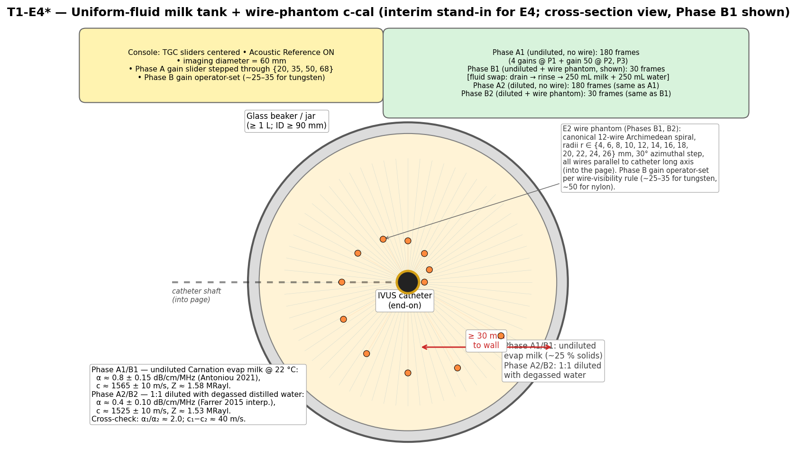
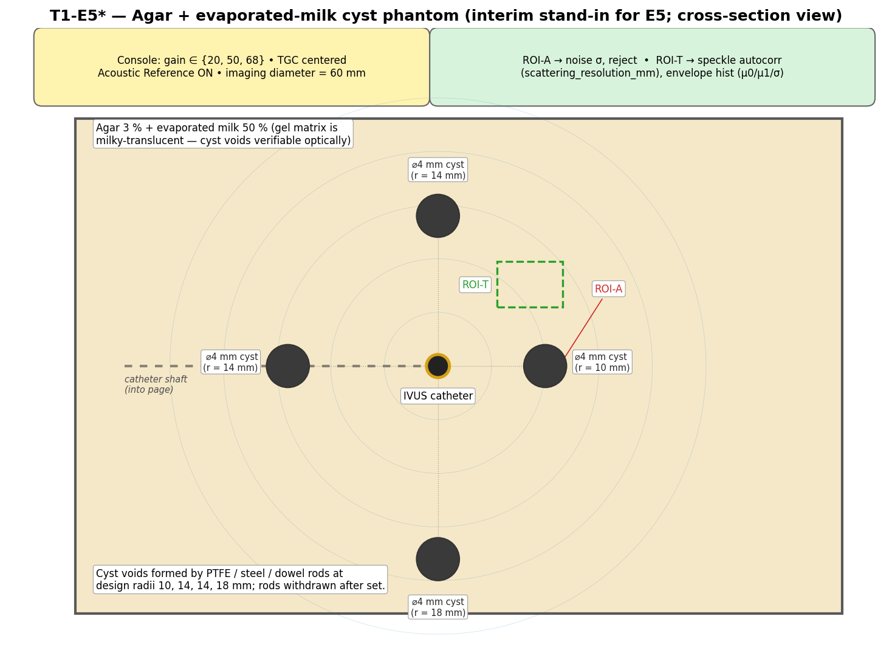

# Interim Milk-based Tier 1 Phantom SOP (T1-E4\* / T1-E5\*)

This SOP defines two **interim** Tier 1 phantom experiments —
**T1-E4\*** and **T1-E5\*** — built around evaporated milk and a
milk-agar gel, intended to keep Tier 1 calibration progressing while the
canonical agar-graphite phantoms (`A.2`, `A.3` of
[`ivus_calibration_protocol.md`](ivus_calibration_protocol.md)) are
blocked on reagent procurement (specifically: micrometer-scale flake
graphite and a verified-CAS n-propanol or glycerol). Both experiments
target the same parameters as the canonical `E4` and `E5`, with looser
α and c tolerances that must be **flagged in every output's
substrate-parameter-sheet entry**.

The asterisk in `T1-E4*` / `T1-E5*` indicates an interim derivative of
the canonical experiment. Outputs from these experiments are **batch-1
interim priors only** and must be re-derived once the canonical
agar-graphite phantoms are available.

| Interim experiment | Replaces (canonical) | Phantom | What we keep | What we lose |
|---|---|---|---|---|
| T1-E4\* | E4 — Uniform attenuation phantom + partial E7 gain-linearity + partial E5 noise | Beaker of evaporated milk **captured at two dilutions** (undiluted, 1:1 with degassed distilled water) + the existing E2 wire phantom (submerged briefly in each dilution for c refinement) | TGC schedule, α prior (loose) at two scatterer densities, refined c from wire-phantom TOF (two independent estimates), gain_db slider linearity (cross-check on E7), noise σ from gain = 20 (cross-check on E5), α-vs-milk-fraction linearity (pipeline self-consistency) | Tight α calibration to ±0.10 dB/cm/MHz |
| T1-E5\* | E5 — Cyst phantom | Agar + evaporated-milk + glycerin gel + PTFE/dowel-rod-formed cyst voids | noise σ, scattering_resolution_mm, μ0/μ1/σ priors, reject_db, cyst contrast | Recipe-matched α; speckle-statistic batch-to-batch reproducibility |

The canonical `E7` step phantom has **no interim equivalent** in this
SOP — it depends on a per-chamber graphite α ladder that talc and
milk-based gels cannot replicate. Defer E7 until the graphite arrives.

> All Tier 1 / Tier 1\* experiments are run with the same Volcano s5i
> console, the same catheter, and at **22 ± 1 °C** unless otherwise
> noted. Speed of sound in degassed water at 22 °C is
> **c_water = 1488 m/s** (Marczak 1997).

## Common equipment (deltas from the canonical protocol's "Common equipment" table)

| Item | Spec | Tolerance / Notes |
|------|------|-------------------|
| Volcano s5i console + Visions PV .035 catheter | service-mode access | Same unit and same catheter S/N as the canonical `P_035_PointScatter/` dataset |
| Catheter fixture | rigid clamp, vertical orientation preferred so catheter long axis is normal to gravity *only* if the phantom container is also held vertical; otherwise horizontal — see per-experiment setup | axial alignment ≤ ±0.1 mm; does not occlude the imaging plane |
| Calibrated thermometer | ± 0.2 °C | Log T at the start **and end** of every session (milk c is ~−3 m/s per °C; temperature stability matters more than usual) |
| Degassed deionized water | dissolved O₂ ≤ 4 ppm | Used for the agar dissolution step in T1-E5\* only |
| RF capture (preferred) / frame grabber (acceptable) | as per canonical `ivus_calibration_protocol.md` Common equipment table | Same as canonical |

## Common console settings (reference operating point — match the calibration sheet)

The console settings used in this SOP are the **calibration-sheet
reference operating point** from
[`../p035_visions/volcano_s5i.yaml`](../p035_visions/volcano_s5i.yaml),
**not** the older E4/E5 settings of "imaging diameter = 16 mm". The
sheet was calibrated against `P_035_PointScatter/` at 60 mm imaging
diameter and gain slider 54; we capture at that operating point so the
extracted parameters can be consumed by the simulator without
re-validating Tier 1 at a different diameter.

| Setting | T1-E4\* | T1-E5\* |
|---|---|---|
| Imaging mode | IVUS B-mode | IVUS B-mode |
| Imaging diameter | **60 mm** | **60 mm** |
| Gain slider | **{20, 35, 50, 68}** (50 = canonical E4 reference operating point; 20 = noise-floor anchor; 35 and 68 added to give a 4-point fit on the gain_db(slider) transfer — three points only check linearity, four points detect bow) | **{20, 50, 68}** (matches canonical E5) |
| TGC sliders | **All centered** (flat / disabled) | All centered |
| Acoustic Reference (AR) | **ON** | **ON** |
| Speckle reduction / smoothing | OFF | OFF |
| Compounding | OFF | OFF |

If any setting deviates, **stop** — the capture won't be comparable to
the calibration sheet.

## Substrate identification

Every batch must carry a `substrate_id`. T1-E4\* generates **two**
substrate IDs per session (one per dilution):

- `tmm-milk-INTERIM-<YYYYMMDD>-undiluted` — Phase A1 + B1 captures.
- `tmm-milk-INTERIM-<YYYYMMDD>-dil1to1` — Phase A2 + B2 captures
  (1:1 by volume evaporated milk : freshly degassed distilled water).

T1-E5\* generates one ID per gel batch:

- `tmm-milk-agar-INTERIM-<YYYYMMDD>` — the milk-agar-glycerin cyst gel.

The **`INTERIM`** token in the substrate ID is intentional: it ensures
the parameter-sheet analysis pipeline can quickly identify these as
not-yet-canonical and flag them for re-derivation when the canonical
phantom arrives.

Every interim parameter row in the substrate parameter sheet must carry
`Source: bench, interim milk-* batch <date>, no substitution measurement`
in the `Source` column.

---

## T1-E4\* — Uniform-fluid milk tank (interim stand-in for E4)



**Produces:** interim `processing.tgc_control_points` (cross-validated
across two milk dilutions), interim `materials[].attenuation_db_per_cm_mhz`
priors at two scatterer densities, interim refined
`probe.speed_of_sound_mm_per_us` (from wire-phantom-in-milk acquisitions
in both dilutions), interim `processing.gain_db(slider)` cross-check at
the four captured gains (partial E7 output), and an interim
`processing.noise.sigma` cross-check from the gain = 20 capture (partial
E5 output, useful for self-consistency against T1-E5\*). The
**two-dilution structure** is the core self-consistency check of T1-E4\*:
α from the two dilutions must scale linearly with milk fraction
(expected ratio ≈ 2:1) and the recovered TGC curve must agree across the
two dilutions to within ±2 dB over the 30 mm imaging range.

**Substrate ID pattern:** `tmm-milk-INTERIM-<YYYYMMDD>-undiluted` and
`tmm-milk-INTERIM-<YYYYMMDD>-dil1to1` (one row per dilution in the
substrate parameter sheet).

> **Goal.** Use a uniform attenuating *fluid* with literature-known c
> and α to extract a TGC schedule and a loose α prior, without waiting
> for the canonical agar-graphite phantom. We capture at **two
> dilutions** — undiluted Carnation evaporated milk (α ≈ 0.8 dB/cm/MHz,
> Antoniou 2021) and 1:1 with degassed distilled water
> (α ≈ 0.4 dB/cm/MHz, interpolated; brackets the 0.5 dB/cm/MHz
> soft-tissue target of Goss-Johnston-Dunn 1978/1980). The two-point
> capture cross-validates the α-extraction pipeline (α ratio should be
> ≈ 2.0 by Antoniou's milk-fraction linearity), self-consistency-checks
> the recovered TGC curve (same console TGC must be recovered from
> both substrates), and gives independent c estimates from the wire
> phantom at two different bulk-c values (~1565 m/s vs ~1525 m/s),
> catching any systematic TOF-extraction bias.
>
> Evaporated milk is a published tissue-mimicking material — see the
> References section at the bottom of this SOP for the foundational
> papers, in particular Madsen-Frank-Dong (1998) for the WARF
> milk-based gel (the patent that backs the commercial CIRS / ATS
> milk phantoms), Farrer et al. (2015) for the gelatin + 50/50
> water-milk variant (open access, reports c ≈ 1540 m/s and
> α ≈ 0.4–0.5 dB/cm/MHz — anchors our diluted phase), and
> Antoniou et al. (2021) for the agar + evaporated-milk recipe that
> most closely matches our T1-E5\* gel (open access, reports α
> scaling with milk fraction in the 0.3–1.0 dB/cm/MHz range —
> anchors our undiluted phase at the 0.8 dB/cm/MHz end and the
> dilution-linearity cross-check).

### Equipment

| Item | Spec | Tolerance |
|------|------|-----------|
| Evaporated milk | Carnation **evaporated** milk (or any brand meeting the FDA evaporated-milk standard of identity, ~25 % total solids minimum). *Not* sweetened condensed milk. Plan **2 cans per session** — ~1 can (≈ 350 mL) for the undiluted phase A1/B1 fill and ~0.7 can for the diluted phase A2/B2 fill (250 mL milk + 250 mL degassed water). Do not mix milk between cans of different brand / fat content; if topping up, use the same can. | Best-by date logged; cans opened on the day of the session |
| Distilled water (degassed) | ≥ 300 mL of freshly degassed distilled water, prepared by boiling for 5 min in a covered pot and cooling to room temperature still covered. Used for the 1:1 dilution in phase A2/B2 only. Do not substitute tap water (chlorinated, microbubble-prone) or stored "degassed" water (re-absorbs O₂ within hours). | Dissolved O₂ ≤ 4 ppm (proxy: no visible bubbles forming on the container wall during the 30 min settle) |
| Measuring jug / graduated cylinder | 500 mL, ± 5 mL graduations | For measuring 250 mL milk + 250 mL degassed water for the 1:1 dilution |
| Container | Tall glass beaker, jar, or plastic food-storage container. **All four phases need:** ID ≥ 90 mm (so the wire-phantom disc, ⌀ 80 mm, fits with ≥ 5 mm radial clearance per side) and fill height ≥ 80 mm above the floor (so the catheter element ring sits ≥ 30 mm above the floor and ≥ 30 mm below the milk surface *in the imaging plane*). The 30 mm clearance requirement applies to the imaging plane around the catheter element ring (so the milk acts as semi-infinite within the imaging fan), **not** around the wire-phantom assembly — the disc faces sit ±25 mm out of the imaging plane along the catheter long axis, well outside the IVUS slice thickness (~1 mm) and therefore invisible to the transducer. A **9 × 9 × 8 cm plastic food-storage container is known-good for all four phases** when paired with a hole-in-the-lid catheter mount. A 1 L Pyrex beaker (ID ≈ 100 mm, height ≈ 145 mm) or a wide-mouth 32 oz Ball mason jar (ID ≈ 95 mm, height ≈ 170 mm) is the preferred fit when on hand. 500 / 600 mL beakers (ID ~78–82 mm) are too narrow for the wire phantom and force the single-wire c-cal fallback. **One container is sufficient** — drain and rinse with degassed water between the undiluted and diluted phases. | Probe-to-wall ≥ 30 mm in the imaging plane (all phases); disc-to-wall ≥ 5 mm (phases B1/B2 only — the disc itself is axially out of the imaging plane so its near-wall position only matters for mechanical clearance during insertion) |
| Catheter mount | Holds catheter horizontal with the element ring submerged near the center of the container; must remain in place across the fluid swap between phases B1 → A2 so that the catheter axial position (P1) is reproducible across dilutions. | ≤ ±0.1 mm axial position; ≤ ±0.5 mm radial position before and after fluid swap |
| c-cal distance marker (primary) | The existing **E2 wire phantom** used for canonical Tier 1 PSF work (`hardware/wire_spiral_disc.stl`, 12 wires on a 1-turn Archimedean spiral at canonical radii / azimuths `{(4,0°), (6,30°), (8,60°), (10,90°), (12,120°), (14,150°), (16,180°), (18,210°), (20,240°), (22,270°), (24,300°), (26,330°)}`, all wires parallel to the catheter long axis). Submerged in milk for the c-refinement acquisitions only; the phantom must fit inside the milk container with ≥ 30 mm clearance to walls in the imaging plane. **Wire material is determined by the canonical E2 build** — if your build uses 30 µm tungsten (the Mie-resonance-avoidance choice for the PV .035), expect Phase B captures to need lower gain (~25–35) than Phase A. | Design radii ± 0.05 mm (calibrated per the canonical E2 fixture) |
| c-cal distance marker (fallback) | A single 0.05 mm tungsten wire (or any reflective ≥ 25 µm wire) suspended vertically through the milk so it crosses the imaging plane at a measured radial distance. Use only if the E2 wire phantom is unavailable. | r measured by digital calliper ± 0.05 mm |
| Calibrated thermometer | ± 0.2 °C | Log T at the start and end of each phase (4 log points minimum) |

### Setup procedure

0. **Degas the dilution water.** Boil ≥ 300 mL distilled water for
   5 min in a covered pot, then cover and cool to room temperature
   (~30–40 min). Keep the lid on while cooling so the water doesn't
   re-absorb atmospheric O₂. This can run in parallel with the rest of
   setup and Phase A1 — by the time Phase A1/B1 are done, the water
   should be at room temp and ready for the 1:1 mix.
1. Open one fresh can of evaporated milk and pour it into the
   container until the fill height is ≥ 80 mm above the floor (~350 mL
   for the 9 × 9 cm container). Top up with milk from a second can if
   needed to fully submerge the element ring at P1 with ≥ 30 mm
   clearance below the milk surface.
2. Let the container sit, covered with cling film or a clean lid, at
   room temperature for **≥ 30 min** to allow any pour-induced bubbles
   to escape. Log T_room and T_milk at the end of equilibration. Do not
   shake the can or stir the contents — you want a settled, uniform
   fluid.
3. Mount the catheter horizontally so the element ring is centered in
   the container, **≥ 30 mm from all walls** (sides and bottom). Verify
   by visual inspection / calliper from the outside. **Do not unmount
   the catheter between phases** — the mount must remain registered to
   the same P1, P2, P3 positions through the entire session, including
   the fluid swap between phases B1 and A2.
4. Confirm the console is at the reference operating point per the
   table above (gain slider will be stepped during the run; start at
   50). Take a screen capture / photo of the slider state.

### Acquisition procedure

The capture runs in **four phases**, in order:

| Phase | Substrate | Captures | Notes |
|---|---|---|---|
| **A1** | Undiluted evap milk (Carnation, ~25 % solids) | 4 gains × P1 + gain-50 × P2, P3 = 180 frames | Main TGC + α extraction run; literature α anchor 0.8 dB/cm/MHz (Antoniou 2021) |
| **B1** | Undiluted evap milk + E2 wire phantom | **operator-set gain** × 30 frames (typically 25–35 for tungsten, 50 for nylon — pick on the bench using the wire-visibility rule below) | c refinement at the undiluted bulk-c (~1565 m/s expected) |
| **A2** | 1:1 evap milk : degassed distilled water (250 mL + 250 mL) | 4 gains × P1 + gain-50 × P2, P3 = 180 frames | Cross-validation TGC + α run; literature α anchor 0.4 dB/cm/MHz (Farrer 2015 interp.); same P1/P2/P3 positions as A1 |
| **B2** | 1:1 diluted milk + E2 wire phantom | operator-set gain × 30 frames (same gain as Phase B1 if possible — use the operator-set gain from B1, log it in metadata) | c refinement at the diluted bulk-c (~1525 m/s expected) — independent check of TOF-extraction pipeline at a different bulk c |

> **Phase B gain rule.** Phase B is for c calibration via wire-time-of-flight,
> not PSF shape — saturated wire peaks are acceptable as long as **peak
> *locations* remain unambiguous** (no merging with adjacent peaks or with
> the catheter ring-down). Set the gain such that:
>
> - the **deepest** clearly-visible wire (target r = 26 mm) is ≥ 20 dB above
>   the noise floor, AND
> - the **shallowest** visible wire (target r = 4 mm) has ≤ 95 % of its
>   peak ring inside the displayed-palette top (i.e. no saturation blob
>   wider than ~2 azimuthal bins).
>
> For 30 µm tungsten on the PV .035 this typically falls at **gain 25–35**
> (well below the Phase A reference of 50); for nylon monofilament, gain
> 50 usually meets both criteria. The operator-set value is logged in
> the session metadata.

**Why the four-phase structure.** The console TGC and the
slider→dB transfer are probe properties that must be invariant across
substrate; capturing in two substrates with a factor-of-2 difference in
α gives us a redundancy check on both. The recovered TGC curve must
match across A1 and A2 to within ±2 dB, and the extracted α values must
scale ~2:1 (Antoniou 2021 confirms linear α scaling with milk fraction).
Both checks fail loudly if anything in the analysis pipeline has a bias.

Phase B1 and B2 may be skipped if the E2 wire phantom is not on the
bench *that day*, but are strongly preferred — they add ~3 min each and
fold in 5 distance markers at known radii per dilution, plus cross-check
TOF extraction at two bulk-c values.

#### Phase A1 — multi-gain undiluted-milk capture

1. **Position 1, gain sweep.** With the catheter centered in the
   beaker and the milk settled, capture **30 frames at each of gains
   {20, 35, 50, 68}** in ascending order. The catheter must remain
   stationary between gains — change *only* the gain slider. (Total
   at P1: 120 frames across 4 gains.)
2. **Position 2, gain 50 only.** Move the catheter ≥ 5 mm along its
   long axis (or move the container vertically by the same distance).
   Capture **30 frames at gain 50**.
3. **Position 3, gain 50 only.** Repeat. Total Phase A1: 30 × 4 + 30 +
   30 = **180 frames** (4 gains × 30 at P1 + 30 each at P2, P3).
4. Return the catheter to P1 (the position must be reproduced for A2).
5. Log T_milk at the end of Phase A1.

#### Phase B1 — wire-phantom c-refinement in undiluted milk

6. Lower the **E2 wire phantom** into the milk so the wires straddle
   the imaging plane of the catheter. Use the same fixture that holds
   the wire phantom for the canonical E2 (water) acquisition; do not
   try to free-hand-suspend it. If your container has a hole-in-the-
   lid catheter mount, feed the catheter through the disc centre holes
   (⌀ 2.5 mm) of the wire phantom on its way into the milk so the
   assembly hangs from the catheter shaft, with the catheter element
   ring centred in the 50 mm standoff gap between the two discs.
   Verify the geometry:
   - Container ID accommodates the ⌀ 80 mm disc with ≥ 5 mm radial
     clearance per side (e.g., 90 mm ID gives 5 mm; 100 mm gives 10
     mm).
   - **In the imaging plane** (horizontal slice through the catheter
     element ring): probe-to-wall ≥ 30 mm in every direction.
     With ID ≥ 90 mm this is automatic since the catheter is centred
     and the imaging fan is only 30 mm radius.
   - **Along the catheter axis** (vertical): the catheter element ring
     sits ≥ 30 mm above the container floor and ≥ 30 mm below the
     milk surface, so the milk extends ≥ 30 mm in every direction
     around the imaging plane. The disc faces at ±25 mm out of the
     imaging plane are *outside* the slice thickness and do not
     count against this clearance — they are invisible to the
     transducer.
   - All 12 spiral wires (at canonical radii {4, 6, 8, 10, 12, 14, 16,
     18, 20, 22, 24, 26} mm) resolve clearly on the console before
     recording. Inner wires (r ≤ 8 mm) may sit close to the catheter
     ring-down; if a wire is consistently lost in ring-down at every
     azimuth, log it as `excluded_from_c_fit` in the metadata rather
     than chasing it with extra gain.
7. Allow ≥ 60 s for the milk to settle around the wire-phantom frame
   (the immersion will stir up some bubbles).
8. **Set the Phase B gain** per the wire-visibility rule above
   (deepest wire ≥ 20 dB above noise; shallowest wire ≤ 95 %
   saturated). For 30 µm tungsten on the PV .035, expect to land at
   **gain 25–35**, not the Phase A reference of 50 — tungsten gives a
   strong specular reflection that saturates by gain ~40 on the inner
   wires. Log the chosen gain value in metadata as
   `phaseB_gain_slider`. Capture **30 frames** at that gain with the
   wire phantom in place.
9. *(Fallback only — if the wire phantom is unavailable)* Suspend a
   single 0.05 mm tungsten wire vertically through the milk at a
   measured radial distance (10–15 mm from the catheter centerline).
   Calliper-measure the distance both before and after the 30-frame
   capture and log as `r_callipered_mm_pre` / `r_callipered_mm_post`.
10. Remove the wire phantom; rinse with warm water + mild detergent
    to remove milk residue (milk fat will gum the wires within hours
    if left wet). Set aside on a clean towel — it will be re-used in
    Phase B2.
11. Log T_milk at the end of Phase B1.

#### Fluid swap — undiluted to 1:1 diluted

12. Carefully drain the undiluted milk from the container into a
    discard vessel (do not lift the catheter; pour around it, or use
    a kitchen-grade pipette / turkey baster). Wipe the inside of the
    container with a clean paper towel — residual milk film is OK,
    but no visible droplets / pools.
13. Rinse the container with ~100 mL of the room-temperature degassed
    water from step 0; drain the rinse into the discard vessel. (This
    flushes the milk-fat film off the walls so it doesn't bias the
    diluted-fluid α.)
14. Measure **250 mL evaporated milk** into the measuring jug. Add
    **250 mL room-temperature degassed water** (from step 0) on top.
    Gently swirl with a clean glass rod or wooden skewer to mix — do
    not shake (shaking entrains air; the dilution-induced bubbles take
    ≥ 30 min to settle).
15. Pour the 500 mL diluted-milk mixture into the container around the
    still-mounted catheter. Verify the fill height is ≥ 80 mm above
    the floor and the element ring has ≥ 30 mm clearance below the
    fluid surface; if short, add more diluted-milk mixture in the same
    1:1 ratio.
16. Cover and let settle for **≥ 30 min** (longer than for undiluted
    milk — the dilution stirs in fine bubbles that need extra time to
    rise out). Log T_room and T_milk_diluted at the end of the settle.

#### Phase A2 — multi-gain diluted-milk capture

17. Repeat steps 1–4 (Phase A1) verbatim, in the same P1, P2, P3
    positions, in the diluted milk. **Do not** re-mount the catheter
    between A1 and A2 — the analysis script cross-checks the TGC and
    α extractions at the same axial positions across the two
    dilutions.
18. Log T_milk_diluted at the end of Phase A2.

#### Phase B2 — wire-phantom c-refinement in diluted milk

19. Repeat steps 6–11 (Phase B1) verbatim, in the diluted milk. **Use
    the same operator-set gain as Phase B1** (logged as
    `phaseB_gain_slider`) — the wires have not moved and tungsten's
    saturation behaviour does not change between the two dilutions.
    Expected `c_diluted` ≈ 1525 m/s (vs ~1565 m/s in B1); per-wire
    `r_displayed_k` for all 12 wires should shift by ≈ 1.3 % between
    the two phases (the wires haven't moved; only the bulk c has
    changed). This is the TOF-extraction-pipeline cross-check.
20. After Phase B2, remove the wire phantom; rinse with warm water +
    mild detergent **before storing** (milk fat will gum the wires
    within hours if left wet).
21. Log T_milk_diluted at the end of Phase B2.

### Data to acquire

In what follows, `<sid_und>` is the undiluted substrate ID
(`tmm-milk-INTERIM-<YYYYMMDD>-undiluted`) and `<sid_dil>` is the
diluted ID (`tmm-milk-INTERIM-<YYYYMMDD>-dil1to1`).

**Phase A1 (undiluted):**

- `t1_e4i_<sid_und>_phaseA1_p1_gain20.dcm`
- `t1_e4i_<sid_und>_phaseA1_p1_gain35.dcm`
- `t1_e4i_<sid_und>_phaseA1_p1_gain50.dcm`
- `t1_e4i_<sid_und>_phaseA1_p1_gain68.dcm`
- `t1_e4i_<sid_und>_phaseA1_p2_gain50.dcm`
- `t1_e4i_<sid_und>_phaseA1_p3_gain50.dcm`

**Phase B1 (undiluted + wire phantom):**

- `t1_e4i_<sid_und>_phaseB1_wirephantom_gainXX.dcm` (where `XX` is
  the operator-set gain from the Phase B gain rule, also logged as
  `phaseB_gain_slider` in metadata)

**Phase A2 (diluted):**

- `t1_e4i_<sid_dil>_phaseA2_p1_gain20.dcm`
- `t1_e4i_<sid_dil>_phaseA2_p1_gain35.dcm`
- `t1_e4i_<sid_dil>_phaseA2_p1_gain50.dcm`
- `t1_e4i_<sid_dil>_phaseA2_p1_gain68.dcm`
- `t1_e4i_<sid_dil>_phaseA2_p2_gain50.dcm`
- `t1_e4i_<sid_dil>_phaseA2_p3_gain50.dcm`

**Phase B2 (diluted + wire phantom):**

- `t1_e4i_<sid_dil>_phaseB2_wirephantom_gainXX.dcm` (same operator-set
  `XX` as Phase B1; logged as `phaseB_gain_slider`)

Each DICOM is 30 frames per (position, gain, dilution) combination. If
the console concatenates captures, label the segments in the filename.

**Metadata:**

- `t1_e4i_<session_id>_metadata.json` — one per session, covering both
  dilutions. Fields: phase-A gain slider values
  (`phaseA_gain_sliders: [20, 35, 50, 68]`), **phase-B gain slider**
  (`phaseB_gain_slider: <operator-set value>`), imaging diameter, TGC
  schedule, acoustic-reference state, `T_room`,
  `T_milk_undiluted_start/end`, `T_milk_diluted_start/end`, evaporated
  milk brand / can lot / best-by date, **mL milk in each phase** (the
  as-poured amount, not the nominal 250 mL), **mL degassed water in
  the diluted phase**, degassed-water prep time + cooling time,
  container ID / dimensions, **wire phantom S/N + wire material +
  design radii** (the canonical 12-wire spiral, or fallback wire
  diameter and calliper distance), **`excluded_from_c_fit`** list
  recording any wires that were lost in catheter ring-down at every
  azimuth and therefore dropped from the c-extraction fit, photos of
  mount before and after the fluid swap.
- *(Optional)* `t1_e4i_<sid_*>_<segment>_polar.npy` — vendor
  polar-domain export, per segment.

### Analysis

Implementation should live in
`instrument-calibration/p035_visions/extract_t1_e4i_milk.py` (one
script per interim experiment, parallel to the canonical
`tier1_evaluation.py`). The analysis layers the multi-gain and
wire-phantom data from both dilutions into two output groups:
**per-dilution outputs** (computed twice, once per `<sid_*>`) and
**cross-dilution outputs** (computed once across the combined
A1 + A2 / B1 + B2 data).

All per-dilution outputs are computed twice (once for `<sid_und>` from
Phase A1+B1 and once for `<sid_dil>` from Phase A2+B2); cross-dilution
outputs are computed once across the combined data.

#### Per-dilution outputs (computed twice — once per `<sid_*>`)

| Output | Source data | Method |
|--------|-------------|--------|
| Mean intensity vs depth `I_dB(z; gain, position)` | Phase A1 or A2, all 6 captures | Convert each frame to polar B-mode, mask out the inner 0–2 mm (ring-down zone) and the outer 0.5 mm (boundary echoes), compute mean intensity per radial bin, convert to dB, average across the 30 frames of each capture. |
| **Interim** `materials[].attenuation_db_per_cm_mhz` prior | Phase A1/A2, P1 at gain 50 (avoid the gain-20 noise floor and gain-68 saturation; gain 35 used as a cross-check fit) | Fit `slope_dB_per_mm = (I_dB(z2) − I_dB(z1)) / (z2 − z1)` over r ∈ [5, 25] mm at gain 50, and cross-check with the same fit at gain 35 — the two should agree to within ±0.05 dB/cm/MHz. α (dB/cm/MHz) = `slope_dB_per_mm × 10 / (2 × f0_MHz)`. Expected literature anchors: **0.6–1.0 dB/cm/MHz for `<sid_und>`** (Antoniou 2021, undiluted evap milk ≈ 0.8 dB/cm/MHz with brand/lot variation), **0.3–0.5 dB/cm/MHz for `<sid_dil>`** (Farrer 2015 interpolated, 1:1 dilution ≈ 0.4 dB/cm/MHz). Source field: `bench, milk-INTERIM-<date>-<dilution>, no substitution measurement`. Uncertainty ±0.15 dB/cm/MHz per dilution. |
| **Interim** refined `probe.speed_of_sound_mm_per_us` | Phase B1 or B2, wire phantom @ `phaseB_gain_slider` (operator-set; typically 25–35 for tungsten) | For each of the (up to) 12 wires at the canonical Archimedean-spiral radii `r_design_k ∈ {4, 6, 8, 10, 12, 14, 16, 18, 20, 22, 24, 26} mm`, segment the wire echo (Hough or matched filter), read the polar-displayed radius `r_displayed_k`. Exclude any wire flagged in `excluded_from_c_fit` (typically the innermost 1–2 if they're lost in ring-down). Compute `c_k = c_displayed × (r_design_k / r_displayed_k)`, then take a weighted mean across the included wires (weight = inverse of localization uncertainty per wire, with extra down-weighting for the innermost 2 wires where ring-down can broaden the peak). `c_displayed = 1.54 mm/µs` is the displayed-speed-of-sound assumption. Expected: **`c_undiluted` ≈ 1560–1580 m/s**, **`c_diluted` ≈ 1515–1535 m/s**. Uncertainty ±2 m/s per dilution (better than the original ±3 m/s with 5 wires because the 12-wire average gives √(12/5) ≈ 1.5× more statistical power). |
| **Interim cross-check** `processing.noise.sigma` (partial E5) | Phase A1/A2, P1 at gain 20 | At gain 20 the deep-field (r ∈ [25, 28] mm) of plain milk is at or near the console's noise floor. Fit `scipy.stats.rayleigh.fit` to the envelope of the deep ROI; σ is the noise σ. Reported per dilution; the undiluted-milk σ should be the cleaner electronic-noise-floor estimate (less signal contamination), the diluted σ provides a higher-scatter cross-check. |
| **Saturation diagnostic** | Phase A1/A2, P1 at gain 68 | Count fraction of pixels in `r ∈ [3, 8] mm` (near-field, highest intensity) that are within 1 palette unit of the maximum. If > 1 %, the gain-68 capture saturated — flag the gain-68 row of the gain-linearity output as `saturated: true` and exclude that knot from the slope fit. |
| Replicate stability | Phase A1/A2, gain 50 across P1/P2/P3 | Compute `I_dB(z)` per axial position; check pairwise RMS deviation across positions. |

#### Cross-dilution outputs (computed once across A1+A2)

| Output | Source data | Method |
|--------|-------------|--------|
| **Interim** `tgc_control_points` (final) | Phases A1 + A2, P1+P2+P3 at gain 50 across both dilutions (180 frames total) | The console TGC curve `g(z)` is fixed across substrates. Solve `g(z) = −I_dB(z) + I_dB(0) + 2 · α · z` jointly across A1 (`α = α_undiluted`) and A2 (`α = α_diluted`); the per-dilution `α` values are taken from the per-dilution analysis above. Sample at depths {0, 1.5, 3.0, 4.5, 6.0, 8.0, 10.0, 15.0, 20.0, 25.0} mm (extended from canonical E4 to cover the 60 mm imaging diameter). The two dilutions must agree on `g(z)` to within ±2 dB at every knot — otherwise the per-dilution α priors are off, or the pipeline has a depth-dependent bias. Source field: `bench, milk-INTERIM-<date>, cross-dilution joint fit, no substitution measurement`. |
| **Interim cross-check** `gain_db(slider)` linearity (partial E7) | Phases A1 + A2, P1 at gains 20, 35, 50, 68 (8 captures total) | Pick a stable mid-field radial band `r ∈ [10, 14] mm` outside ring-down and clear of any saturation. Compute `mean_dB(gain_k) − mean_dB(gain=20)` for `k ∈ {35, 50, 68}` *for each dilution*; the slider→dB transfer is a probe property and must be identical across dilutions. With 4 knots we can also fit a quadratic to detect bow (deviation from linear ≥ 2 dB at any knot ⇒ flag the slider→dB transfer as non-linear). Report `(slider, delta_dB)` table per dilution and the cross-dilution agreement; report mismatches ≥ 2 dB as failures. Uncertainty ±1 dB per knot. |
| **Pipeline self-consistency:** α-vs-milk-fraction linearity | α priors from both dilutions | Compute the ratio `α_undiluted / α_diluted`. Expected: **2.0 ± 0.2** (Antoniou 2021 reports linear α scaling with milk fraction over 10–100 % milk). A ratio < 1.6 or > 2.4 indicates either a non-linear α response (potential brand issue) or a pipeline bias in α extraction. Reported as a pass/fail flag plus the actual ratio. |
| **Pipeline self-consistency:** TGC recovery agreement | `g(z)` from per-dilution Phase A1 and A2 independent fits | For diagnostic purposes, also fit `g(z)` separately from A1 alone and A2 alone (each using its own `α` prior). The two independent `g(z)` curves should agree to within ±2 dB across the 0–30 mm range. Larger disagreement is the canary for an α-prior or TGC-fit bias. |
| **Pipeline self-consistency:** wire-phantom Δc | `c` from B1 vs `c` from B2 | Expected: `c_undiluted − c_diluted` ≈ 40 ± 15 m/s (undiluted milk is denser + faster than the 1:1 mix; the actual Δc depends on the milk's total solids fraction, but the *sign* must be positive). A negative or null Δc indicates either a TOF-extraction bug or that one of the two dilutions isn't what it's labelled as. |

### Bench acceptance criteria

Per-dilution criteria (must pass independently for both `<sid_und>` and
`<sid_dil>`):

- Per-axial-position mean palette in any 5 mm radial bin stable to
  within **±3 palette units** across the three gain-50 replicates
  (looser than canonical E4's ±2 because milk has slightly more
  inter-position variation than gel TMM).
- α extracted from gain-50 `I_dB(z)` slope falls within the
  **per-dilution literature window**: 0.6–1.0 dB/cm/MHz for
  `<sid_und>`, 0.3–0.5 dB/cm/MHz for `<sid_dil>`. Values outside the
  appropriate band indicate either a temperature drift, a fluid-mix
  error (e.g. wrong volume ratio for the diluted phase), or a
  TGC-not-flat capture error.
- T_milk start vs end stable to within **±1 °C** during each phase
  (A1, B1, A2, B2 logged independently).
- Gain-linearity `delta_dB(gain=68) − delta_dB(gain=50)` is in the
  range `[8, 22] dB` (the gain-50→68 step is canonically ~15 dB on
  this console; outside this band means either saturation or a console
  setting changed mid-capture). Must hold for **both** dilutions.
- Gain-linearity `delta_dB(gain=35) − delta_dB(gain=20)` is in the
  range `[8, 22] dB` (the gain-20→35 step should be similar to the
  50→68 step — both are 15 slider units; large asymmetry between the
  two indicates bow in the slider→dB transfer that must be captured
  by the quadratic fit rather than ignored).
- Gain-68 saturation diagnostic reports < 5 % saturation; if higher,
  drop the gain-68 row and re-run the linearity fit on just
  (20, 35, 50).
- Gain-35 saturation diagnostic (same method, applied to gain 35)
  reports 0 % saturation — gain 35 should never saturate even in the
  near-field; saturation here indicates a TGC slider drift or a
  brighter-than-expected substrate.
- Phases B1/B2: per-wire `r_displayed_k` consistent across the 30
  frames to within ±0.05 mm; per-wire `c_k` values agree across the
  **included** wires (those not in `excluded_from_c_fit`) to within
  **±10 m/s** within each dilution; at least **8 of 12 wires** must
  contribute to the c fit (if more than 4 wires are lost in ring-down
  or saturation, lower the Phase B gain and re-acquire).

Cross-dilution criteria (one pass/fail flag each across A1+A2 / B1+B2):

- **α ratio** `α_undiluted / α_diluted` falls in **2.0 ± 0.4**
  (loose Antoniou 2021 linearity bound; ±0.4 accounts for ±0.15
  uncertainty in each α). Failure here is the loudest red flag — it
  means either the dilution was wrong (mismeasured volumes) or the
  α-extraction pipeline has a bias.
- **TGC self-consistency:** per-dilution `g(z)` independent fits agree
  to within ±2 dB at every depth knot.
- **Gain-linearity self-consistency:** `delta_dB` per slider step
  matches between dilutions to within ±1.5 dB (probe property — must
  not depend on substrate).
- **Δc sign + magnitude:** `c_undiluted − c_diluted` is positive and
  in the range **15–80 m/s**.

If any per-dilution criterion fails, re-run *that dilution* with a
fresh can / fresh dilution mix. If a cross-dilution criterion fails
while per-dilution criteria pass, investigate the analysis pipeline
before re-running — the data may still be usable.

### Provenance for the substrate parameter sheet

T1-E4\* generates **two** substrate-parameter-sheet rows per session
(one per dilution). Each row must include:

- `Source: bench, interim milk batch <YYYYMMDD>-<dilution>, no substitution measurement`
- `Uncertainty: ±0.15 dB/cm/MHz (α) / ±3 m/s (c, wire phantom) / ±1 dB per knot (gain_db cross-check) / ±10 % (noise σ cross-check)`
- `Notes: TIER 1 INTERIM PRIOR — re-derive with canonical agar-graphite phantom (A.2) when available; gain_db and noise σ are CROSS-CHECK values, the authoritative versions still come from T1-E7 and T1-E5* respectively; α cross-validated across <sid_und> and <sid_dil> with ratio = <reported>:1`

The **TGC schedule** (from the cross-dilution joint fit) is recorded
as a *single* row, since the console TGC is substrate-invariant:

- `Source: bench, interim milk batch <YYYYMMDD>, cross-dilution joint fit, no substitution measurement`
- `Uncertainty: ±2 dB per knot (cross-dilution joint-fit residual)`
- `Notes: TIER 1 INTERIM PRIOR — recovered jointly from <sid_und> and <sid_dil>; per-dilution independent fits agree to within <reported> dB; re-derive with canonical agar-graphite phantom (A.2) when available`

---

## T1-E5\* — Agar + evaporated-milk cyst phantom (interim stand-in for E5)



**Produces:** interim `processing.noise.type`,
`processing.noise.sigma`, `processing.scattering_resolution_mm`,
`processing.scatter_integral_scale`, `processing.reject_db`, and
priors on per-tissue scattering parameters (`mu0`, `mu1`, `sigma`).

**Substrate ID pattern:** `tmm-milk-agar-INTERIM-<YYYYMMDD>`.

> **Goal.** Embed PTFE-rod-formed cyst voids in a milk-agar gel to
> reproduce the canonical E5 geometry (catheter at center, four ⌀4 mm
> cysts at design radii 10, 14, 14, 18 mm). The gel matrix is
> milky-translucent (not opaque black like graphite-loaded agar),
> which has the side benefit of making the canonical `A.3` optical
> cyst-diameter acceptance check actually achievable.

### Equipment

| Item | Spec | Tolerance |
|------|------|-----------|
| Mold + lid (preferred) | **`hardware/phantom_mold_cyst_interim.stl` + `phantom_mold_cyst_lid_interim.stl`** — printed cup mold with 4 floor dimples sized for ⌀ 8 mm cyst rods at radii {12, 16, 16, 20} mm, paired with a registration lid carrying matching ⌀ 8.3 mm cyst-rod holes and a ⌀ 2 mm catheter hole. A triangular fiducial notch on the lid edge and a matching notch on the mold rim ensure the lid registers over the floor dimples (rod tops + rod bottoms both pinned, so rods stay vertical without external clamps). The mold is sized for the **60 mm imaging diameter** reference operating point (was 16 mm in the original `phantom_mold_cyst.stl`; the older mold is too narrow for the current calibration-sheet operating point and is retained only for the canonical 4 mm-cyst recipe). | Verify the lid lip slip-fits into the mold ID with ≤ 0.5 mm radial play; verify all 5 holes are open after print (clear with a 2 mm drill bit if the catheter hole is bridged) |
| Mold + lid (fallback) | A 9 × 9 × 8 cm plastic food-storage container + a stiff "register card" cut from cardboard / 4-layer aluminum foil / thin acrylic, with 5 holes punched at the cyst design radii. Use only if the printed mold + lid is not available — see preparation step 1(c) below. | Inner dimensions logged |
| Catheter channel former | A straight, rigid rod ⌀ 2.7–3.3 mm × ≥ 80 mm long. Acceptable materials, in order of preference: (a) **⌀ 3 mm wooden skewer** (BBQ / kebab skewer) lightly oiled with food-grade silicone spray, cooking-oil spray (PAM-style), or rubbed-on canola oil — readily available and demolds cleanly; (b) ⌀ 3 mm stainless steel rod or knitting needle — smoothest demold but needs an oil coat to prevent agar adhesion; (c) ⌀ 3 mm PTFE rod — best of all, no oil needed, but rare on hand. The printed mold's catheter bore is ⌀ 3.5 mm — slip-fits any 3 mm-class rod with FDM tolerance, and the resulting ⌀ 3 mm gel channel accepts the Visions PV .035 catheter (1.9 mm OD) with ~0.55 mm radial clearance per side. **Do not** use a rod smaller than ⌀ 2.5 mm (gel channel will be too narrow for clean catheter insertion) or larger than ⌀ 3.4 mm (won't slip into the lid hole). | Calliper-measure the rod OD and log as `cath_rod_diameter_mm`; rod straightness ≤ 0.5 mm over its length |
| Cyst formers (×4) | Rigid, straight rods, **in order of preference**: (a) **⌀ 4 mm PTFE rod** — canonical, best demold surface, smallest cyst; (b) **⌀ 4 mm stainless-steel rod or knitting needle** — readily available, smooth, demoldable with light twist+pull; (c) **⌀ 8 mm rigid reusable plastic drinking-straw** — *recommended interim choice*, very rigid, smooth wall, easy demold, and the larger lumen actually improves the `roi_A` interior-pixel count for the noise σ / SNR fits; (d) **⌀ 4 mm wooden dowel** — oiled with cooking spray, demoldable but more friction. **Avoid silicone straws** (longitudinal seam imprints a non-circular cyst wall) and **disposable milkshake straws** (too deformable; buckle during the gel pour). For the 8 mm option, **shift the design radii from canonical {10, 14, 14, 18} mm to {12, 16, 16, 20} mm** so the innermost cyst's inner edge stays ≥ 8 mm from the catheter (clear of ring-down). | Diameter ± 0.1 mm (calliper-measured); rods must be straight to within 0.5 mm over their length |
| Hot plate / stirrer | Programmable temperature, magnetic stirring | T ± 2 °C |
| Beaker | 500 mL glass, heat-resistant | — |
| Digital scale | Resolution ≥ 0.01 g | — |
| Vacuum chamber or ultrasonic bath | ≥ 70 kPa vacuum, or 40 kHz ultrasonic | For degassing |
| Refrigerator | 4 ± 2 °C | For setting and storage |
| Substitution-attenuation rig | Two unfocused ≥ 10 MHz transducers (per canonical `A.6`) | *Strongly preferred but optional* — without this measurement the α prior is literature-only at ±0.15 dB/cm/MHz |

### Recipe — milk-agar-glycerin gel (interim)

This is a drop-in modification of the canonical
[`A.2`](ivus_calibration_protocol.md#a2--uniform-tissue-mimicking-phantom-e4)
recipe: the milk replaces the graphite-scatterer role, glycerin
replaces n-propanol as the sound-speed adjuster (no shelf-life decay,
food-grade, and already cited as the IEC 60601-2-37 / Souza 2016
replacement in Tier 2 protocol Appendix B.2), and Tween-20 is omitted
because there's no graphite to wet.

| Component | Mass | Function | Tolerance |
|-----------|------|----------|-----------|
| Distilled water | 76 g | Gel solvent | ± 1 g |
| Evaporated milk (Carnation-type, ~25 % total solids) | 100 g (≈ 95 mL of one can) | Scatterer + α contributor (replaces graphite) | ± 1 g; do not exceed 50 % by mass of the liquid |
| **Glycerin (≥ 99.5 %, USP / food / "vegetable glycerine" grade — single-ingredient)** | **24 g (12 % w/w of total)** | Sound-speed adjuster (target c ≈ 1540 m/s) | ± 0.5 g; do **not** substitute glycerin blends (e.g. "glycerin + rosewater") |
| Agar (high-strength, ≥ 600 g cm⁻² gel strength, single-ingredient food-grade or microbiology-grade) | 6 g (≈ 2.7 % w/w of the liquid phase; ≈ 3 % of water+milk) | Gel matrix | ± 0.05 g; bump to 6.7 g if the demolded gel feels too soft to hold the cyst rods (rare) |
| Potassium sorbate (food / USP grade) | 0.4 g (0.2 % w/w) | Preservative | ± 0.05 g |
| ~~n-Propanol~~ | omit | (would also set c to 1540 m/s) | Replaced by glycerin in this recipe; either is acceptable but glycerin is much better on shelf life |
| ~~Tween-20~~ | omit | (would wet graphite) | Milk scatterers don't need surfactant |
| ~~Graphite~~ | omit | (would be the primary scatterer) | Milk fat globules + casein micelles replace |

Theoretical properties (literature-prior + Urick mixing-rule estimate
for the milk+water+glycerin liquid phase, will refine per batch):

- **c ≈ 1535–1545 m/s** (Urick mixing-rule estimate for the
  76 g water / 100 g milk / 24 g glycerin liquid phase, plus the
  ~+5 m/s contribution of the agar matrix; brought up from the
  no-glycerin recipe's ~1510 m/s).
- **α ≈ 0.3–0.5 dB/cm/MHz at 10 MHz** (lower than the 0.5 dB/cm/MHz
  canonical target because the milk solids are diluted by the agar
  matrix; glycerin adds a small ~+0.02 dB/cm/MHz contribution which
  is in the noise; substitute-measure per `A.6` if you can run one
  this week).
- **Z ≈ 1.58 MRayl** (glycerin nudges density up by ~1.5 % over the
  no-glycerin recipe).
- **Gel firmness:** equivalent to a 3 % graphite-loaded agar; pourable
  at 50 °C, holds PTFE rods, demolds cleanly. Glycerin slightly
  plasticizes the gel — that's a feature, not a bug, for our use
  (less brittle than pure agar; the canonical A.2 phantom is known to
  fracture on rough handling).
- **Shelf life:** glycerin is hygroscopic and non-volatile, so the
  c-drift mechanism that limits canonical-A.2 to ~14 days (propanol
  evaporation through the gel surface) does not apply here.
  Milk-protein bacterial growth is now the limiting factor, which the
  potassium sorbate addresses; expect **7–10 days at 4 °C** with the
  gel wrapped in cling film inside a sealed bag. The canonical 5–7
  days figure (pre-glycerin draft) can be relaxed by ~2 days because
  glycerin itself is mildly bacteriostatic above 10 % w/w.

### Preparation procedure

The key delta from canonical `A.2` is **add milk after the agar is
dissolved and the slurry is below 70 °C** — milk proteins denature
and Maillard-brown above 80 °C, which changes the speckle properties
and discolors the gel.

1. **Prepare the mold (cyst-rod registration).** Lightly oil the
   mold interior with a release agent (silicone spray).

   *(a) Preferred — printed mold + lid:* Use
   `hardware/phantom_mold_cyst_interim.stl` (interim 8 mm cysts at
   shifted radii) or `phantom_mold_cyst.stl` (canonical 4 mm cysts)
   paired with the matching `..._lid_interim.stl` /
   `..._lid.stl`. Wipe the mold interior with a thin coat of food-
   grade silicone spray or cooking-oil spray; let any beads of
   excess oil drain out before proceeding.

   **(i) Seat the catheter rod.** Take your channel-forming rod
   (⌀ 3 mm wooden skewer, PTFE rod, etc. — see equipment table) and
   coat it with the same release agent: spin it through an oiled
   palm or paper towel and wipe off the excess so a uniform thin
   film remains. Drop the rod into the mold's centre bore (⌀ 3.5 mm,
   passes through the gel cavity into a 2 mm-deep blind divot in
   the floor — the rod's bottom seats in the divot and the floor
   stays solid below it, so no gel can leak out during pouring).
   The rod should drop in with light force and stand vertical
   under its own weight; if it binds, ream the bore with a 3.5 mm
   drill bit.

   **(ii) Seat the cyst rods.** Lightly oil each of the four cyst
   rods. Press them firmly into the floor dimples at the design
   radii — **{12, 16, 16, 20} mm for the 8 mm rigid plastic
   straws**, or **{10, 14, 14, 18} mm for the canonical 4 mm PTFE /
   steel rods**. They should stand vertical without external
   support; if they wobble, the dimples may need a quick clean-out
   with a drill bit of the matching diameter.

   **(iii) Seat the lid (mechanical key alignment).** Place the
   matching registration lid (`..._lid_interim.stl` or
   `..._lid.stl`) over the rod tops so the catheter rod and all 4
   cyst rods pass cleanly through the lid's pre-drilled through-
   holes. The lid has a rectangular **orientation key tab** on its
   underside at 0° (5 mm wide × 3 mm tall, extending from the
   underside of the top plate at the wall position). Rotate the
   lid until this tab drops into the matching slot in the mold rim
   at 0° — when correctly oriented, the lid seats flush on the rim
   with no perceptible play; **if the lid sits visibly proud of the
   rim by ~3 mm, the tab is over the wall, not the slot — lift the
   lid and rotate until it drops**. With the lid fully seated, both
   ends of every rod are mechanically registered (lid hole at the
   top, floor divot/dimple at the bottom) and the rods are forced
   vertical — no external clamps are needed. Stand the assembly on
   a level surface.

   *(b) Fallback — plain food-storage container + register card:* If
   the printed mold + lid is not available, cut a stiff "register
   card" from any flat, food-safe-adjacent material — thin acrylic,
   the side panel of a metal milk can (folded 2× for stiffness),
   4-layer-folded aluminum foil, or stiff cardboard — sized to lie
   flat on a 9 × 9 × 8 cm food-storage container's top rim. Punch
   5 holes through the register card:
   - 1 center hole, ⌀ 2 mm, for the PTFE catheter channel rod;
   - 4 cyst-rod holes, sized to the cyst-rod diameter, at design
     radii **{10, 14, 14, 18} mm if using 4 mm cysts** or
     **{12, 16, 16, 20} mm if using 8 mm cysts** (the shifted radii
     keep the innermost cyst's inner edge ≥ 8 mm from the catheter,
     clear of ring-down). The angular layout is always
     {0°, 90°, 270°, 180°}.

   Tape the register card to the container's top rim. Push the
   5 rods (1 catheter + 4 cyst) through the card so they hang
   vertically inside the container, with their lower tips touching
   the container floor. Anchor each rod's lower tip with a pea-sized
   ball of **food-grade plumber's putty or Crayola modeling clay** on
   the container floor — both are removable, grippy on plastic, and
   release cleanly when the rod is pulled. Verify each rod is
   vertical with a small bubble level on top of the register card.
   Stand the assembly on a level surface.
2. **Hydrate the agar in pure water (NOT milk).** Stir 6 g agar into
   **76 g** of cold distilled water in the beaker; rest 5 min to
   fully wet. Agar dissolves much better in clean water than in milk
   or in a glycerin solution.
3. **Heat to dissolve agar.** Bring the agar-water slurry to a gentle
   boil on the hot plate with continuous magnetic stirring. Hold at
   90 ± 2 °C for **5 minutes** until you see no agar granules and the
   liquid is clear amber.
4. **Cool to 70 °C with continuous stirring.** Take off the hot plate
   if needed; the slurry should cool from 90 to 70 °C in ~3 min. *Do
   not let it fall below 60 °C before the next step.*
5. **Add the glycerin.** Pour the 24 g of glycerin into the agar
   solution. Glycerin is fully miscible with water and won't shock
   the agar. Stir for **2 minutes** to homogenize. The temperature
   will drop a couple of °C; keep above 60 °C.
6. **Add the evaporated milk.** Pour the 100 g of room-temperature
   evaporated milk into the agar-glycerin solution. The temperature
   should drop to ~50–55 °C immediately. Stir gently for 2 minutes to
   homogenize. **Do not reheat above 70 °C after the milk is added** —
   that's what causes Maillard browning and protein denaturation.
   (Adding the glycerin *before* the milk also slightly reduces the
   temperature shock to the milk proteins, because the glycerin-water
   mixture has a higher heat capacity per gram than plain water.)
7. **Add potassium sorbate.** Stir in the 0.4 g of K-sorbate.
8. **Degas.** Pour into the vacuum chamber and pull ≥ 70 kPa for
   5 min, or sonicate in the ultrasonic bath for 10 min, until
   visible micro-bubbles are gone. Milk-agar-glycerin foams more
   easily than pure agar-graphite (glycerin reduces surface tension
   slightly), so this step is more important than usual — allow the
   full 5 min even if the foam looks gone at 2 min.
9. **Pour the mold.** While still at 45–50 °C, pour into the prepared
   mold in one continuous pour. Avoid splashing onto the mold walls
   above the fill line. Tap the mold gently to release wall-bubbles.
10. **Set at 4 °C for ≥ 4 h.** Cover with cling film. The gel firms
    up similarly to pure agar; glycerin slows the set time slightly
    (allow 4–5 h instead of 3–4 h).
11. **Demold the cyst-forming rods.** Twist + vertical pull on each
    of the four cyst rods (PTFE: easy; steel: light twist+pull;
    dowel: gentle twist+pull, may shed a small amount of fiber);
    vertical pull on the catheter channel rod. Glycerin makes the
    rods marginally easier to release because the gel surface stays
    slightly tacky.
12. **Storage.** Wrap in cling film + sealed bag at 4 °C. **Use
    within 7–10 days** — glycerin + potassium sorbate together hold
    the milk-protein-bacterial-growth limit out to ~10 days, vs the
    canonical graphite-agar phantom's 14 days per `A.2`.

### Mold acceptance criteria (analogous to `A.3`)

- All 4 cyst voids cleanly demolded; walls intact, no tears or
  collapsed inclusions.
- Each cyst diameter at the imaging plane within ±0.2 mm of nominal
  (canonical 4.0 mm for PTFE/steel rods; **8.0 mm for the rigid
  reusable plastic-straw option** — adjust the analysis ROI sizes
  accordingly). **Measured optically through the gel** with a USB
  microscope + graticule card behind the phantom: the milk-agar gel
  is translucent enough at 50 % milk content that this measurement is
  actually feasible.
- Cyst-to-catheter radial distance at the imaging plane within ±0.3 mm
  of design — {10, 14, 14, 18} mm for 4 mm cysts or
  **{12, 16, 16, 20} mm for 8 mm cysts** — measured with the same
  optical setup.
- Visible homogeneity: no settling layer of milk solids at the bottom
  (a thin <0.5 mm cream layer at the top is acceptable and won't
  affect the imaging plane).
- Mass after demold within ±2 % of the design mass (≈ 206.4 g =
  76 + 100 + 24 + 6 + 0.4) — confirms full liquid was retained.
- *(If substitution-attenuation measured per `A.6`)* α within
  0.3–0.6 dB/cm/MHz; record the measured value as the substrate-sheet
  α and note `Source: bench, substitution per A.6, interim milk-agar-glycerin
  batch <date>`.

### Setup procedure (imaging session)

1. Mount the phantom in the imaging plane with the catheter channel
   accessible. Verify the catheter channel is clear and dry; insert
   the catheter to the marked imaging plane (typically 30 — 40 mm into
   the channel).
2. Allow ≥ 60 s of equilibration after catheter movement.
3. Log T_phantom (insert a thermometer through a small hole in the
   gel surface, away from the catheter and cysts).

### Acquisition procedure

Capture **30 frames at static position** at **each of three gain
settings**: gain 20 (low; clean noise floor), gain 50 (reference
operating point), gain 68 (high; pushes saturation). Repeat the
acquisition at the **same** catheter position for all three gains.

Total: 3 gains × 30 frames = 90 frames at one position.

### Data to acquire

- `t1_e5i_<substrate_id>_gainXX.dcm` for `XX ∈ {20, 50, 68}` — one
  DICOM per gain, 30 frames each.
- `t1_e5i_<substrate_id>_metadata.json` — gain settings, imaging
  diameter, TGC schedule, AR state, T_phantom, milk batch /
  best-by-date, agar batch, cyst-rod material(s), measured cyst
  diameters and radial distances (from the mold acceptance check),
  photos of mount.
- `t1_e5i_<substrate_id>_rois.json` — ROI definitions:
  - `roi_A`: anechoic interior of one well-formed cyst (≥ 3 × 3 mm² of
    cyst lumen, no boundary). The figure suggests using the r=10 mm
    cyst as ROI-A but any of the four works as long as the ROI is
    fully inside the cyst.
  - `roi_T`: uniform-gel region (≥ 5 × 5 mm², away from any cyst, the
    catheter ring-down zone, or the mold wall).
- *(Optional)* `t1_e5i_<substrate_id>_polar.npy` — vendor polar
  export.

### Analysis

Implementation lives in
`instrument-calibration/p035_visions/extract_t1_e5i_milk_agar.py`.

| Output | Method |
|--------|--------|
| **Interim** `noise.sigma` (linear units) | At gain = 20, take an ROI in the deep gel field (r ∈ [25, 28] mm) where attenuation has driven speckle below the noise floor. Fit `scipy.stats.rayleigh.fit` to the envelope; σ is the noise σ. For envelope-only DICOM, use the same Rayleigh-σ method. |
| **Interim** `noise.type` | KS-test of the deep-ROI envelope histogram against Rayleigh / Gaussian / Nakagami. Pick the lowest-D distribution. |
| **Interim** `reject_db` | `dB_below_T_at_roi_A_50_pct` — the dB level at which 50 % of `roi_A` pixels fall below the display threshold. |
| **Interim** `scattering_resolution_mm` | 2D autocorrelation of `roi_T`; report the 1/e radius along the radial and lateral axes (use mean for the scalar field). |
| **Interim** `scatter_integral_scale` | Run simulator with measured material defaults; tune until simulated `roi_T` mean matches measured `roi_T` mean within 1 dB. |
| **Interim** `mu0` / `mu1` / `sigma` priors | Fit a homodyned-K distribution to the `roi_T` envelope histogram. Map shape parameter k → μ0/μ1 (literature mapping); RMS amplitude → σ. |
| **Diagnostic — speckle autocorrelation length (sim vs bench)** | Same `roi_T` autocorrelation as above, but **also** render a uniform-tissue sim frame at the reference operating point with the current `volcano_s5i.yaml`, compute its autocorrelation length, and report `(bench, sim, ratio)`. The ratio is the headline diagnostic for the "sim looks too sharp" observation. **This is the most informative output from T1-E5\* — do not skip it.** |

### Bench acceptance criteria

- `roi_A` mean intensity drops by **≥ 25 dB** vs `roi_T` (slightly
  looser than the canonical `E5`'s 30 dB threshold because the
  milk-agar speckle floor is closer to the cyst interior than a
  graphite-loaded gel's; below 25 dB indicates a poorly-formed cyst
  or trapped bubbles).
- KS p-value for chosen noise distribution **≥ 0.05**.
- Speckle autocorrelation length consistent across gain settings
  (CV ≤ 15 %).
- Bench-vs-sim autocorrelation ratio reported (no pass/fail —
  diagnostic only at the interim stage).

### Provenance for the substrate parameter sheet

Every row populated from T1-E5\* must include:

- `Source: bench, interim milk-agar batch <YYYYMMDD>, no substitution measurement` (or `… substitution per A.6` if you ran it)
- `Uncertainty: ±10 % for noise σ / mu / sigma; ±15 % for scattering_resolution_mm`
- `Notes: TIER 1 INTERIM PRIOR — re-derive with canonical agar-graphite cyst phantom (A.3) when available; speckle-autocorrelation diagnostic figure attached separately`

---

## Reproducibility

Schematic figures for this SOP are generated by the same tool as the
canonical protocol figures:

```
PYTHONPATH=/path/to/matplotlib MPLBACKEND=Agg \
  python3 instrument-calibration/tools/gen_calibration_figures.py
```

The two SOP figures (`fig_t1_e4i_milk_tank.png` and
`fig_t1_e5i_milk_agar_cyst.png`) live in
`instrument-calibration/docs/calibration_figures/` alongside the
canonical E1–E9 figures.

## Closing — when to retire this SOP

Once the canonical agar-graphite phantoms (`A.2` and `A.3`) are
available — i.e. once 3 µm flake graphite (bulk density ≥ 0.3 g/mL)
arrives (glycerin is already on-hand from this SOP and can be carried
over to the canonical `A.2` as the n-propanol replacement) — the
canonical `E4` and `E5` should be **re-run from scratch** and the
substrate parameter sheet rows updated:

- Drop the `INTERIM` token from the `substrate_id`.
- Replace the `Source` field with the canonical phantom batch ID.
- Tighten the `Uncertainty` columns to the canonical-protocol values
  (±0.10 dB/cm/MHz for α, ±2 m/s for c, ±5 % for the speckle
  statistics).
- Archive the interim DICOM / metadata files in
  `<bench_dataset>/interim_milk_phantom_<YYYYMMDD>/` rather than
  deleting them — they remain useful as cross-batch sanity-check
  references and as the source of the speckle-autocorrelation
  diagnostic figure.

The `T1-E7` step-attenuation phantom has **no equivalent in this
SOP**; it must wait for canonical graphite.

## References

Foundational TMM literature (cited above for c, α targets and milk-as-TMM precedent):

1. **Madsen E.L., Zagzebski J.A., Banjavic R.A., Jutila R.E.** (1978).
   *Tissue mimicking materials for ultrasound phantoms.* Med. Phys.
   5(5):391–394. [doi:10.1118/1.594483](https://aapm.onlinelibrary.wiley.com/doi/abs/10.1118/1.594483)
   — Original water-based agar + graphite + n-propanol TMM. Sets the
   canonical α = 0.5–1.0 dB/cm/MHz target. This is the **agar-graphite**
   paper that backs canonical T1-E4/E5/E7; it is **not** a milk paper.

2. **Goss S.A., Johnston R.L., Dunn F.** (1978). *Comprehensive
   compilation of empirical ultrasonic properties of mammalian
   tissues.* J. Acoust. Soc. Am. 64(2):423–457.
   [doi:10.1121/1.382016](https://pubs.aip.org/asa/jasa/article-abstract/64/2/423/682500/) ·
   [PubMed 361793](https://pubmed.ncbi.nlm.nih.gov/361793/) — Where the
   1540 m/s and ~0.5 dB/cm/MHz tissue targets come from.

3. **Goss S.A., Johnston R.L., Dunn F.** (1980). *Compilation of
   empirical ultrasonic properties of mammalian tissues. II.* J. Acoust.
   Soc. Am. 68(1):93–108. [Free PDF](https://www.brl.uiuc.edu/Publications/1980/Goss-JASA-93-1980.pdf)
   · [PubMed 11683186](https://pubmed.ncbi.nlm.nih.gov/11683186/) —
   Follow-up compilation with 45 more tissue studies.

4. **Madsen E.L., Frank G.R., Dong F.** (1998). *Liquid or solid
   ultrasonically tissue-mimicking materials with very low scatter.*
   Ultrasound Med. Biol. 24(4):535–542. [PubMed 9651963](https://pubmed.ncbi.nlm.nih.gov/9651963/)
   — The WARF / Madsen evaporated-milk-based gel material, patented at
   U. Wisconsin and distributed in thousands of commercial CIRS / ATS
   phantoms. Establishes evaporated milk + congealing solution as a
   long-shelf-life soft-tissue TMM.

5. **Farrer A.I., Odéen H., de Bever J., Coats B., Parker D.L.,
   Payne A., Christensen D.A.** (2015). *Characterization and
   evaluation of tissue-mimicking gelatin phantoms for use with
   MRgFUS.* J. Ther. Ultrasound 3:9.
   [doi:10.1186/s40349-015-0030-y](https://jtultrasound.biomedcentral.com/articles/10.1186/s40349-015-0030-y)
   · [PubMed 26146557](https://pubmed.ncbi.nlm.nih.gov/26146557/) —
   **Gelatin + 50/50 water/evaporated-milk** phantom. Carnation
   evaporated milk (6.3 % fat). Reports c, α, density, Young's
   modulus, MR T1/T2\* across three bloom values. At 50/50 milk/water
   they report c ≈ 1540 m/s and α ≈ 0.4–0.5 dB/cm/MHz, matching the
   soft-tissue targets.

6. **Antoniou A., Damianou C., et al.** (2021). *Ultrasonic Attenuation
   of an Agar, Silicon Dioxide, and Evaporated Milk Gel Phantom.* J.
   Med. Ultrasound 29(4):239–249. [doi:10.4103/JMU.JMU\_145\_20](https://doi.org/10.4103/JMU.JMU_145_20)
   · [PMC8772477](https://pmc.ncbi.nlm.nih.gov/articles/PMC8772477/) ·
   [PubMed 35127403](https://pubmed.ncbi.nlm.nih.gov/35127403/) — **The
   closest published match to the T1-E5\* recipe in this SOP.** 9
   agar-based phantoms varying agar (2–6 %), SiO₂ (2–6 %) and
   evaporated milk (10–30 %). Reports α range 0.30–1.49 dB/cm/MHz
   scaling ~linearly with milk fraction; whole homogenized milk α ≈
   0.35 dB/cm/MHz; evaporated-milk α-slope contribution ≈ 0.8
   dB/cm/MHz; recommended soft-tissue phantom α range 0.3–0.7
   dB/cm/MHz.
