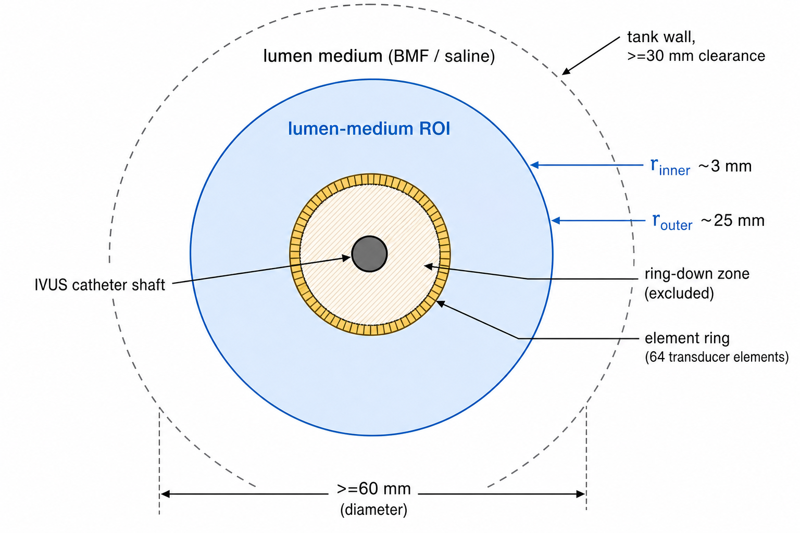
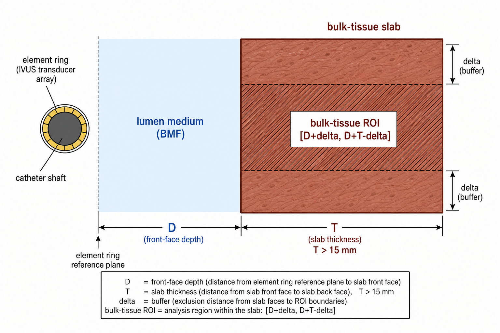
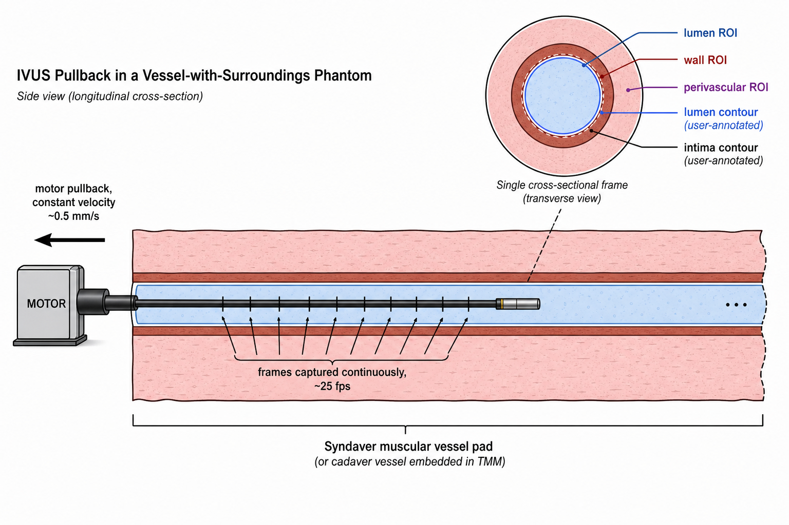

# IVUS Tier 2 / Tier 3 Acceptance Protocol — Visions PV .035

This document is the **bench protocol** for the experiments that supply
the sim-vs-real reference data consumed by Tier 2 and Tier 3 of the
simulator acceptance criteria
([../../i4h-sensor-simulation/docs/simulation_acceptance_criteria.md](../../i4h-sensor-simulation/docs/simulation_acceptance_criteria.md)).
Tier 1 calibration of the probe itself is covered separately in
[ivus_calibration_protocol.md](ivus_calibration_protocol.md); this
protocol does **not** repeat that work and assumes the calibration
sheet at
[`../p035_visions/volcano_s5i.yaml`](../p035_visions/volcano_s5i.yaml)
(with its provenance in
[`../p035_visions/parameter_sheet.csv`](../p035_visions/parameter_sheet.csv)
and outstanding bench requests in
[`../p035_visions/calibration_delta.md`](../p035_visions/calibration_delta.md))
has already been populated for the probe under test.

## Why these four experiments

The protocol is organised as **four bench experiments**, **T2-E1 — T2-E4**,
mirroring
[§2.2](../../i4h-sensor-simulation/docs/simulation_acceptance_criteria.md#22-reference-acquisitions-for-sim-vs-real-comparison)
of the AC document. The experiment IDs use the `T2-` prefix to avoid
collision with the Tier 1 calibration `E1–E9` numbering used in the
calibration protocol cited above.

| ID | Phantom | What it characterises | Annotations |
|---|---|---|---|
| **T2-E1** | Uniform lumen-medium tank | Lumen-medium acoustic statistics (histogram, Rayleigh σ, mean vs depth) | None |
| **T2-E2** | Wall-material tube in lumen medium | Wall-material acoustic statistics (histogram, texture), **and** soft-tissue interface reflectivity at the inner / outer wall surfaces, **and** wall attenuation (from inner-vs-outer-wall amplitude ratio) | None |
| **T2-E3** | Bulk-tissue slab (Syndaver muscular pad imaged away from any vessel, or butcher muscle) | Bulk-tissue acoustic statistics (histogram, texture) | None |
| **T2-E4** | Vessel-with-surroundings pullback (Syndaver muscular vessel pad) | Whole-frame deployment-shaped scenes for Tier 3 (FID + inference parity); Tier 2 visual review | Lumen + intima contours per frame on the Tier 3 split |

Each experiment includes:

1. Purpose — which AC rows and substrate-sheet entries it produces.
2. Equipment list (with tolerance thresholds).
3. Console / device settings.
4. Step-by-step procedure.
5. Data to acquire (file naming and contents).
6. Analysis — formulas and routines used to extract each metric.
7. Acceptance criteria (the bench-side QC checks; the simulator-vs-bench
   comparison thresholds are in
   [§A.2.3](../../i4h-sensor-simulation/docs/simulation_acceptance_criteria.md#a23-quantitative-pass-criteria)).

> All experiments are run with the same probe (Visions PV .035 / Volcano
> s5i), the same console, and at the **same operating point** (gain,
> imaging diameter, TGC) as the calibration-sheet reference operating
> point. Tank and phantom temperature is held at **22 ± 1 °C** unless the
> substrate parameter sheet specifies otherwise. Speed of sound in
> degassed water at 22 °C is taken as **c_water = 1488 m/s** (Marczak 1997).

## Common equipment

| Item | Spec | Tolerance / Notes |
|------|------|-------------------|
| Probe + console | Visions PV .035 (10 MHz peripheral IVUS), Volcano s5i | Same unit and same catheter S/N for all experiments |
| Water tank | ≥ 300 × 200 × 150 mm, non-reflective lining | Walls ≥ 30 mm from any catheter or phantom interface in any imaging direction |
| Degassed deionized water | Dissolved O₂ ≤ 4 ppm | Let sit ≥ 24 h after degassing; T = 22 ± 1 °C |
| Calibrated thermometer | ± 0.2 °C | Log T at the start and end of every session |
| Catheter mount / fixture | Rigid clamp, axial alignment ≤ ±0.1 mm | Holds the probe horizontal; does not occlude the imaging plane |
| Frame capture (DICOM, primary) | Same export pipeline as `P_035_PointScatter/` (DICOM with private tags for imaging diameter, gain, TGC) | One DICOM file per acquisition; per-frame metadata via private tags as in the existing dataset |
| Frame capture (raw RF or polar `.npy`, preferred where available) | DAQ-based RF tap or vendor polar export | Optional; if available, capture in addition to DICOM, not instead |
| Photo / video record of mount | Smartphone-quality is acceptable | Each session must include a photograph of the phantom mounting and any deviations from the protocol |

> **Data format.** The default and required output of every experiment in
> this protocol is **DICOM**, matching the existing `P_035_PointScatter/`
> dataset (`FILE0000`, `FILE0001`, …). Raw RF or vendor polar `.npy`
> exports are welcome **in addition to** DICOM if the lab can produce
> them, but they are not required and the protocol's analysis pipeline
> assumes DICOM is available.

## Common console settings (reference operating point)

These are the **explicit device-side settings** the lab applies on the
s5i console for every acquisition in this protocol. They match the
operating point at which the existing `P_035_PointScatter/` calibration
dataset was acquired, which is the only operating point at which the
simulator's calibration sheet
([`../p035_visions/volcano_s5i.yaml`](../p035_visions/volcano_s5i.yaml))
is currently valid.

| Setting | Value | Notes |
|---------|-------|-------|
| Imaging mode | IVUS B-mode | — |
| Catheter | Visions PV .035 | The calibration sheet is for this catheter family only. |
| Imaging diameter | **60 mm** | Produces a 0.12 mm/pixel display pitch (the calibration-dataset value). Imaging diameters of 35 mm (0.07 mm/pixel) or 40 mm (0.08 mm/pixel) are allowed *only* if Tier 1 has been re-run at the chosen diameter and the calibration sheet has been re-validated against it. |
| Gain slider | **54** | The simulator's reference gain. |
| TGC sliders | **All sliders at the centre detent.** | The calibration dataset was acquired with operator TGC effectively flat (≤ ~2 dB applied at any depth in water). Photograph the slider state at the start of every session and include the photo in the metadata; if the slider hardware does not have a centre detent, set every slider to its mid-position by visual inspection and photograph. |
| Acoustic Reference (AR) | **ON** | The calibration dataset was acquired with AR enabled (DICOM private-tag confirmed). |
| Speckle reduction / smoothing | **OFF** | — |
| Compounding | **OFF** | — |

If any setting deviates from the values above, **stop**: the experiment
as captured will not be comparable to the sim-side configuration and
Tier 1 must be re-validated at the deviated setting before proceeding.

## Substrate identification

Every experiment that uses a lumen medium, wall material, or bulk tissue
must record the substrate's **identity and batch** in the session log.
The substrate parameter sheet
([§A.2.1](../../i4h-sensor-simulation/docs/simulation_acceptance_criteria.md#a21-substrate-parameter-sheet))
of the AC document is the canonical store; `substrate_id` strings used
in filenames must match the `Identity` field there.

Recommended `substrate_id` patterns:

- Lumen medium: `bmf-ramnarine-batch-<YYYYMMDD>` for Ramnarine BMF;
  `bmf-cirs-046-lot-<###>` for CIRS commercial BMF; `saline-09pct` if
  saline is used (logged but note the limitation in §T2-E1 below).
- Wall material: `syndaver-customvessel-<part>-lot<###>` (the custom
  Syndaver iliac / upper-leg vessels); `butcher-<species>-<vessel>-batch-<YYYYMMDD>`
  if a butcher source is used.
- Bulk tissue: `syndaver-pad-bulk-lot<###>` (the Syndaver muscular vessel
  pad bulk, away from any vessel); `butcher-<species>-skeletal-batch-<YYYYMMDD>`.

### Recommended phantom-material recipes / sources

The substrate parameter sheet entries for backscatter and attenuation
are ideally measured on the actual batch (substitution method —
Appendix A). If a published recipe or commercial source is used, the
following are the recommended starting points for diagnostic-frequency
(≤ 10 MHz) ultrasound. Detailed preparation steps are in **Appendix B**.

- **Blood-mimicking fluid (BMF):** Holdsworth Lab BMF SOP (Robarts
  Research Institute), adapted from Ramnarine et al. 1998. CIRS
  Model 046 is the turnkey commercial alternative. See Appendix B.1.
- **Tissue-mimicking material (TMM, optional — only required if the
  Syndaver muscular vessel pad bulk or butcher skeletal muscle is
  unavailable for T2-E3):** IEC 61685 / Teirlinck et al. 1998 agar TMM.
  See Appendix B.2.

---

## T2-E1 — Uniform lumen-medium tank

**Produces:** Tier 2 lumen rows (palette histogram, Rayleigh σ in lumen
medium, lumen-medium mean palette vs depth) per
[§A.2.3](../../i4h-sensor-simulation/docs/simulation_acceptance_criteria.md#a23-quantitative-pass-criteria),
and the bench-side characterization data that populates the
**lumen-medium** group of the substrate parameter sheet
([§A.2.1](../../i4h-sensor-simulation/docs/simulation_acceptance_criteria.md#a21-substrate-parameter-sheet)).

> **Goal.** Isolate the probe's representation of the lumen medium.
> No vessel, no wall material, no scatterer at depth other than the
> medium itself. The acquisition is a long, uniform A-line through the
> chosen fluid.

### Equipment

| Item | Spec | Tolerance |
|------|------|-----------|
| Lumen medium under test | Ramnarine BMF (recipe above) or CIRS Model 046 BMF | Recipe / commercial source documented; batch ID logged; temperature held at 22 ± 1 °C; allow ≥ 30 min equilibration after pouring before capture |
| Tank | Common tank above; entirely filled with the lumen medium under test | All probe-to-wall distances ≥ 30 mm in the imaging plane and ≥ 30 mm along the catheter shaft from the element ring |
| Catheter mount | Common; probe horizontal, element ring at the centre of the tank | ≤ ±0.1 mm axial position |

### Console settings

Reference operating point (table above). No deviation.

### Procedure

1. Fill the tank with the lumen medium under test. If the medium is
   freshly mixed (e.g. Ramnarine BMF), allow ≥ 30 min equilibration;
   visually confirm no settling layer.
2. Measure and log the temperature.
3. Mount the catheter horizontally; insert the tip ≥ 50 mm into the
   tank with the element ring near the centre of the tank, ≥ 30 mm
   clearance to all walls.
4. Set the console to the reference operating point. Verify the
   gain slider, imaging diameter, TGC, and acoustic-reference state
   match the calibration sheet (record any digital readout or screen
   capture).
5. Capture **≥ 60 frames** in static position at the reference
   operating point. (60 gives margin for any per-frame artifacts.)
6. Photograph the tank, catheter mount, and console settings screen.

### Data to acquire

- `t2_e1_<substrate_id>.dcm` — DICOM volume containing the captured
  frames (one DICOM per acquisition is fine; multiple if the console
  splits captures).
- `t2_e1_<substrate_id>_metadata.json` — gain slider, imaging diameter,
  TGC schedule, acoustic-reference state, frame rate, T_water,
  substrate identity and batch, fluid temperature at start and end,
  notes on equilibration / agitation, paths to photos.
- *(Optional, preferred where available)* `t2_e1_<substrate_id>_polar.npy`
  — vendor polar-domain export, shape `(N_frames, N_az, N_r)`.

### Analysis

Implementation lives in `instrument-calibration/p035_visions/` (one
extract script per experiment is recommended; place under
`extract_t2_e1_lumen_medium.py`).

| Output | Method |
|--------|--------|
| Lumen-medium ROI mask | Per [§B.1](../../i4h-sensor-simulation/docs/simulation_acceptance_criteria.md#b1-tier-2-roi-definitions): polar pixels with r in `[r_inner, r_outer]`, where `r_inner` is just outside the calibration sheet's ring-down extent and `r_outer` is the deepest sample free of tank-wall returns; band must span ≥ 5 mm. |
| Palette histogram | Per-ROI pixel histogram, 1 palette unit per bin. |
| Rayleigh σ | Invert log compression to RF amplitude using `volcano_s5i.yaml`'s `log_floor` and `log_multiplier`; fit `scipy.stats.rayleigh.fit` per [§B.3](../../i4h-sensor-simulation/docs/simulation_acceptance_criteria.md#b3-rayleigh-fit). |
| Mean palette vs depth | Bin pixels into 1 mm radial bins inside the ROI, take the mean per bin; report as a 1-D vector aligned to depth. |
| Lumen-medium attenuation (substrate sheet input, optional) | Substitution method (Appendix A) on the **same tank** during the same session if a reference reflector is set up; else cite the recipe / commercial source's published value at 10 MHz with explicit uncertainty. |

### Bench acceptance criteria

These are the bench-side QC checks; sim-vs-bench thresholds are in
[§A.2.3](../../i4h-sensor-simulation/docs/simulation_acceptance_criteria.md#a23-quantitative-pass-criteria).

- ROI band length ≥ 5 mm and free of tank-wall echoes (visual check).
- Per-frame mean palette in the ROI stable to within ±2 palette units
  across the 60-frame capture (no thermal or settling drift).
- Substrate identity, batch, and temperature recorded; if any mid-session
  parameter changes, segment the capture and treat halves as independent.

---

## T2-E2 — Wall-material tube in lumen medium

**Produces:** the Tier 2 wall rows (palette histogram, lateral
autocorrelation length, GLCM statistics), the Tier 2 interface rows
(leading-edge palette at the lumen↔wall surface, trailing-edge palette
at the wall↔lumen surface, edge axial spread) and the wall-attenuation
input to the substrate parameter sheet — all from the **same** tube
acquisition, by analysing different parts of the polar B-mode within
the near-normal-incidence azimuthal sector.

> **Goal.** Isolate the probe's representation of the wall material at
> the depth band the wall occupies in deployment, and quantify the
> reflection at the lumen↔wall and wall↔lumen interfaces. A tube is
> used (not a slab) because all available wall material is in tube
> form (custom Syndaver iliac / upper-leg vessels, optionally butcher
> arteries). The lab does **not** need to physically measure the
> catheter offset inside the tube; all geometry is recovered from the
> acquired polar images by segmentation post-acquisition.

### Equipment

| Item | Spec | Tolerance |
|------|------|-----------|
| Wall material | One of (priority order): (a) custom Syndaver vessel material (iliac / upper-leg set), (b) butcher arterial wall | Material identity and batch logged; uniform wall thickness over the imaging length; no calcified plaque, no perforation |
| Tube | Inner radius `R_in` and outer radius `R_out` measured by digital callipers **before mounting** | `R_in` and `R_out` ± 0.05 mm; wall thickness `t = R_out − R_in` ± 0.1 mm uniform along length |
| Surrounding fluid | The same lumen medium used in T2-E1 (Ramnarine BMF / CIRS BMF) on **both** sides of the wall | Fluid identity, batch, and temperature logged |
| Phantom mount | Holds the wall tube rigid in the imaging plane, parallel to the catheter long axis. The catheter passes through the tube. | The catheter must not contact the wall, but its **exact** offset from the tube centre does not need to be controlled or physically measured — set it up so the catheter is offset enough from the centre that one side of the tube is closer than the other (at least 0.5 mm inside the tube, but not touching the wall). |

### Console settings

Reference operating point.

### Procedure

1. Mount the wall tube in the imaging plane, with its long axis parallel
   to the catheter long axis. The tube must extend ≥ 10 mm past the
   element ring on both sides so the imaged wall band is fully within
   the tube.
2. Insert the catheter through the tube. Position it so it is offset
   from the tube centre but **not** in contact with the wall. The
   exact offset is recovered post-acquisition from the image; do not
   attempt to measure it physically.
3. Fill the tube and surrounding tank with the chosen lumen medium;
   eliminate trapped air on both sides of the wall.
4. Capture **≥ 60 frames** in static position. The catheter must remain
   stationary; small flow in the surrounding fluid is acceptable
   provided the wall does not move.
5. Photograph the mount.

### Data to acquire

- `t2_e2_<substrate_id>.dcm` — DICOM, ≥ 60 frames at the reference
  operating point.
- `t2_e2_<substrate_id>_tube_geometry.json` — measured `R_in`,
  `R_out`, and wall thickness `t` from the digital-calliper measurement
  of the **tube** (no catheter-offset measurement required).
- `t2_e2_<substrate_id>_metadata.json` — identical fields to T2-E1
  metadata, plus the wall-material identity, batch, source.
- *(Optional)* `t2_e2_<substrate_id>_polar.npy` — vendor polar-domain
  export.

### Analysis

| Output | Method |
|--------|--------|
| Catheter offset `d` and near-normal-incidence azimuth `θ₀` | Image-based segmentation: in each polar frame, fit the inner-wall echo as a function of azimuth — the azimuth at which the inner-wall depth is minimum (`r_min`) gives `θ₀`; offset `d = (R_in − r_min)`. Report mean and σ across frames. |
| Wall ROI mask | Per [§B.1](../../i4h-sensor-simulation/docs/simulation_acceptance_criteria.md#b1-tier-2-roi-definitions): annular polar region between the segmented inner-wall and outer-wall echoes, restricted to angles within ±15° of `θ₀` (near-normal incidence). |
| Wall palette histogram | Per-ROI pixel histogram, 1 palette unit per bin. |
| Lateral autocorrelation length | Per [§B.4.1](../../i4h-sensor-simulation/docs/simulation_acceptance_criteria.md#b41-lateral-autocorrelation-length); mean across radial bins inside the wall ROI. |
| GLCM statistics | Per [§B.4.2](../../i4h-sensor-simulation/docs/simulation_acceptance_criteria.md#b42-glcm-statistics); per-patch contrast, homogeneity, energy, correlation across the session. |
| Leading-edge ROI | Narrow band `[r_min − w, r_min + w]` at the inner-wall echo, restricted to angles within ±15° of `θ₀`, with `w ≥ 1.5 ×` the Tier 1 axial PSF FWHM at `r_min`. |
| Leading-edge palette | Mean over angles and frames of the peak palette in the leading-edge ROI. |
| Trailing-edge ROI | Narrow band `[r_max − w, r_max + w]` at the outer-wall echo, where `r_max = r_min + t` is the segmented outer-wall depth at `θ₀`. |
| Trailing-edge palette | Mean over angles and frames of the peak palette in the trailing-edge ROI. |
| Edge axial spread | Axial −6 dB FWHM of the leading-edge bright band on the A-line trace, averaged over the analysis-window angles. |
| Predicted leading-edge palette | Predicted reflection coefficient `R = (Z_wall − Z_fluid) / (Z_wall + Z_fluid)` from substrate-sheet impedances; convert reflected envelope amplitude to palette using `volcano_s5i.yaml`'s `log_floor` and `log_multiplier`. |
| Wall round-trip attenuation (dB) | `α_round-trip = 20 · log10(A_leading / A_trailing)`, where `A_leading` and `A_trailing` are the un-log-compressed envelope amplitudes from the leading- and trailing-edge ROIs. The leading and trailing impedance contrasts are equal (fluid–wall on both faces), so the amplitude ratio is dominated by the round-trip wall attenuation `2 · α_wall · t`. Solve for the wall's one-way attenuation `α_wall` in dB/cm. |
| Wall acoustic impedance and attenuation (substrate sheet inputs) | `α_wall` from the row above. Impedance from leading-edge palette inverted through the predicted-reflection formula. |

### Bench acceptance criteria

- Tube `R_in` and `R_out` measurements reproducible across two
  callipering sessions to within ±0.05 mm.
- Catheter does not contact the wall in any frame (segmented inner-wall
  depth `r_min ≥ 0.3 mm` everywhere along the capture).
- No trapped air in the tube interior or tank (visual check + B-mode
  check for high-amplitude near-field artefacts that would indicate
  bubbles).
- Inner-wall echo SNR ≥ 20 dB above the surrounding-fluid speckle floor
  in the analysis window.
- Outer-wall echo SNR ≥ 10 dB above the surrounding-fluid speckle floor
  (lower threshold because the wall attenuates the round trip).

---

## T2-E3 — Bulk-tissue slab

**Produces:** Tier 2 bulk-tissue rows (palette histogram, lateral
autocorrelation length, GLCM statistics) per
[§A.2.3](../../i4h-sensor-simulation/docs/simulation_acceptance_criteria.md#a23-quantitative-pass-criteria),
and the bench-side characterization data that populates the **bulk
tissue** group of the substrate parameter sheet.

> **Goal.** Isolate the probe's representation of bulk tissue at the
> radial depths a perivascular ROI would occupy in deployment. The
> Syndaver muscular vessel pad imaged **away from any vessel** is the
> primary phantom — the bulk material is the same as the perivascular
> material in T2-E4, so the same pad and the same session covers both.

### Equipment

| Item | Spec | Tolerance |
|------|------|-----------|
| Bulk-tissue slab | One of (priority order): (a) Syndaver muscular pad bulk (away from any vessel — same pad as T2-E4), (b) butcher skeletal muscle, (c) Madsen / IEC 61685 TMM | Slab thickness ≥ 15 mm so the back face is beyond `t_far`; no fascia, gristle, or fat seams in the imaging volume; surface flatness within 1 mm peak-to-valley |
| Surrounding fluid (in front of slab) | Same lumen medium as T2-E1 / T2-E2 | Identity, batch, temperature logged |
| Phantom mount | Slab rigidly held with its surface parallel to the catheter long axis | Approximately parallel; exact orientation recovered from the segmented front-face echo post-acquisition |

### Console settings

Reference operating point.

### Procedure

1. Mount the bulk-tissue slab so its front face is approximately
   parallel to the catheter long axis at a comfortable working distance
   from the element ring (5–10 mm front-face depth is typical). The
   exact depth is recovered from the acquired image post-acquisition
   and does not need to be physically pre-measured.
2. Fill the tank with the chosen lumen medium up to and over the slab
   (slab fully immersed, no air in the imaging path).
3. Capture **≥ 60 frames** in static position.
4. Photograph the mount.

### Data to acquire

- `t2_e3_<substrate_id>.dcm` — DICOM, ≥ 60 frames at the reference
  operating point.
- `t2_e3_<substrate_id>_metadata.json` — gain, TGC, acoustic-reference
  state, T_water, slab identity / batch / source / handling notes.
- *(Optional)* `t2_e3_<substrate_id>_polar.npy` — vendor polar-domain
  export.

### Analysis

| Output | Method |
|--------|--------|
| Slab front-face depth `D` and orientation | Image-based segmentation of the front-face echo in each polar frame; report `D` as the mean depth across the analysis-window angles, and the slab orientation relative to the catheter as the slope of the front-face echo across angles. |
| Bulk-tissue ROI mask | Per [§B.1](../../i4h-sensor-simulation/docs/simulation_acceptance_criteria.md#b1-tier-2-roi-definitions): polar pixels in `[D + δ, D + T − δ]` with δ ≥ 0.5 mm. `T` is the slab thickness (≥ 15 mm). |
| Bulk-tissue palette histogram | Per-ROI pixel histogram. |
| Lateral autocorrelation length | Per [§B.4.1](../../i4h-sensor-simulation/docs/simulation_acceptance_criteria.md#b41-lateral-autocorrelation-length); mean across radial bins inside the ROI. |
| GLCM statistics | Per [§B.4.2](../../i4h-sensor-simulation/docs/simulation_acceptance_criteria.md#b42-glcm-statistics); per-statistic distributions across the session. |
| Bulk-tissue acoustic impedance | Estimate from the leading-edge specular reflection coefficient (front face of the slab) measured in this experiment and the lumen-medium impedance from T2-E1 / substrate sheet. |
| Bulk-tissue attenuation (substrate sheet input, optional) | Substitution method on a thin replicate of the slab if available, else cite literature for the material at 10 MHz. |

### Bench acceptance criteria

- Slab front-face echo visible across all imaging angles (slab covers
  the full FOV in the imaging plane).
- No trapped air at the front face of the slab.
- Slab thickness ≥ 15 mm such that the back face is at or beyond `t_far`.

### Through-wall consistency check (uses T2-E2 + T2-E3 + T2-E4 jointly, no extra capture)

Once T2-E2 (wall attenuation) and T2-E3 (bulk-tissue reference) and
T2-E4 (vessel-with-surroundings pullback) are all acquired, the
through-wall attenuation and post-interface bulk-tissue speckle checks
are computed analytically:

1. From T2-E2: extract `α_wall` (one-way attenuation, dB/cm) and the
   leading- and trailing-edge palette values.
2. From T2-E4: segment the perivascular ROI per
   [§B.1](../../i4h-sensor-simulation/docs/simulation_acceptance_criteria.md#b1-tier-2-roi-definitions);
   measure the wall thickness `t_E4` in the same frames.
3. Predict the perivascular palette: take the T2-E3 free-fluid
   bulk-tissue palette at the matching radial depth, subtract
   `2 · α_wall · t_E4` in dB (round-trip wall attenuation), and convert
   back to palette via the calibration log mapping.
4. Pass criterion: predicted vs measured perivascular palette within
   ±2 dB; perivascular speckle statistics (autocorrelation, GLCM)
   within ±30 % of T2-E3 after attenuation correction. These thresholds
   live in
   [§A.2.3](../../i4h-sensor-simulation/docs/simulation_acceptance_criteria.md#a23-quantitative-pass-criteria).

---

## T2-E4 — Vessel-with-surroundings pullback (Phase A + Phase B)

**Produces:** Tier 3 reference (FID, inference parity) per
[§A.3](../../i4h-sensor-simulation/docs/simulation_acceptance_criteria.md#a3-tier-3--feature-level-fidelity-encoder-distance),
the Tier 2 visual-review row per
[§A.2.3](../../i4h-sensor-simulation/docs/simulation_acceptance_criteria.md#a23-quantitative-pass-criteria),
the data needed for the through-wall consistency check above, and the
**primary** Tier 3 cross-distribution anchor (Phase B).

> **Goal.** Clinically-shaped IVUS pullbacks in a phantom whose lumen,
> wall, and perivascular tissue are all configured to match the
> simulator's training distribution. T2-E4 is the **only** acquisition
> that satisfies Tier 3.

T2-E4 is run in **two phases**, in order, on the **same** mounted
vessel phantom:

- **Phase A — Visions PV .035 pullback (mandatory).** The Visions
  PV .035 catheter on the Volcano s5i, at the reference operating point
  defined above. Provides the Tier 2 visual-review reference, the
  Tier 3 reference, and the through-wall-consistency-check input.
- **Phase B — Cross-probe replicate (optional but strongly
  recommended).** A *different* IVUS probe — Boston Scientific IVUS or
  a smaller Volcano IVUS catheter — pulled through the **same** vessel
  section of the **same** Syndaver pad, at *that* probe's own
  reference operating point. Provides the **primary** Tier 3
  cross-distribution anchor in
  [§A.3.3](../../i4h-sensor-simulation/docs/simulation_acceptance_criteria.md#a33-quantitative-pass-criteria)
  of the AC document. Without Phase B, only the Roboflow-based
  secondary anchor (§2.3 of the AC document) is available, and that
  anchor confounds "different probe" with "different anatomy".

### Common phantom setup (used by both phases)

| Item | Spec | Tolerance |
|------|------|-----------|
| Vessel phantom | Syndaver muscular vessel pad (peripheral-relevant 6 mm vessel preferred over 3 mm where available) | Vessel patent end-to-end; lumen length sufficient for ≥ 100 mm of pullback travel |
| Lumen medium | Same BMF as T2-E1 (Holdsworth / Ramnarine or CIRS) | Identity and batch logged; same temperature as the rest of the session |
| Lumen flow *(optional, nice-to-have)* | If a continuous-flow pump is available, run continuous (not pulsatile) flow at clinically realistic rate | Rate logged in metadata. Pulsatile flow is **not** required and is **not assumed** unless explicitly documented in the metadata. |
| Phantom mounting | Stable, horizontal orientation; the mount must remain undisturbed between Phase A and Phase B | Mark the phantom orientation with respect to the mount so Phase B can verify the same vessel section is imaged |

The vessel phantom is mounted **once**. Phase A is run, the Visions
PV .035 catheter is withdrawn without disturbing the phantom, and
Phase B is run by inserting the second IVUS probe through the same
lumen.

### Phase A — Visions PV .035 pullback (mandatory)

#### Phase A — Equipment (deltas from common setup)

| Item | Spec | Tolerance |
|------|------|-----------|
| Probe | Visions PV .035 (10 MHz peripheral IVUS) on the Volcano s5i | Same catheter S/N as T2-E1 / T2-E2 / T2-E3 |
| Catheter motion | **Motorised** constant-velocity pullback (e.g. 0.5 or 1.0 mm/s) is preferred. **Manual** pullback is acceptable when a motor is unavailable. | If motorised, velocity tolerance ≤ ±5 % over the pullback length. If manual, the motion type must be explicitly recorded in the metadata; no specific velocity profile is required. |
| Frame capture | DICOM, continuous capture for the duration of the pullback, ≥ 25 fps | One DICOM containing the full pullback is preferred; per-frame timestamp recorded |
| Annotation pipeline | Lumen and intima contours per frame on the Tier 3 split (≥ 1000 frames) | Annotation tool documented; contour format compatible with the simulator's polar coordinate convention |

#### Phase A — Console settings

The pullback is acquired with the **same operating point** as T2-E1 /
T2-E2 / T2-E3 (the reference operating point in the *Common console
settings* section above). Deviation invalidates the Tier 1 calibration
round-trip and downstream comparisons.

#### Phase A — Procedure

1. Mount the vessel phantom in a stable, horizontal orientation per
   the *Common phantom setup* table above. Mark the phantom orientation
   on the mount.
2. Insert the Visions PV .035 catheter through the vessel lumen so the
   element ring exits the distal end of the phantom and is then
   withdrawn through the imaging volume during pullback.
3. Establish lumen medium fill: prime the lumen with the BMF; verify no
   bubbles in the imaging volume by a static B-mode check at the start
   of the pullback path. If a continuous-flow pump is available,
   document the flow rate; pulsatile flow is not required.
4. Confirm console settings match the Visions PV .035 reference
   operating point. Take a screen capture for the metadata.
5. Run the pullback over ≥ 100 mm of vessel length.
   - **Motorised (preferred):** constant velocity (0.5–1.0 mm/s
     typical); record the commanded velocity.
   - **Manual (acceptable):** smoothly withdraw the catheter at an
     approximately constant rate; avoid stalls. Record the motion type
     as `manual` in the metadata.
   Capture **continuously**; the total number of frames must be
   **≥ 2200** before any quality filtering, so that the 50 / 50
   Tier 2 / Tier 3 split (§2.2.1) yields ≥ 1000 frames per half after
   dropping any corrupt frames.
6. Repeat pullbacks if the first attempt has identifiable transient
   issues (sync drops, console reset, motor stutter); discard runs that
   cannot be reconciled to a single continuous pullback path.
7. Run the annotation pipeline on the Tier 3 split: produce per-frame
   lumen and intima polar contours.
8. Photograph the entire mount.
9. Withdraw the Visions PV .035 catheter **without disturbing the
   phantom mount**.

#### Phase A — Data to acquire

- `t2_e4_<substrate_id>.dcm` — DICOM containing the full Phase A
  pullback.
- `t2_e4_<substrate_id>_pullback.json` — motion type (`motorised` /
  `manual`), motorised velocity if applicable, pullback length, start /
  end timestamps, frame timestamps.
- `t2_e4_<substrate_id>_metadata.json` — gain, TGC, acoustic-reference
  state, T_water, vessel-phantom identity (pad ID and vessel section),
  lumen medium identity / batch, flow setting if any, photos.
- `t2_e4_<substrate_id>_split.json` — frame-level Tier 2 / Tier 3 split
  index list, generated **before** any sim-vs-real comparison is run.
- `t2_e4_<substrate_id>_annotations.zip` — per-frame lumen and intima
  polar contours for the Tier 3 split.

### Phase B — Cross-probe replicate (optional but strongly recommended)

> **Why Phase B matters.** §A.3.3 of the AC document gates the
> simulator on "does it look more like the Visions PV .035 than like a
> generic IVUS probe imaging the same anatomy?". Phase B is what makes
> that question cleanly answerable — the same vessel section of the
> same Syndaver pad with the same lumen medium, imaged by a *different*
> IVUS probe, isolates probe-only differences from anatomy / phantom
> differences. Without Phase B the gate falls back to a Roboflow-based
> anchor that confounds the two.

#### Phase B — Equipment (deltas from common setup)

| Item | Spec | Tolerance |
|------|------|-----------|
| Second IVUS probe | One of (in priority order): (a) **Boston Scientific IVUS** (e.g. Opticross HD, AVANTI), (b) a **Volcano IVUS** catheter of a different size from the Visions PV .035 (e.g. Eagle Eye Platinum 20 MHz). See "Probe selection" below. | Catheter S/N, model, and manufacturer logged in Phase B metadata |
| Console for the second probe | The manufacturer's own console for that probe (Boston Scientific clinical console for the BSc probe, or the Volcano s5i for a different-size Volcano catheter) | Console identity and firmware version logged |
| Vessel phantom | **Same** Syndaver pad and **same** vessel section as Phase A; phantom mount left undisturbed between phases | Phase B images the same anatomy as Phase A; metadata explicitly records this |
| Lumen medium | **Same** BMF batch as Phase A | Identity and batch repeated in Phase B metadata for traceability |
| Catheter motion | Same options as Phase A (motorised preferred, manual acceptable) | Motion type recorded in metadata |
| Frame capture | DICOM, ≥ 1000 frames after quality filtering | Annotations not required |

**Probe selection.** Phase B's value comes from imaging the *same*
anatomy with an acoustically *different* probe. The Boston Scientific
IVUS family and smaller / higher-frequency Volcano catheters all
qualify because they differ from the Visions PV .035 in centre
frequency, beam geometry, and post-processing. If multiple second
probes are available, prefer the one whose imaging frequency differs
most from 10 MHz (e.g. a 20 MHz Eagle Eye Platinum or a Boston
Scientific 40 / 60 MHz catheter), since that maximises the
"different-probe" distance the triangle test is measuring against.

#### Phase B — Console settings

Use **the second probe's own reference operating point**: the gain,
imaging diameter, TGC, and acoustic-reference state appropriate for
that probe and console. Do **not** force the Visions PV .035 settings
onto the second probe — the calibration sheet at
[`../p035_visions/volcano_s5i.yaml`](../p035_visions/volcano_s5i.yaml)
applies to the Visions PV .035 only. Whatever the second probe's
operating point is, record every adjustable setting in the Phase B
metadata (slider values, screen capture).

#### Phase B — Procedure

1. With Phase A complete and the Visions PV .035 catheter withdrawn,
   confirm the phantom mount is undisturbed (visual check against the
   orientation marks made at Phase A step 1).
2. Insert the second IVUS catheter through the **same vessel section**
   used in Phase A (best-effort — exact axial alignment is not
   required, but the catheter must enter the same vessel and traverse
   the same approximate length).
3. Confirm the lumen is still primed with BMF; top up if necessary.
   Verify no bubbles by a static B-mode check on the second probe.
4. Set the second probe's console to its own reference operating
   point. Photograph the slider state and the console-settings screen.
5. Run a pullback over the same vessel length covered in Phase A.
   Capture **continuously**; ≥ 1000 frames after quality filtering is
   sufficient. Motorised or manual pullback both acceptable; document
   the motion type.
6. Photograph the second-probe console and cabling.

#### Phase B — Data to acquire

- `t2_e4_<substrate_id>_xprobe_<probe_id>.dcm` — DICOM containing the
  full Phase B pullback. `<probe_id>` is a short string identifying
  the probe family / model, e.g. `bsc-opticross-hd`, `volcano-eep20`,
  etc.
- `t2_e4_<substrate_id>_xprobe_<probe_id>_metadata.json` — second
  probe identity / model / S/N, console identity / firmware, gain /
  TGC / imaging diameter / acoustic-reference state at the
  second probe's reference operating point, T_water, motion type and
  velocity if applicable, photos. Repeats the lumen-medium identity
  and the Phase A `t2_e4_<substrate_id>` reference for traceability.

No annotations are required for Phase B; Tier 3 only uses Phase B
frames for FID computation.

### Analysis

For Tier 3, see
[§A.3.2](../../i4h-sensor-simulation/docs/simulation_acceptance_criteria.md#a32-test-protocol).
The bench-side analysis for T2-E4 is limited to:

| Output | Method |
|--------|--------|
| Frame quality filter (Phase A) | Drop frames with sync errors, console reset markers, or visibly corrupt DICOM. The drop list is logged in the split JSON. |
| Tier 2 / Tier 3 split (Phase A) | First contiguous 50 % of clean frames → Tier 2 visual-review reference; remaining 50 % → Tier 3 reference. Splits are generated before any sim-vs-real test is run and are not modifiable thereafter. |
| Visual review (informal, A.2.3) | 20 frames (10 sim, 10 real) drawn from the Tier 2 visual-review split of Phase A; reviewers are blind to source. |
| Frame quality filter (Phase B, if collected) | Same as Phase A; logged separately. Phase B is not split — the entire clean frame set is used as the Tier 3 cross-probe anchor. |

### Cross-probe triangle anchor in Tier 3

[§A.3.3](../../i4h-sensor-simulation/docs/simulation_acceptance_criteria.md#a33-quantitative-pass-criteria)
requires the simulator to look more like the Visions PV .035 probe than
like a different probe. With Phase B collected, the triangle test has a
clean anchor:

- **Primary:** `FID(sim, T2-E4 Phase A Visions PV .035 reference) ≤ FID(sim, T2-E4 Phase B cross-probe replicate)` — same phantom, same anatomy, only the probe differs.
- **Secondary:** `FID(sim, T2-E4 Phase A Visions PV .035 reference) ≤ FID(sim, Roboflow IVUS-2)` — kept as a sanity check on more diverse anatomy.

If Phase B is not collected, only the secondary (Roboflow-based) anchor
is available; that anchor confounds probe with anatomy and the gate's
diagnostic value is reduced accordingly.

### Bench acceptance criteria

**Phase A (mandatory):**

- ≥ 2200 frames captured before quality filtering.
- ≥ 1000 frames per Tier 2 / Tier 3 split after quality filtering.
- ≥ 95 % of split frames carry valid lumen and intima annotations.
- Pullback motion type explicitly recorded; if motorised, velocity
  stable to within ±5 % across the run; no frame-time jumps > 2 frame
  periods.
- No air bubbles or annotation gaps lasting > 3 consecutive frames.

**Phase B (if collected):**

- ≥ 1000 frames captured after quality filtering.
- Phase B images the **same** vessel section of the **same** Syndaver
  pad as Phase A; metadata explicitly references the Phase A
  `<substrate_id>`.
- Phantom mount left undisturbed between Phase A and Phase B (verified
  by the orientation marks placed at Phase A step 1).
- Phase B's metadata explicitly records the second-probe model, S/N,
  console identity / firmware, and the full slider state of that
  probe's reference operating point. No DICOM cross-mixing between
  Phase A and Phase B output files.

---

## Appendix A — Substitution attenuation measurement (optional)

For substrate-parameter-sheet entries that require a measured
attenuation in dB/cm at 10 MHz (lumen medium, bulk tissue), the
substitution method below is the recommended bench protocol. Wall
attenuation is recovered directly from T2-E2 (inner-vs-outer-wall
amplitude ratio) and does not need a separate substitution capture.

1. Mount a flat, polished metal reflector (the Tier 1 E1 reflector is
   suitable) at a known radial distance `D_ref` from the element ring
   in the chosen lumen medium with the test substrate **absent** from
   the imaging path.
2. Capture ≥ 30 frames; record the peak A-line palette at the
   reflector depth and convert to envelope amplitude `A_without` via
   the calibration log mapping.
3. Insert the test substrate of known thickness `L` into the imaging
   path in front of the reflector. Re-capture ≥ 30 frames; record
   `A_with`.
4. Compute attenuation: `α (dB/cm) = 20 · log10(A_without / A_with) / (2 · L · 0.1)`.

Document `L`, both peak palettes, T_water, and substrate identity /
batch in the same metadata file as the parent experiment.

---

## Appendix B — Material preparation references

When the lab prepares its own BMF or TMM, the published SOPs / recipes
below are the canonical starting points. This protocol does **not**
reproduce the full step-by-step preparation; the lab follows the cited
SOP and records the batch and preparation details in the experiment
metadata.

### B.1 Blood-mimicking fluid (BMF)

**Recommended SOP.** Holdsworth Lab BMF SOP (Robarts Research
Institute), [`making_bmf_sopt.pdf`](https://holdsworthwiki.robarts.ca/files/techniques/making_bmf_sopt.pdf).
The Holdsworth SOP is adapted from Ramnarine, Nassiri, Hoskins &
Lubbers, *"Validation of a new blood-mimicking fluid for use in Doppler
flow test objects"*, Ultrasound in Medicine and Biology 24(3):451–9
(1998), and characterises the resulting fluid for diagnostic
ultrasound frequencies. Suitable as the lumen medium for T2-E1, T2-E2,
and T2-E4 in this protocol.

**Commercial alternative.** CIRS Model 046 BMF — use as supplied;
record lot number in the experiment metadata. No in-house preparation
needed.

**What to log per batch (in addition to the SOP's own log fields).**

- Batch ID matching the `substrate_id` pattern in this protocol's
  *Substrate identification* section (e.g. `bmf-ramnarine-batch-20260507`).
- Date prepared, operator, ingredient lot numbers and weights.
- Storage conditions (container, temperature, since when).
- Any in-house acoustic measurements made on the batch (substitution
  attenuation per Appendix A; speed-of-sound spot check if a calibrated
  through-transmission rig is available).
- Photographs of the batch as poured / in storage.

### B.2 Tissue-mimicking material (TMM)

**Recommended SOP.** Souza, Santos, Oliveira, Alvarenga &
Costa-Felix, *"Standard operating procedure to prepare agar
phantoms"*, J. Phys.: Conf. Ser. 733 012044 (2016), open-access PDF at
[`iopscience.iop.org/article/10.1088/1742-6596/733/1/012044/pdf`](https://iopscience.iop.org/article/10.1088/1742-6596/733/1/012044/pdf).
The Inmetro (Brazilian National Institute of Metrology) SOP gives a
step-by-step preparation procedure for the IEC 60601-2-37 agar TMM
(glycerol 11.21 %, deionised water 82.95 %, benzalkonium chloride
0.47 %, SiC −400 mesh 0.53 %, Al₂O₃ 0.3 µm 0.88 %, Al₂O₃ 3 µm 0.94 %,
agar 3.02 % by weight) with explicit handling of the points the IEC
standard leaves under-specified (stirring method, water-bath
temperature window, cooling temperature before pouring, storage
solution). This is the recommended SOP for in-house TMM preparation.

**Underlying standards and characterisation references.**

- IEC 60601-2-37 / IEC 61685 — the source recipe.
- Teirlinck, Bezemer, Kollmann *et al.*, *Ultrasonics* 36 (1998)
  653–660 — original characterisation of the IEC TMM at diagnostic
  frequencies.
- Inglis *et al.*, *UMB* 44(2):440–51 (2018) — per-component
  attenuation breakdown for varied recipes.
- Cannon *et al.*, *UMB* 41(2):574–82 (2014/2015) — characterisation up
  to 60 MHz (relevant if the lab pushes the TMM beyond 10 MHz).

**When to prepare TMM.** Only prepare TMM in-house if the Syndaver
muscular vessel pad bulk and butcher skeletal muscle are unavailable
for T2-E3, **or** if the lab needs a TMM characterised for the
substrate parameter sheet at a level of certainty above what literature
provides.

**What to log per batch.** Same as B.1 above, plus the SOP step at
which any deviation occurred (water-bath temperature, stirring rpm
profile, cooling-before-pour temperature) — the Souza SOP is explicit
that these points drive batch-to-batch variability.

### B.3 Substrate batch logging convention

For every BMF or TMM batch — whether prepared in-house or commercial —
the batch's `substrate_id` must match the `Identity` field of the
substrate parameter sheet
([§A.2.1](../../i4h-sensor-simulation/docs/simulation_acceptance_criteria.md#a21-substrate-parameter-sheet))
of the AC document. If a batch is used across multiple experiments
(e.g. one BMF batch covers T2-E1, T2-E2, and T2-E4), the same
`substrate_id` is reused in every experiment's metadata so the AC
analysis pipeline can group acquisitions by batch.
