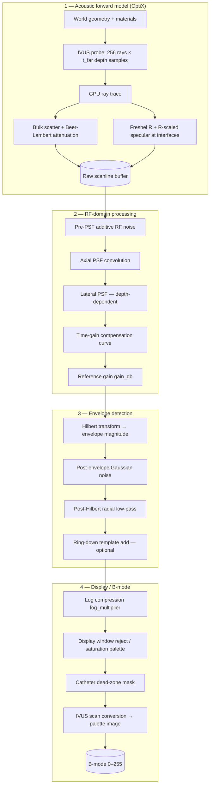
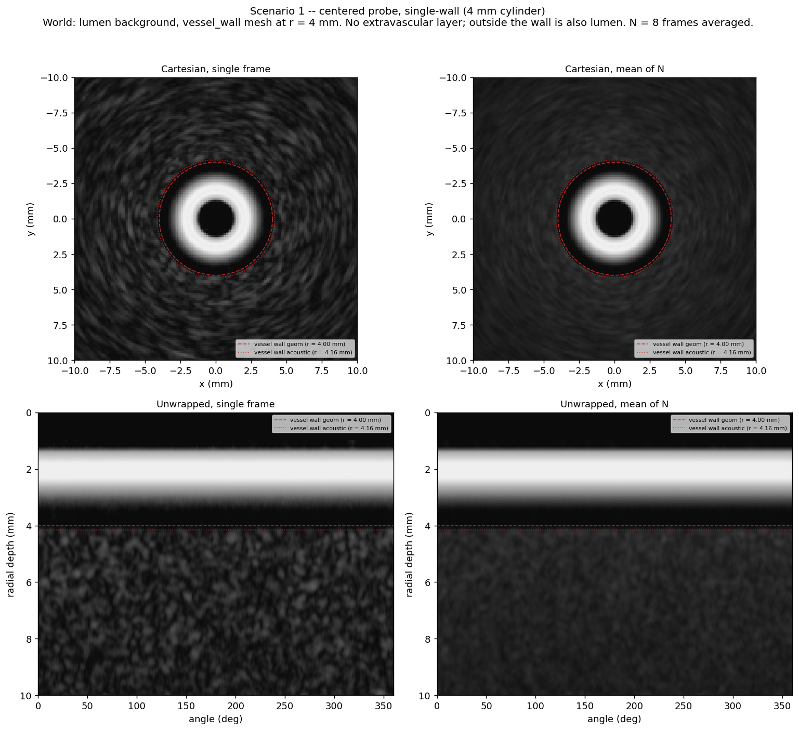
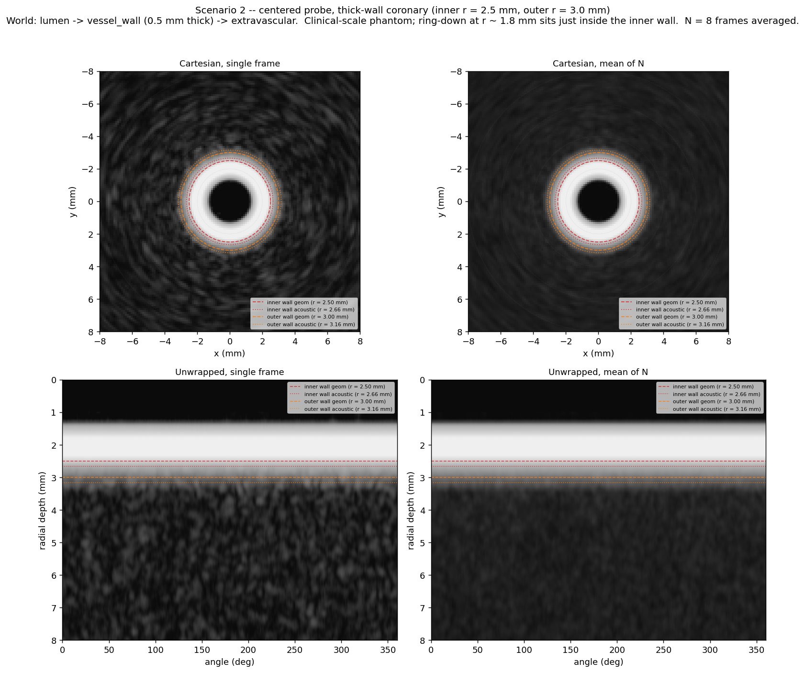
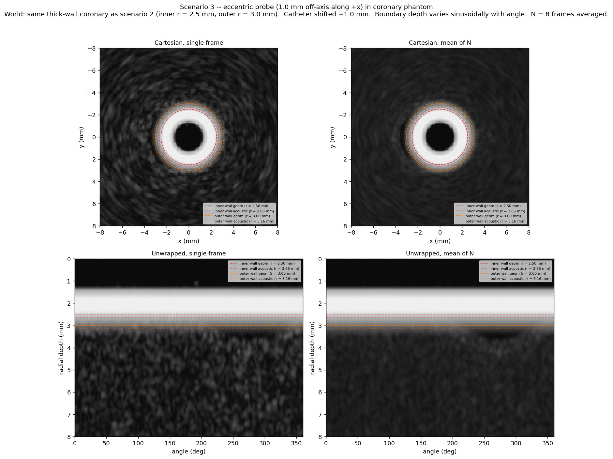
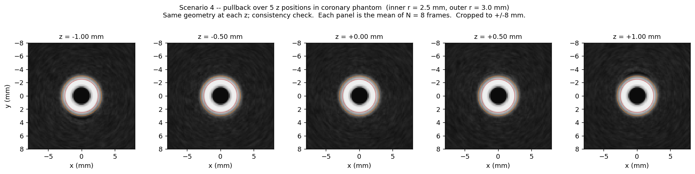
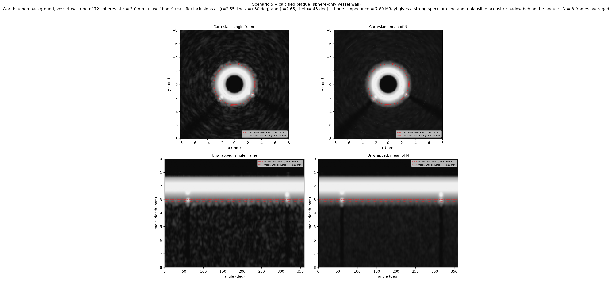
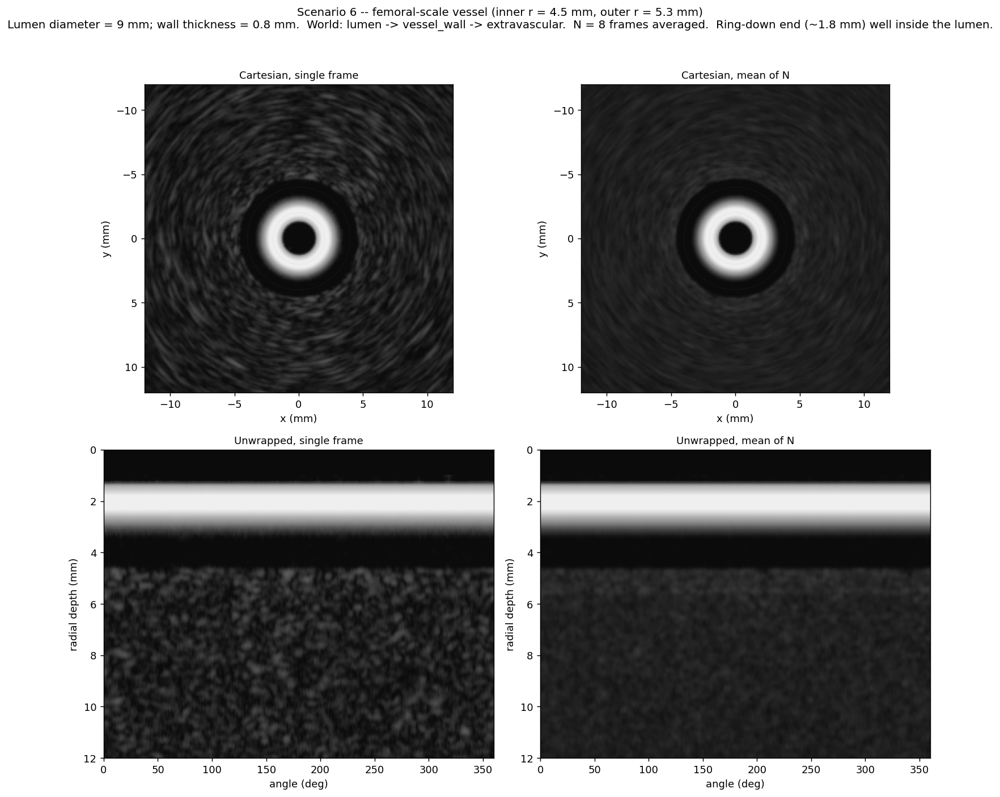
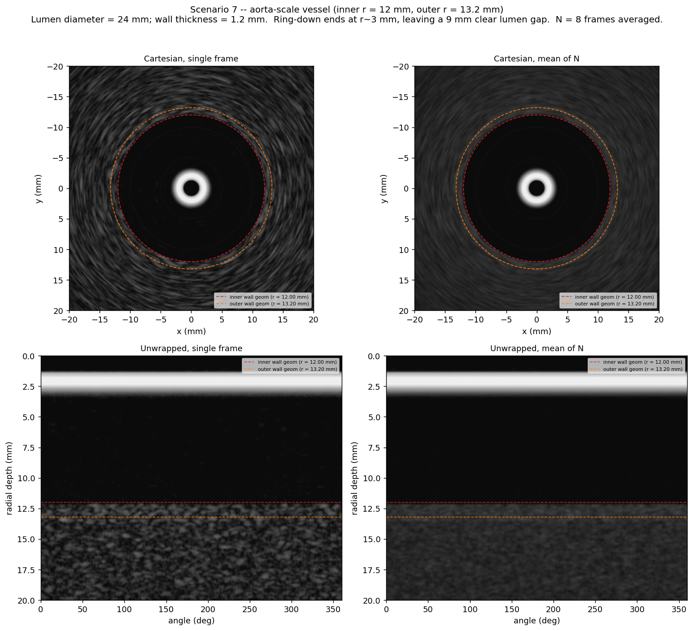

# Vessel-phantom evaluation -- calibrated Volcano s5i sim

All renders use the calibrated `volcano_s5i.yaml` configuration (10 MHz, 256 scanlines, t_far = 30 mm).  Display range is palette 0–255 (raw sim output).  See **Simulation model** below for the full physics and processing chain.

## Simulation model

These renders use **raysim**, a GPU Monte-Carlo ultrasound simulator (NVIDIA OptiX ray tracing + CUDA post-processing).  All calibrated instrument and processing parameters come from `instrument-calibration/p035_visions/volcano_s5i.yaml`, fit against the Volcano s5i / `ivus_test_0515` bench corpus (wire PSF, milk-bath depth uniformity, cyst noise floor, ring-down template).

### Geometry and materials

Each scenario builds an IVUS **World**: a 3-D scene centred on the catheter origin with a background medium and optional mesh / sphere primitives.

| Layer | Material | Role |
|---|---|---|
| Catheter lumen | `lumen` (blood-like, Z ≈ 1.68 MRayl) | Background inside the vessel; low scatter (μ₀ ≈ 0.1) |
| Vessel wall | `vessel_wall` (Z ≈ 1.82 MRayl) | Thin cylindrical mesh; moderate bulk scatter |
| Perivascular tissue | `extravascular` (Z ≈ 1.62 MRayl) | Outside the outer wall; speckle-filled background |
| Wire targets (bench) | `tungsten` (Z ≈ 101 MRayl) | PSF / gain calibration phantoms only |
| Calcific inclusions (scenario 05) | `bone` (Z ≈ 7.8 MRayl) | High-impedance stand-in for calcified plaque |

Cylinder meshes are generated with ~20 µm radial jitter and ~0.1 rad normal jitter so concentric walls do not produce an artificial uniformly-bright rim at normal incidence.

### Acoustic physics (OptiX trace)

For each of the **256 angular rays** the simulator launches GPU paths from the IVUS probe at the origin.  Along each path:

1. **Bulk backscatter** — Bernoulli–Gaussian scatterers (μ₀, σ per material) integrated along the ray with **Beer–Lambert** depth attenuation (dB/cm/MHz × frequency).
2. **Specular interfaces** — at every material boundary the scanline receives (a) the **Fresnel intensity reflection** R from the impedance contrast, plus (b) an empirical **directivity term** cosⁿ(θ) scaled by R (Mattausch 2016).  Soft-tissue interfaces (lumen→wall, R ≈ 0.2 %) therefore appear as **texture transitions**, not bright rims; high-impedance targets (tungsten, calcification) remain bright.
3. **Refraction** — transmitted energy continues into the distal medium (e.g. lumen → wall → extravascular), producing bulk speckle that begins slightly **distal** to the geometric surface.

Probe: **10 MHz**, pulse **15 cycles** (axial PSF FWHM ≈ 0.318 mm at anchor settings).  Radial FOV **t_far = 30 mm** sampled at **1024** depth bins × **256** angles.

### Signal-processing pipeline (execution order)

After ray tracing, each scanline passes through the calibrated receive chain below.  Stages run **top to bottom** on the GPU (see diagram).

| Stage | Calibrated parameter(s) | Notes |
|---|---|---|
| Axial PSF | `probe.pulse_duration_cycles` | Tier 1 Test C vs tungsten wire FWHM |
| Lateral PSF | `processing.lateral_psf_kernel.sigma_theta_rad` | Depth-dependent arc width; Test D |
| TGC | `processing.tgc_control_points` | Depth compensation; Test H / I |
| Reference gain | `processing.gain_db` | Wire-peak brightness; Test E |
| Pre-PSF noise | `processing.noise.sigma` | Coherent + random speckle floor |
| Post-envelope noise | `processing.envelope_noise.*` | Anechoic / deep noise floor; Test F |
| Ring-down | `processing.ring_down.*` | Catheter near-field artifact; **disabled by default** in this vessel eval |
| Log compression | `processing.log_multiplier`, `log_floor` | Palette mapping; E7 wire anchor |
| Display window | `reject_palette`, `saturation_palette` | Device floor / ceiling |

### Figure overlays

Boundary circles / lines on each panel mark two radii per wall:

- **Dashed (`--`)** — **geometric** mesh surface (OBJ ground truth).
- **Dotted (`:`)** — **acoustic** boundary = geometric + Δr ≈ **0.16 mm** (half the calibrated axial PSF FWHM).  Bulk speckle from the distal medium and PSF smearing make the visible texture change appear slightly distal to the mesh.

Each scenario renders **N = 8** frames with small catheter-yaw jitter; the **mean-of-N** panels suppress random speckle while preserving deterministic structure (walls, ring-down, plaque).

---

## Scenario summary

| # | Name | Image |
|---|---|---|
| 01 | Single-wall (4 mm) | `01_single_wall.png` |
| 02 | Thick-wall coronary (2.5 / 3.0 mm) | `02_thick_wall_coronary.png` |
| 03 | Eccentric probe (1.0 mm offset) | `03_eccentric.png` |
| 04 | Pullback (5 z positions) | `04_pullback.png` |
| 05 | Calcified plaque (eccentric calcific inclusions) | `05_calcified_plaque.png` |
| 06 | Femoral-scale vessel (9 mm diameter) | `06_femoral.png` |
| 07 | Aorta-scale vessel (24 mm diameter) | `07_aorta.png` |

## Single-wall (4 mm)

**Purpose.**  Geometric accuracy reference at the bench-phantom scale.  A single specular interface at r = 4 mm tests that the calibrated PSF + ring-down + TGC pipeline renders a clean closed ring at the right depth, with no angular drop-outs or systematic depth errors.

**Expected if the simulation is accurate.**  Closed bright ring at r = 4 mm in both the single-frame and averaged renders.  Ring-down disc at r ~ 1.8 mm in every panel. Inside the wall (r < 4 mm) is the lumen speckle background; outside is the same speckle (no impedance change).

---

## Thick-wall coronary (2.5 / 3.0 mm)

**Purpose.**  Clinical-scale vessel rendering.  Two concentric specular interfaces (lumen->wall at r=2.5 mm, wall->extravascular at r=3.0 mm) test depth-dependent attenuation and contrast.  The extravascular speckle should attenuate with depth via the calibrated `attenuation_db_per_cm_mhz` + TGC schedule.

**Expected if the simulation is accurate.**  Two concentric rings ~0.5 mm apart, inner at r=2.5 mm.  The inner ring sits just outside the ring-down disc (r ~ 1.8 mm).  Extravascular speckle fills the FOV beyond r=3 mm and attenuates smoothly to background by r ~ 20-25 mm.

---

## Eccentric probe (1.0 mm offset)

**Purpose.**  Geometric accuracy under off-axis catheter pose.  The inner-wall depth must vary sinusoidally with angle, from inner_r - offset on the +x side (closest) to inner_r + offset on the -x side (farthest).

**Expected if the simulation is accurate.**  Both rings remain closed but oscillate in depth across angle.  For offset=1.0 mm and inner_r=2.5 mm the inner wall ranges from r=1.5 mm (against the catheter, possibly buried in the ring-down) to r=3.5 mm.  No angular drop-outs.

---

## Pullback (5 z positions)

**Purpose.**  Reproducibility / consistency along the catheter long axis.  The cylinder is translationally symmetric in y (the catheter axis), so each z position should render an identical cross-section.  Detects z-dependent artefacts (e.g. elevational PSF boundary effects, mesh-length truncation, slice-thickness leakage).

**Expected if the simulation is accurate.**  Identical concentric rings in every z panel; no systematic drift in ring depth or contrast.  End-of-mesh truncation may be visible at the most extreme z positions if the cylinder length (4 mm) is comparable to the elevational PSF.

---

## Calcified plaque (eccentric calcific inclusions)

**Purpose.**  Contrast + shadow demonstration.  Two `bone`-material spheres embedded at the lumen-wall interface produce specular echoes much brighter than the surrounding wall + a radial shadow behind each (sound that reflects off the inclusion does not penetrate, so the wall behind the calcific spot reads at the noise floor).

**Expected if the simulation is accurate.**  The vessel-wall ring is visible at r=3.0 mm but interrupted by two bright specular spots near r=2.55 / 2.65 mm.  Each bright spot is followed by a wedge-shaped low-intensity region (acoustic shadow) extending outward to the edge of the FOV.  The shadow widens with depth because the calcific blocker subtends a larger angle from the probe at closer radii.

---

## Femoral-scale vessel (9 mm diameter)

**Purpose.**  Large-vessel rendering at femoral-artery scale.  Inner r = 4.5 mm (9 mm lumen diameter) leaves a 2.7 mm gap of visible lumen speckle between the ring-down edge (~1.8 mm) and the inner wall, making the vessel anatomy obvious without zooming.  Tests that the calibrated TGC + attenuation schedule handles the larger depth range correctly.

**Expected if the simulation is accurate.**  Two concentric rings 0.8 mm apart: inner at r = 4.5 mm, outer at r = 5.3 mm.  The lumen fills the display with visible speckle from ~2 mm to 4.5 mm.  Extravascular speckle beyond r = 5.3 mm attenuates smoothly.  Both rings should be equally bright (no depth-dependent ring-brightness bias from miscalibrated TGC).

---

## Aorta-scale vessel (24 mm diameter)

**Purpose.**  Large-vessel demo at aortic scale where the ring-down zone (r~3 mm) is far inside the lumen, leaving a clear anatomical separation between artifact and vessel wall.  Tests the sim at 12-13 mm target depth where TGC and attenuation gradients are most apparent.

**Expected if the simulation is accurate.**  Two concentric rings 1.2 mm apart: inner at r=12 mm, outer at r=13.2 mm.  Clear dark lumen from r~3 mm to 12 mm.  Both rings visible as bright lines (not a saturated disc).  Extravascular speckle beyond r=13.2 mm decreasing in brightness with depth.

---

