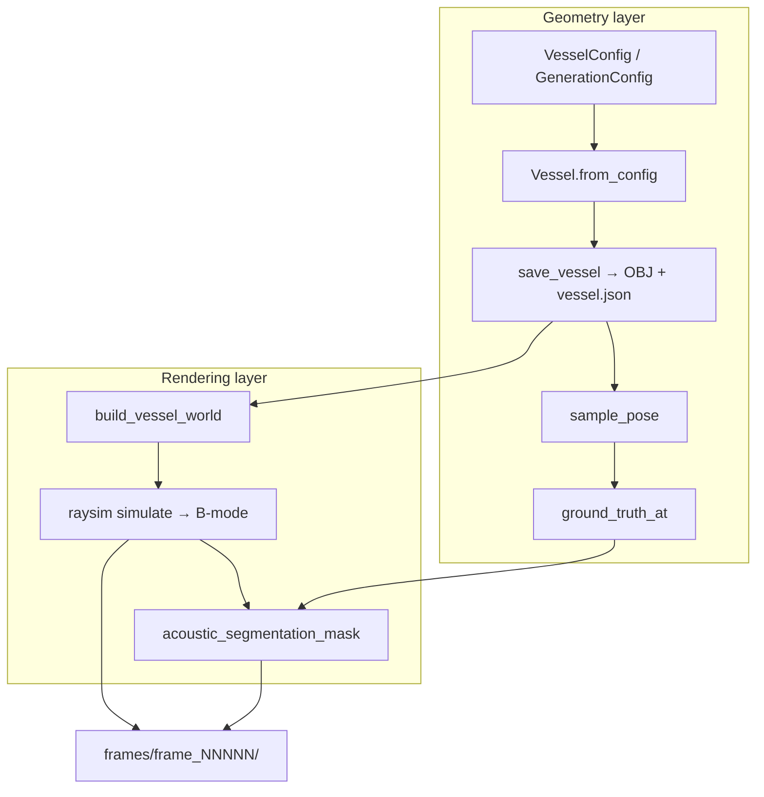

# Pipeline overview

The vessel-generator module sits between procedural anatomy and the IVUS
simulator. It has two distinct layers:

1. **Geometry library** (`vesselgen` package) — builds watertight vessel
   meshes, samples probe poses, and extracts geometric ground truth.
2. **Paired renderer** (`examples/render_paired_dataset.py`) — loads saved
   vessels into raysim, renders B-mode frames, and rasterizes acoustic
   segmentation masks.



## Geometry layer

**Entry points:**

| Tool | Purpose |
|------|---------|
| `vesselgen-vessel` | One vessel with explicit CLI flags |
| `vesselgen-dataset` | Batch of N vessels via `GenerationConfig.sample()` |
| Python API | `Vessel.from_config()`, `save_vessel()`, `Vessel.load()` |

**Outputs per vessel:** closed OBJ meshes + `vessel.json` manifest. See
[On-disk format](on-disk-format.md).

**Sampling API:** `Vessel.sample_pose(rng)` returns a `PoseSample` (position,
rotation, branch, arclength). `Vessel.ground_truth_at(pose)` returns lumen
contours, per-angle wall distances, CSA, and visible branch IDs.

The training loop samples **frame-level snapshots** — there is no pullback
path. The simulator can render an unbounded number of distinct frames per
vessel by calling `sample_pose` repeatedly.

## Rendering layer

**Entry point:** `examples/render_paired_dataset.py`

This script:

1. Draws vessel configs from `GenerationConfig` (trilaminar walls pinned).
2. Saves each vessel with `save_vessel()`.
3. Loads meshes into a raysim `World` using manifest materials.
4. Samples poses with bifurcation-aware scheduling.
5. Renders B-mode via `RaytracingUltrasoundSimulator.simulate()`.
6. Rasterizes GT polygons into per-pixel label masks.

Calibration comes from
`instrument-calibration/p035_visions/volcano_s5i.yaml`. Per-frame
randomization is applied via `SimRandomizationConfig` (see
[Simulator integration](simulator-integration.md)).

**Output layout:**

```
out/
  manifest.json              # dataset-level metadata
  vessels/
    vessel_0000/
      lumen.obj, surfaces/, vessel.json, ...
  frames/
    frame_00000/
      image.png, segmentation.png, overlay.png
      image.npy, segmentation.npy, metadata.json
```

## Feature interaction matrix

| Feature | Single vessel CLI | Batch sampler | Paired renderer |
|---------|-------------------|---------------|-----------------|
| Trilaminar wall | `--layers 3` | ~70% probability | Always |
| Side branch | `--side-branch` | ~45% probability | Configurable |
| Lesions | `--n-lesions` (no side branch) | Skipped if bifurcation | Same |
| Guidewire | `--guidewire` (no side branch) | ~70% if no bifurcation | Same |
| Layered + bifurcation | Supported | Supported | Supported |

## Related components

| Component | Role |
|-----------|------|
| `i4h-sensor-simulation/ultrasound-raytracing/` | GPU raysim simulator |
| `instrument-calibration/p035_visions/` | Volcano s5i calibrated config |
| `simulated_pullback_from_CT/` | CT-pullback bridge via `vessel_manifest_path` |
